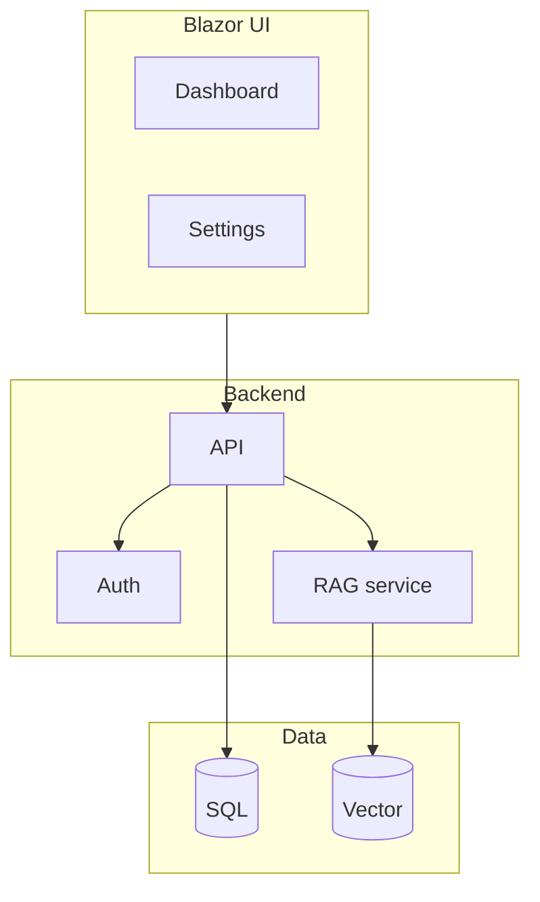
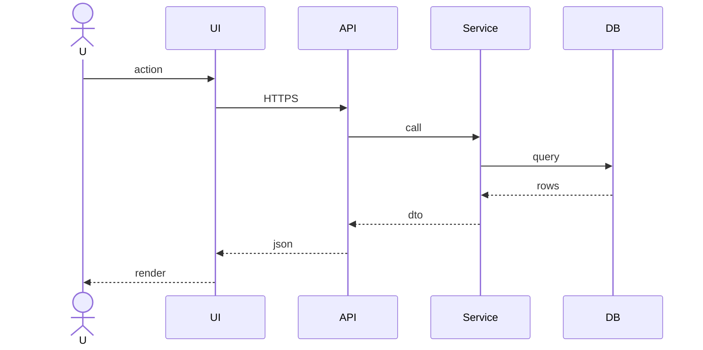
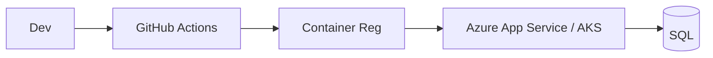
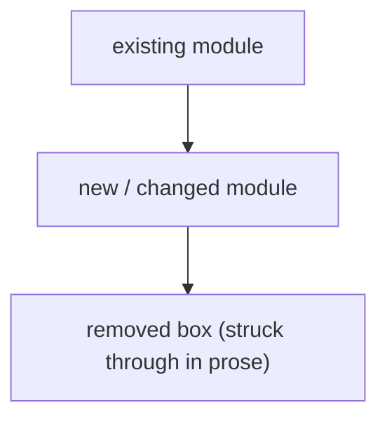

# {AppName} — Architecture

**Last updated:** {YYYY-MM-DD}
**Status:** Current (brownfield) | Target (greenfield) | Current + planned target (brownfield with structural change)

<!-- AGENT-ONLY AUTHORING NOTES. Everything in this comment is an instruction to the DRAFTING
     AGENT, not content for the document's human reader. Carry it into the generated document
     ONLY as this HTML comment (or drop it entirely) — NEVER as visible text: the owner reads
     the rendered HTML and must not see authoring instructions (generate-html.md strips any
     that leaked from older templates).

  DEPTH MANDATE: this is a HUMAN document, read as rendered HTML. Module rows in §4 with
  non-trivial behavior get a prose paragraph beneath the table, and every significant runtime
  flow beyond §3's primary path (background jobs, ingestion pipelines, auth handshakes,
  external-API round-trips) gets its own sequenceDiagram/flowchart. When harvesting source
  docs, preserve their architecture content — superset, never summary.

  MERMAID MANDATE: every diagram MUST follow the authoring rules in
  .tfcore/templates/v4custom/html-render-shell.md §5.5 — quote every node/edge/subgraph label
  (API["ASP.NET API (v2)"], not API[ASP.NET API (v2)]) and never use `end` as a node id.
  Unquoted special characters ( ( ) / & : , … ) in flowchart labels are the #1 cause of
  "Syntax error" diagrams in the rendered HTML.
-->

## Table of Contents

<!-- Auto-maintained by the analyst/day-1 tasks. Use the slug rule from .tfcore/templates/v4custom/html-render-shell.md §1 so links work in both MD and rendered HTML. Update this list whenever you add/rename a section. -->

1. [Tech stack](#tech-stack)
2. [Component map](#component-map)
3. [Data flow — primary path](#data-flow-primary-path)
4. [Module responsibilities](#module-responsibilities)
5. [Cross-cutting concerns](#cross-cutting-concerns)
6. [Deployment architecture](#deployment-architecture)
7. [Architectural decisions (ADR-style log)](#architectural-decisions-adr-style-log)
8. [Target architecture (brownfield only — if enhancement changes structure)](#target-architecture-brownfield-only-if-enhancement-changes-structure)
9. [Open questions / risks](#open-questions-risks)

## 1. Tech stack
| Layer | Choice | Version | Notes |
|-------|--------|---------|-------|
| Runtime | .NET 9 | … | … |
| UI | Blazor [Server/WASM/Auto] + TrBlazeUI | … | … |
| AI/RAG | TechieRag | … | If applicable |
| DB | SQL Server / SQLite / Postgres | … | … |
| Vector store | SqliteVec / PgVector / Qdrant | … | If RAG |
| Auth | … | … | … |

## 2. Component map

## 3. Data flow — primary path

## 4. Module responsibilities
| Module | Responsibility | Depends on |
|--------|----------------|------------|
| `src/{AppName}.Web` | UI host | Domain, Infra |
| `src/{AppName}.Domain` | Entities, business rules | (none) |
| `src/{AppName}.Infrastructure` | EF, external services | Domain |
| `src/{AppName}.Rag` | TechieRag wiring (if applicable) | Domain |

## 5. Cross-cutting concerns
- Logging — Serilog file-based logging (rolling file sink under `logs/`, wired at startup in EVERY executable head — web, API, MAUI, desktop, console; app code logs via `ILogger<T>`). This is a TechieFlow standing requirement, not a per-app choice — see Coding Standards §Logging.
- Error handling — global middleware; ProblemDetails responses
- Auth — JWT / cookie / Azure AD
- Caching — IMemoryCache / Redis
- Telemetry — OpenTelemetry / Application Insights

## 6. Deployment architecture

## 7. Architectural decisions (ADR-style log)
- **ADR-001 — <decision>.** Reason: …
- **ADR-002 — <decision>.** Reason: …

## 8. Target architecture (brownfield only — if enhancement changes structure)

Describe deltas: what's added, what's removed, what's renamed, migration path.

## 9. Open questions / risks
- …
