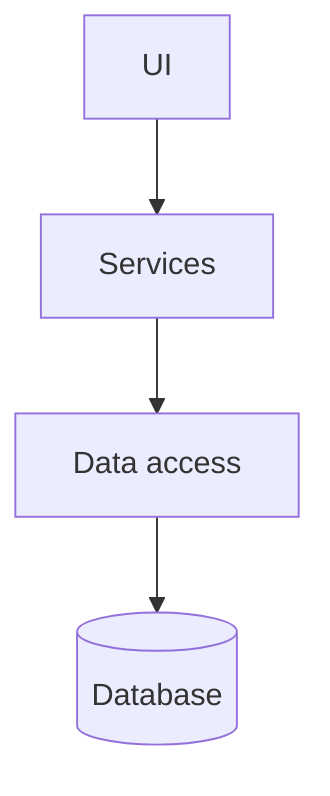
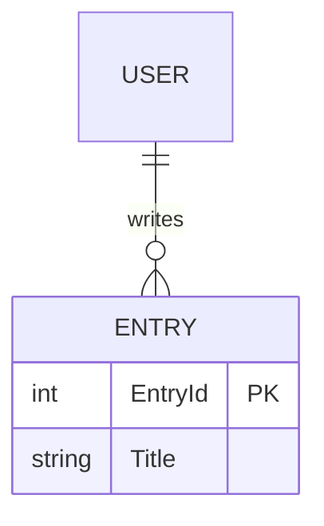

<!-- tf-schema
doc: architecture
file: docs/{App}-Architecture.md
header: App, Kind, Size, Stack answer set, Date
section: Stack decisions | required
section: Solution structure | required
section: Component map | required
section: Data model | required
section: Cross-cutting | required
section: Decisions log | required
section: Module responsibilities | optional-small
section: Open questions | optional
budget: S 2500 3500 | M 4000 6000 | L 4000 6000
rule: stack-table
rule: solution-table
rule: request-flow
rule: er-diagram
rule: decisions-log
-->
<!-- Authoring notes (agent only; never visible text).
     Sections and order are fixed by the schema above. The Stack decisions table answers the stack
     questions (.tfcore/templates/stack-questions.md); answers taken from an answer set cite it.
     No Deployment section: hosting is decided after UAT and lives in the Deployment Checklist; how a
     developer runs the app lives in the UsageGuide. Detailed per-screen flows live in the DevGuide.
     A brownfield project describes the code as it is; a planned change is a Decisions log row with
     Status "planned" naming the BRD item that drives it.
     Mermaid: quote every label; never use `end` as a node id. -->

# {App} — Architecture

| | |
|---|---|
| App | {App} |
| Kind | app or library |
| Size | Small, Medium or Large |
| Stack answer set | {name, or "none"} |
| Date | {YYYY-MM-DD} |

## 1. Stack decisions

One row per stack question. "Source" says where the answer came from: the answer set, the owner, or the existing code.

| Q | Topic | Decision | Source |
|---|---|---|---|
| Q1 | Configuration | {…} | {answer set / owner / code} |
| Q2 | Secrets in development | {…} | {…} |
| Q3 | Database | {…} | {…} |
| Q4 | Authentication | {…} | {…} |
| Q5 | Logging | {…} | {…} |
| Q6 | Tests | {…} | {…} |
| Q7 | Layout and naming | {…} | {…} |
| Q8 | User interface | {…} | {…} |
| Q11 | Standing rules | {…} | {…} |

## 2. Solution structure

| Project | Kind | Purpose |
|---|---|---|
| `{App}` | {web app, desktop app, API, …} | {the primary head} |
| `{App}.Core` | class library | {…} |
| `{App}Db` | migrations project | {…} |
| `{App}.Tests` | test project | {…} |

## 3. Component map

**How a request travels** (one typical request, in words; per-screen detail is in the DevGuide):
1. {The page calls …}
2. {The service …}
3. {The data access …}
4. {The result is shown …}

## 4. Data model

| Entity | Key fields | Notes |
|---|---|---|
| {Entity} | {…} | {…} |

## 5. Cross-cutting

- **Identity:** {AppManager API, or the mechanism chosen at Q4}.
- **Configuration:** {…}
- **Logging:** {…}
- **Errors:** {…}

## 6. Decisions log

One row per decision. Every package added to the project has a row saying why.

| Date | Decision | Why | Status |
|---|---|---|---|
| {YYYY-MM-DD} | {…} | {…} | decided, planned, done |

## 7. Module responsibilities

| Module | Responsibility | Depends on |
|---|---|---|
| {…} | {…} | {…} |

## 8. Open questions

- {…}
