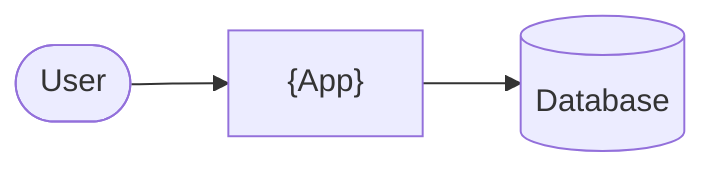

<!-- tf-schema
doc: brd
file: docs/{App}-BRD.md
header: App, Kind, Size, Stack answer set, Status, Date
section: Summary | required | max 200
section: Scope | required
section: Users and roles | required
section: Screens and flow | required
section: Requirements | required
section: Non-functional requirements | required
section: Development status | required
section: Context diagram | optional-small
section: Constraints and assumptions | optional-small
section: Risks | optional-small
section: Glossary | optional
budget: S 6000 8000 | M 10000 15000 | L 10000 15000
rule: brd-ledger
rule: screens-table
rule: mockup-links
-->
<!-- Authoring notes (agent only; never visible text).
     Sections and order are fixed by the schema above; tf-doc-check.sh refuses the document otherwise.
     Word counts exclude code blocks and comments. The budget is met by shorter prose, never by dropping
     a screen, a field or a requirement. BRD ids are append-only and never renumbered.
     Size and requirement cap: Small up to 10 screens, one role, 50 requirements; Medium up to 20 screens,
     100 requirements; Large is split into phases, each phase its own BRD. Every routed page is a screen;
     dialogs, tabs and panels are regions of their page and are listed under it.
     Mermaid: quote every label (A["Order (v2)"]); never use `end` as a node id. -->

# {App} — Business Requirements

| | |
|---|---|
| App | {App} |
| Kind | app or library |
| Size | Small, Medium or Large |
| Stack answer set | {name of the answer set, or "none"} |
| Status | Draft, Approved |
| Date | {YYYY-MM-DD} |

## 1. Summary

{What it is, for whom, why it exists. At most 200 words.}

## 2. Scope

**In:**
- {…}

**Out:**
- {…}

## 3. Users and roles

| Role | Who they are | What they need |
|---|---|---|
| {Role} | {…} | {…} |

## 4. Screens and flow

One row per routed page. A dialog is a row under its parent screen with `on /route` in the Route column; it is not counted as a screen.

| Screen | Route | Role | Mockup | Fields |
|---|---|---|---|---|
| {Screen name} | `/route` | {Role} | [mockup](mockups/{screen-slug}.html) | {field, field, field} |
| {Dialog name} (dialog) | on `/route` | {Role} | [mockup](mockups/{screen-slug}.html) | {field, field} |

**Primary journey:**
1. {The user opens … and …}
2. {…}

## 5. Requirements

One item per thing the verifier will test. Each names its screen, links the mockup, and states its acceptance in the form the checklist will carry.

- **BRD-1** — {Title}. *Screen:* {Screen name} · *Mockup:* [mockup](mockups/{screen-slug}.html)
  - *Acceptance:* When {actor} {does what} on {screen}, then {a result a browser robot can observe}.
- **BRD-2** — {Title}. *Screen:* {Screen name} · *Mockup:* [mockup](mockups/{screen-slug}.html)
  - *Acceptance:* When …, then ….

## 6. Non-functional requirements

| Id | Area | Requirement | Measure |
|---|---|---|---|
| BRD-{N} | Performance | {…} | perf-budget: p95 load <= 2000ms @ concurrency 1 |
| BRD-{N} | Security | {…} | {…} |
| BRD-{N} | Logging | {from the Stack answer set} | {…} |

The `perf-budget:` measure is machine-read by the verifier, in exactly this form: `perf-budget: <p50|p95|max> <ttfb|load> <= <N>ms [@ concurrency <N>]`. Write one only where the owner stated a number.

## 7. Development status

Written by the status gate after every build, verify and handoff; not by hand.

**Snapshot as of {YYYY-MM-DD}.** Live per-requirement status: `PROJECT-STATUS.md` and the Requirements Status table in `docs/{App}-Checklist.md`.

| Screen | Requirements | Verified | Open | Status |
|---|---|---|---|---|
| {Screen} | {n} | {n} | {n} | Planned, In progress, Partial, Done |

## 8. Context diagram

## 9. Constraints and assumptions

- {…}

## 10. Risks

| Risk | Likelihood | Impact | Mitigation |
|---|---|---|---|
| {…} | {…} | {…} | {…} |

## 11. Glossary

- {Term} — {meaning}
