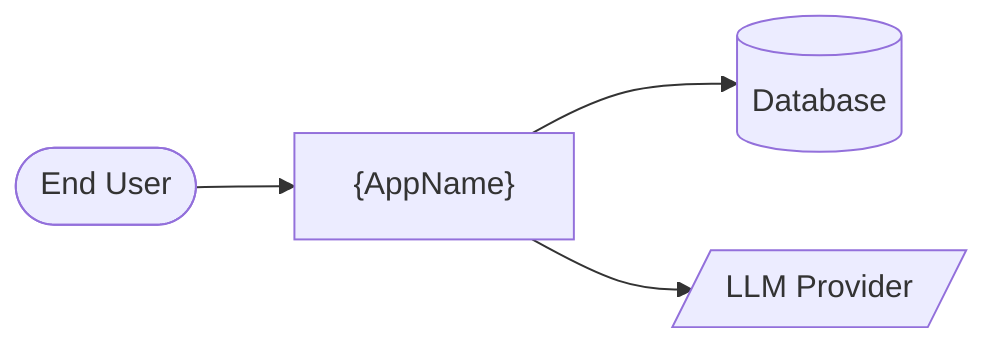
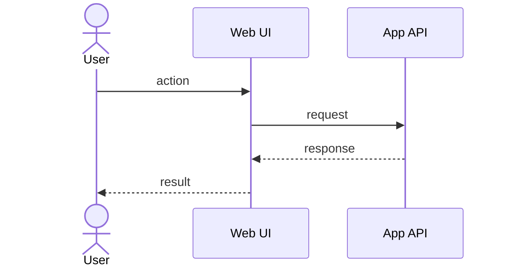
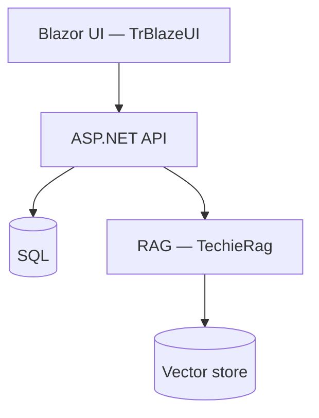
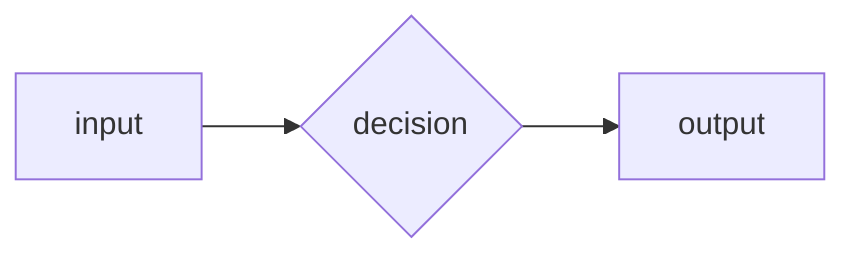

# {AppName} — Business Requirements

> Stable IDs: every requirement has a BRD-{N} ID. IDs are append-only across revisions.

> **Depth mandate — read before drafting.** This is a HUMAN document, read as rendered HTML by the product owner. It is NOT the coding checklist (that's the UI-Checklist / split-brd output). One-line entries belong ONLY in §10's requirements ledger. Every other section is full prose, tables, and Mermaid diagrams. §9 Feature catalog is the heart of the document — one detailed subsection per feature, with screens, workflows, and a diagram wherever the flow is non-trivial. When harvesting existing source docs, this document must be an information-preserving SUPERSET of their requirements content: carry their tables, matrices, screen inventories, and menus forward (updated, not summarized away). If a reader of the old doc would miss something in this one, the draft is wrong.

> **Mermaid mandate.** Every diagram MUST follow the authoring rules in `.tfcore/templates/v4custom/html-render-shell.md §5.5` — **quote every node/edge/subgraph label** (`A["Order Service (v2)"]`, not `A[Order Service (v2)]`) and never use `end` as a node id. Unquoted special characters (`(`, `)`, `/`, `&`, `:`, …) in flowchart labels are the #1 cause of "Syntax error" diagrams in the rendered HTML.

## Table of Contents

<!-- Auto-maintained by the analyst/day-1 tasks. Use the slug rule from .tfcore/templates/v4custom/html-render-shell.md §1 so links work in both MD and rendered HTML. Update this list whenever you add/rename a section. List each `### F-…` catalog entry as an H3 sub-entry under Feature catalog. -->

1. [Executive summary](#executive-summary)
2. [Business objectives](#business-objectives)
3. [Scope](#scope)
4. [Development status](#development-status)
5. [Stakeholders / users](#stakeholders-users)
6. [Context diagram](#context-diagram)
7. [User journey — primary use case](#user-journey-primary-use-case)
8. [Component sketch](#component-sketch)
9. [Feature catalog](#feature-catalog)
10. [Functional requirements (BRD ledger)](#functional-requirements-brd-ledger)
11. [Non-functional requirements](#non-functional-requirements)
12. [Constraints & assumptions](#constraints-assumptions)
13. [Success metrics](#success-metrics)
14. [Risks](#risks)
15. [Glossary](#glossary)

## 1. Executive summary
<2-3 paragraphs: what we're building/changing and why it matters.>

## 2. Business objectives
- <measurable objective 1>
- <measurable objective 2>

## 3. Scope
**In scope:** …
**Out of scope (explicit):** …

## 4. Development status

<!-- SNAPSHOT (point-in-time) of what is BUILT vs PENDING, at the feature level — the first thing a
     reader of an existing app wants to know. This is a HUMAN summary, NOT a competing source of truth:
     the LIVE per-requirement status lives in PROJECT-STATUS.md + the UI/Functional checklist
     "Requirements Status" tables. Do NOT duplicate per-REQ status here — one row per feature only.
       • Brownfield: fill from the migrated dev-plan and/or the code scan (what actually compiles/runs).
         Mirror the phase tags used in the checklists.
       • Greenfield: this is the build ROADMAP — every row is "Planned" with its target phase.
     One row per §9 Feature-catalog F-code; group/order by phase. Keep the as-of date honest.
     AUTO-MAINTAINED after day-1: the status gate (every build/verify/handoff phase) and
     *refresh-status re-derive this table from the checklists and re-render the HTML, so it
     tracks reality without manual edits — see _status-update-gate.md item 9. -->

**Snapshot as of {YYYY-MM-DD}.** Live, per-requirement status: see `PROJECT-STATUS.md` and the **Requirements Status** tables in the UI-Checklist / Functional Checklist.

| Feature (F-code) | Phase | Status | % | Notes |
|------------------|-------|--------|---|-------|
| F-{CODE}: {name} | {0 / 1 / 2 … or MVP} | Done | 100 | {what works} |
| F-{CODE}: {name} | {phase} | Partial | {0–100} | {what's done / what's left} |
| F-{CODE}: {name} | {phase} | Planned | 0 | {not started} |

**Legend:** **Done** = shipped & working · **In progress** = actively being built · **Partial** = some sub-features done, others pending · **Planned** = not started. (Maps to the checklist's `Done (pre-existing)` / `In Progress` / `PARTIAL` / `Not Started`.)

## 5. Stakeholders / users
<!-- Full persona detail, not just a 2-row table. For each persona: role mapping (if an external auth/licensing system is involved), responsibilities, key screens, registration/onboarding path. If the app has license tiers / feature gating, include the full license & feature matrix here or as its own H2 (and add it to the TOC). -->
| Role | Needs |
|------|-------|
| End user | … |
| Admin    | … |

## 6. Context diagram

## 7. User journey — primary use case

## 8. Component sketch

## 9. Feature catalog

<!-- THE HUMAN-READABLE HEART OF THE BRD. One `### F-{CODE}: {Name}` subsection per
     feature / capability area. A real app typically has 8–25 entries; depth scales with
     the app, NOT with a template quota. Repeat the skeleton below per feature.
     Per feature include, where applicable:
       - personas + phase/priority
       - 1-2 paragraphs of what/why
       - screens & routes table
       - workflow / processing steps (numbered), inputs → outputs
       - a Mermaid diagram for any multi-step or multi-actor flow (flowchart or
         sequenceDiagram) — generic features (simple CRUD lists) may skip the diagram
       - the BRD-N IDs this feature owns (forward links into §10)
     Every F-code here MUST appear as a row in the §4 Development status table. -->

### F-{CODE}: {Feature name}

**Personas:** <who uses it> · **Phase:** <0/1/2/… or MVP/Later>

<1-2 paragraphs: what this feature does and why it exists.>

| Screen | Route | Description |
|--------|-------|-------------|
| … | `/…` | … |

**Workflow:**
1. <step>
2. <step>

**Requirements:** BRD-x, BRD-y (see §10)

## 10. Functional requirements (BRD ledger)

<!-- The machine-traceable ledger consumed by *split-brd and the coding pipeline.
     One line per discrete capability, `<actor> can <action>` or `system shall <behavior>`.
     Each line names its catalog feature: `(F-CODE)`. The count scales with the app —
     one BRD per capability, NEVER merge capabilities to keep the list short. -->

- **BRD-1** — <one-line requirement> *(F-{CODE})*
- **BRD-2** — <one-line requirement> *(F-{CODE})*

## 11. Non-functional requirements
<!-- Keep the BRD-N IDs, but give each NFR its target table when there are concrete numbers
     (latency, uptime, concurrency, import throughput), as a human reader expects. -->
- **BRD-N** — Performance: …
- **BRD-N+1** — Security: …
- **BRD-N+2** — Accessibility: …

## 12. Constraints & assumptions
- …

## 13. Success metrics
- …

## 14. Risks
| Risk | Likelihood | Impact | Mitigation |

## 15. Glossary
- TrBlazeUI, TechieRag, REQ-UI-*, REQ-FN-*, REQ-RAG-*, REQ-NFR-*

---
Last updated: {YYYY-MM-DD}
Highest BRD ID: BRD-{N}
