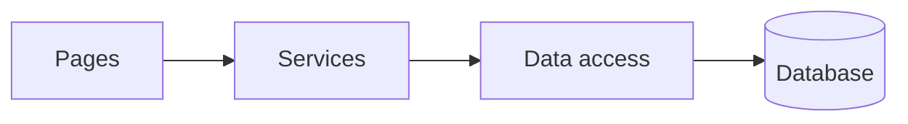

<!-- tf-schema
doc: devguide
file: docs/{App}-DevGuide.md
header: App, Kind, Size, Verified on, Date
section: Architecture cheat-sheet | required | max 300
section: Roles and menu map | app
section: Screen-by-screen code map | required
section: Cross-cutting flows | required
section: Known issues | required
entries: Screen-by-screen code map |
per-entry: 300 450
budget: S 4000 6000 | M 7000 10000 | L 7000 10000
rule: entry-screenshot
rule: entry-call-chain
rule: entry-break-table
-->
<!-- Authoring notes (agent only; never visible text).
     A developer's map from each screen to the code that serves it, written so they can set breakpoints
     and debug it. Documents the code AS BUILT, read at file:line; never inferred from folder names.
     One `###` per screen (per component for a UI library, linked to the sample-app screen that shows it).
     Each entry: the screenshot captured from the running app; one "Call chain:" line, page method to
     service class and method to data-access class and method; a where-to-break table, one row per step:
     file and line, function, the variable to watch, the value it should hold. Line numbers are as of
     "Verified on"; the function name is what to search for when a line has moved.
     Produced when the build completes the checklist; refreshed at handoff. -->

# {App} — Developer Guide

| | |
|---|---|
| App | {App} |
| Kind | app or library |
| Size | Small, Medium or Large |
| Verified on | {YYYY-MM-DD, the run the screenshots and line numbers come from} |
| Date | {YYYY-MM-DD} |

## Architecture cheat-sheet

| Layer | Project or folder | What lives here |
|---|---|---|
| UI | `src/{App}/Pages` | {…} |
| Services | `src/{App}.Core/Services` | {…} |
| Data access | `src/{App}.Core/Data` | {…} |

## Roles and menu map

| Role | Test user | Menu items and the screen each opens |
|---|---|---|
| {Role} | {user #} | {Menu → screen (`/route`)} |

## Screen-by-screen code map

### {Screen name} (`/route`)

**Call chain:** `{Page}.razor.cs:{HandleX}` → `{Service}.{Method}` → `{DataAccess}.{Method}` → `{table or procedure}`

| File and line | Function | Watch | Expected value |
|---|---|---|---|
| `src/{App}/Pages/{Page}.razor.cs:127` | `HandleX` | `aModel.Email` | the email typed in the box |
| `src/{App}.Core/Services/{Service}.cs:54` | `{Method}` | `vResult` | {…} |
| `src/{App}.Core/Data/{DataAccess}.cs:31` | `{Method}` | `vRows.Count` | {…} |

**Calculations on this screen:** {method name and what it computes, or "none"}

## Cross-cutting flows

### Sign-in
**Call chain:** {…}

| File and line | Function | Watch | Expected value |
|---|---|---|---|
| {…} | {…} | {…} | {…} |

### Configuration, logging, errors
{One line each: where it is wired, file and line.}

## Known issues

- {one line each, with the REQ or feedback id}
