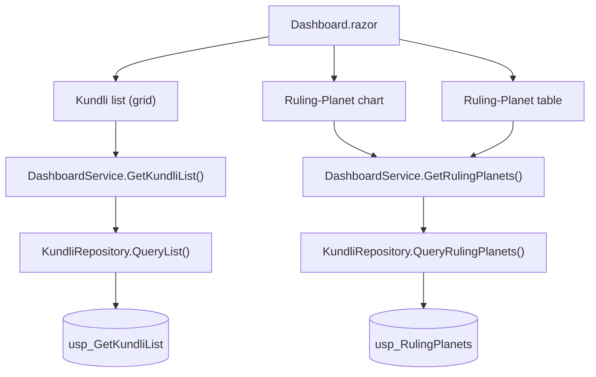

# {AppName} — Developer Guide (Screen-by-Screen Code Map)

> {Verification-status banner — REQUIRED, set by the OBSERVE pass (devguide §5a). One of:}
> ✅ **Runtime-verified {YYYY-MM-DD}** — exercised as: {roles}. Control render-status **and per-screen visual-status** below are **observed** (data renders + screen looks right), not inferred. Per-screen screenshots in `docs/screenshots/{AppName}/`.
> ⚠ **STATIC-ONLY ({YYYY-MM-DD})** — built from code reading; **NOT yet runtime-verified**. Render/visual status is unconfirmed and no screenshots were captured until `*verify` runs against the running app.

> **Purpose — this is the document a HUMAN developer uses to trace any screen, control, or number on the page all the way down to the database, so they can find and fix a bug, or verify that AI-generated code is actually correct.** The BRD explains *what* the app does; the Architecture explains *how the system is shaped*; the database design explains *the data*. **None of those tell a developer "the dashboard's Ruling-Planet chart comes from `DashboardService.GetRulingPlanets()` → `KundliRepository.QueryRulingPlanets()` → `usp_RulingPlanets`."** This guide does exactly that, per user role, per screen, down to the stored procedure or query.
>
> It documents the **AS-BUILT code**, not the plan. Regenerate it with `*devguide {AppName}` after meaningful code changes (it is also refreshed automatically at handoff). It is a **human-readable** doc — it is rendered to HTML; it is NOT one of the AI checklists.

> **Depth mandate — read before drafting.** Every screen entry must connect the visible UI to the code that produces it: the Razor page/component (with file path), each meaningful **control** on it, and the full **data lineage** for each control/action — `Razor component → service method → data-access method → stored procedure name / SQL query`. If a value is *calculated*, say where and how. "It's handled in the service" is NOT acceptable — name the method and the file. A developer who has never seen the code must be able to open this guide, find the screen, and know exactly which files to open to fix a bug.
>
> **Two rules that keep this guide TRUE (not hallucinated):**
> - **Landing-truth** — a screen's "Reached via" / where a role lands after login MUST be read from the routing/redirect code (the `NavigateTo(...)` after login, the default `@page "/"`, the auth redirect) and cite `file:line`. NEVER infer it from the folder a page lives in or its name (e.g. don't assume an Admin lands on an Admin Dashboard just because the page is under `Admin/`).
> - **Render-truth** — confirm the data actually **reaches and renders** in each control, not merely that a method/proc exists. Check the `@if` guards, whether the query's columns map to the model (case/underscore), computed getters that can throw/blank, and required component parameters that must be declared (e.g. a grid's `Pagination`). Tag each control **renders** / **renders-empty (suspected defect — why)** / **{unresolved — TODO}**; a suspected defect is also logged to the checklist.

## Table of Contents

1. [How to use this guide](#how-to-use-this-guide)
2. [Architecture cheat-sheet](#architecture-cheat-sheet)
3. [Roles and menu map](#roles-and-menu-map)
4. [Screen-by-screen code map](#screen-by-screen-code-map)
5. [Cross-cutting flows](#cross-cutting-flows)
6. [How to fix a bug with this guide](#how-to-fix-a-bug-with-this-guide)

---

## How to use this guide

- **Find your screen** in §4, grouped by user role. Each screen tells you the route, the Razor file, every control, and where each control's data comes from.
- **Chasing a wrong number / missing data?** Find the control in that screen's *Data lineage* table → it names the service method → the data-access method → the stored proc / query. Open those files in order.
- **Verifying AI-generated code?** Compare what this guide claims against the actual files. If a row says `usp_GetDashboardKpis` but the service actually calls inline SQL, the guide (or the code) is wrong — that mismatch is exactly the kind of hallucination this guide is meant to catch.
- **For a large app (many roles / screens)** this guide is split into one file per role, kept together in the `docs/devguides/` subfolder (so they don't clutter `docs/`) — see the [index](#roles-and-menu-map). Open only the role file you need.
- **Library variant (a library is documented by its PUBLIC SURFACE, not its sample app's screens — `devguide.md §0`).** Replace "Roles and menu map" with a **catalog by category/module**, and each item block documents **Purpose · Public API surface** (the consumer's contract, read at file:line) **· Internal flow** (file:line) **· Demo & usage** (the `demos/`/`samples/` page or sample code + screenshot where it has UI + a copy-paste snippet) **· Known issues**. The unit depends on what the package ships:
  - **UI-component library** (e.g. TrBlazeUI) → **component-by-component**; API surface = every `[Parameter]`/`EventCallback`/`@typeparam`; categories = Inputs / Layout / Overlays / Data display / Feedback / Icons; snippet = `<Component … />`.
  - **Service/SDK library** (e.g. TechieRag) → **service/API-by-service**; API surface = the `AddXxx(...)` DI registration + options + facade/interface method signatures; modules = e.g. Ingestion / Embedding / Query-RAG / LLM / Resilience+Token / Admin; snippet = `services.AddXxx(...)` + an `IFacade` call.

  The "find your screen / chase a wrong number" guidance above reads as "find your component/service / chase a broken parameter or method". Any public item the sample app does **not** exercise is marked **`⚠ no demo coverage`** (a sample gap logged to the checklist) — the sample app is part of the library's deliverable, not just a backdrop.

## Architecture cheat-sheet

Brief — just enough to navigate the code. (Full detail lives in `docs/{AppName}-Architecture.md`.)

| Layer | Project / folder | What lives here | Example types |
|-------|------------------|-----------------|---------------|
| UI (Blazor) | `src/{AppName}.Web` | Razor pages/components, layouts, nav menu | `Pages/`, `Components/`, `Shared/NavMenu.razor` |
| App services | `src/{AppName}.Application` (or `.Services`) | Business logic, orchestration | `DashboardService`, `KundliService` |
| Data access | `src/{AppName}.Infrastructure` (or `.Data`) | Repositories, DbContext, Dapper queries | `KundliRepository`, `AppDbContext` |
| Database | `database/` / `src/{AppName}.Db` | Tables, stored procs, seed scripts | `usp_*.sql`, migrations |

- **Stored-proc vs ORM vs inline SQL:** {state the project's convention — e.g. "reads go through stored procs `usp_*`; writes via EF Core SaveChanges" — fill from the actual code}.
- **How a Razor component gets its data:** {e.g. "components inject a `*Service`; services inject a `*Repository`; repositories call `usp_*` via Dapper" — fill from the actual code}.

## Roles and menu map

The app has these user roles (from `docs/{AppName}-UsageGuide.md` test-users + the authorization policies in code). For a **split** guide, this index and every role file live together in `docs/devguides/`, and each role links to its own file (relative `./{AppName}-DevGuide-{Role}.md`).

| Role | Test user (see UsageGuide) | Authorization (policy / role claim in code) | Menus this role sees | Detail file |
|------|----------------------------|----------------------------------------------|----------------------|-------------|
| {App Admin} | {admin@…} | {`[Authorize(Roles="Admin")]` / policy name} | {Dashboard, Users, Settings, …} | [{App}-DevGuide-AppAdmin.md](./{AppName}-DevGuide-AppAdmin.md) |
| {App Manager} | {manager@…} | {…} | {Dashboard, Reports, …} | [{App}-DevGuide-AppManager.md](./{AppName}-DevGuide-AppManager.md) |
| {End user} | {user1@…} | {…} | {Home, Profile, …} | [{App}-DevGuide-EndUser.md](./{AppName}-DevGuide-EndUser.md) |

For each role, list the **menu → menu-item → screen** mapping so a developer knows, for a given role, what appears and what each item opens:

### {Role} — menu structure
- **{Menu group}** → **{Menu item}** → opens `{Route}` (`{RazorFile}`) — see [§4 {Role} · {Screen}](#role--screen)
- ...

## Screen-by-screen code map

One subsection per screen, grouped by role, in navigation order. **In a split guide, the per-role file carries only that role's screens.** Repeat the block below for every screen.

---

### {Role} · {Screen / Page name}

- **Route:** `{@page "/dashboard"}`
- **Razor file:** `src/{AppName}.Web/Pages/Dashboard.razor` (+ code-behind `Dashboard.razor.cs` if present)
- **Reached via:** {Menu group → menu item}; **Log in as:** {test user from UsageGuide}
- **What this screen does:** {one or two lines}
- **Visual status:** {✅ looks-right (runtime-confirmed {date}) | ⚠ visual-broken (DEFECT — {what} @ {width}, {date}) | static-only (unconfirmed)}

**Screenshot** — the real rendered screen (captured by the OBSERVE pass, devguide §5a). Review this for layout/overlap issues.

<!-- Path is relative to where this guide lives: `screenshots/...` from docs/, `../screenshots/...` from docs/devguides/. STATIC-ONLY guides omit the image (no shot captured). -->

**Screen flowchart** — show every meaningful control on the screen and where its data comes from. (Follow the Mermaid authoring rules in `.tfcore/templates/v4custom/html-render-shell.md §5.5` — quote every label, never use `end` as a node id.)

**Controls on this screen**

| Control | Type | Purpose | Populated / calculated by |
|---------|------|---------|---------------------------|
| {Kundli list} | {grid} | {lists kundlis for the tenant} | {`DashboardService.GetKundliList()`} |
| {Ruling-Planet chart} | {chart} | {shows current ruling planets} | {`DashboardService.GetRulingPlanets()` — values computed in `RulingPlanetCalculator`} |

**Data lineage** — the full path for each control/action. This is the heart of the guide.

| Control / Action | Razor component (file) | Service method (file) | Data-access method (file) | Stored proc / Query | Notes / calculation |
|------------------|------------------------|-----------------------|---------------------------|---------------------|---------------------|
| {Load Kundli list} | {`Dashboard.razor` line ~40} | {`DashboardService.GetKundliList()`} | {`KundliRepository.QueryList()`} | {`usp_GetKundliList`} | {paged; tenant-filtered} |
| {Ruling-Planet chart} | {`Dashboard.razor` `<RulingPlanetChart>`} | {`DashboardService.GetRulingPlanets()`} | {`KundliRepository.QueryRulingPlanets()`} | {`usp_RulingPlanets`} | {planet strengths computed in `RulingPlanetCalculator.Compute()` from the proc rows} |
| {Save / submit action} | {…} | {…} | {…} | {…} | {…} |

**Business rules / calculations on this screen**
- {Any non-trivial computation, validation, or derived value — name the method that does it.}

**Known issues / gotchas**
- {Anything fragile, any TR-NNN library gap, any `Blocked` REQ touching this screen.}

_(Repeat the `### {Role} · {Screen}` block for every screen the role can reach.)_

---

## Cross-cutting flows

Flows that span screens or run in the background (auth/login, token refresh, background jobs, notifications, file ingestion). One subsection each with a Mermaid diagram and the same service → data-access → proc lineage. Skip if the app has none.

## How to fix a bug with this guide

1. Reproduce the bug and note **which screen** and **which control** shows it.
2. Open §4, find that role + screen, find the control in the **Data lineage** table.
3. Walk the lineage **top-down**: Razor component → service method → data-access method → stored proc/query. The bug is in one of those four.
4. If the visible value is *calculated*, the lineage row names the calculator method — check it.
5. After fixing, re-run the screen's walkthrough in `docs/{AppName}-UsageGuide.md`, then re-generate this guide (`*devguide {AppName}`) if the code path changed.

---
_Generated/refreshed by `*devguide {AppName}`. Reflects the code as built at the time shown in the subtitle — regenerate after code changes._
