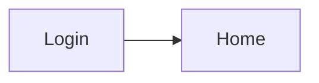

<!-- tf-schema
doc: uidesign
file: docs/{App}-UIDesign.md
header: App, Kind, Size, UI library, Theme
section: Design system | required | max 300
section: Screens | required
section: Click-through flow | optional-small
section: Branding guide | optional
entries: Screens | Screen:
per-entry: 250 400
rule: entry-mockup
rule: entry-regions-table
rule: entry-fields-table
rule: entry-states
rule: mockup-links
-->
<!-- Authoring notes (agent only; never visible text).
     One `### Screen: Name (/route)` per routed page, in navigation order. The mockup shows the layout;
     the entry lists what the mockup cannot say: regions to controls, fields with validation, the dialogs
     the screen opens, and the empty, loading and error states. Do not describe in prose what the mockup
     already shows. Use only controls that exist in the UI library's catalogue; a missing control goes
     to the library feedback file, not into a workaround. The set of screens must equal the BRD's
     Screens and flow table. For a library, this document is optional. -->

# {App} — UI Design

| | |
|---|---|
| App | {App} |
| Kind | app or library |
| Size | Small, Medium or Large |
| UI library | {library and version} |
| Theme | {light, dark, both} |

## Design system

- **Layout shell:** {top nav, sidebar, both; the layout components used}
- **Theme:** {…}
- **Shared controls:** {the controls every screen uses}
- **Rules:** {spacing, density, responsive breakpoints in one line each}

## Screens

### Screen: {Name} (`/route`)

**Mockup:** [mockups/{screen-slug}.html](mockups/{screen-slug}.html) · **Roles:** {who reaches it} · **BRD:** BRD-{N}

| Region | Control | Shows or binds |
|---|---|---|
| {Top nav} | {control} | {…} |
| {Main list} | {control} | {…} |

| Field | Type | Required | Validation |
|---|---|---|---|
| {Title} | text | yes | {1 to 120 characters} |

**Dialogs opened here:** {Dialog name: fields …; or "none"}

**States:** empty: {…} · loading: {…} · error: {…}

## Click-through flow

## Branding guide

{Only when colours or type differ from the library defaults.}
