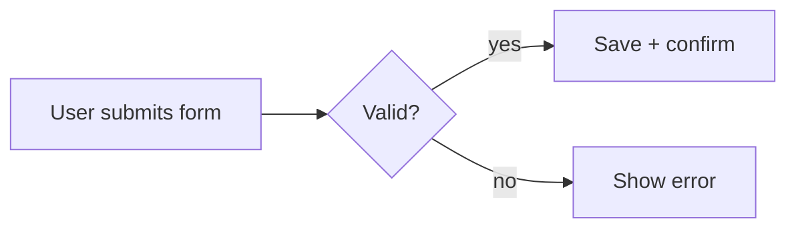

# {AppName} — Usage Guide (Test Users · Test Plan · Setup)

> The single source for **how to test and run** this app. Every agent (flow-master self-smoke, the verifier) **and** the human UAT use the SAME test users and the SAME walkthrough listed here — no one invents throwaway accounts (enforced by `.tfcore/tasks/_smoke-test-policy.md`). Keep the Test-users table current: when an account is actually created, flip its `Created?` to ✅.

## Test users (canonical — use THESE for all smoke / verify / UAT)

One row per account needed to exercise the app. Cover every distinct role/permission level. These are the ONLY accounts smoke/verify/UAT may use.

| # | Username / Email | Password | Role / Permission | Created? | Notes |
|---|------------------|----------|-------------------|----------|-------|
| 1 | {admin@app.test} | {Pass!23} | Admin | ⬜ | {seeded by …  / create on first build} |
| 2 | {user1@app.test} | {Pass!23} | Standard user | ⬜ | {…} |
| 3 | {…}              | {…}       | {role}           | ⬜ | {…} |

- **Created?** — ✅ = the account exists in the database now (verified). ⬜ = planned; create it on first build, but **only after confirming with the owner** (see `_smoke-test-policy.md`). Never auto-create silently.
- **To add or confirm an account:** edit this table — it is the registry the whole pipeline reads from.
- **Seeding:** if the project seeds users via a migration / `database/*-seed-*.sql` / a DbUp step, reference it here so the accounts above are reproducible from a clean DB.

## How to test — screen by screen / menu by menu

One subsection per screen or top-level menu, in navigation order, so a tester (human or agent) can walk the whole app and exercise **every feature**. Each subsection names which test user to log in as.

**Flowchart any complex flow.** When a flow is multi-step, multi-actor, or branches (approval queues, learning/feedback loops, ingestion→processing→review pipelines, auth/token handshakes, payment/consent gates), add a Mermaid `flowchart` (or `sequenceDiagram`) right above that flow's steps so the tester sees the path at a glance. Simple linear CRUD screens don't need one. **Every diagram MUST follow the authoring rules in `.tfcore/templates/v4custom/html-render-shell.md §5.5`** — quote every node/edge/subgraph label, never use `end` as a node id — or it will throw "Syntax error" in the rendered HTML. Example:



### {Screen / Menu name}
- **Log in as:** {user # from the table above}
- **Steps:** 1) {action} → 2) {action} → 3) {action}
- **Expected:** {observable result — what proves the feature works}
- **Covers:** {BRD-N / REQ-* IDs this walkthrough exercises}

_(Repeat one block per screen/menu until every feature in the BRD feature catalog is covered. This is the human UAT script AND the map the verifier/smoke use to decide what to exercise.)_

## Prerequisites
- .NET {N} SDK
- {OtherRuntime — e.g. Node 20 for Playwright, PostgreSQL 16, etc. — one line each, only if actually required}

## Setup / Deployment steps (runbook — one command per line, in order)

Numbered, terse, copy-pasteable. No narrative. Omit any step that doesn't apply (no "N/A" placeholders).

1. `git clone <repo> && cd <repo>`
2. `dotnet restore`
3. {database setup — one line per SQL file in lexicographic order, or a single DbUp `dotnet run --project src/{AppName}.Db` step. Include the test-user seed step if one exists.}
4. `dotnet build`
5. {run the backend — one command, e.g. `dotnet run --project src/{AppName}.Api --urls http://localhost:5100`}
6. {run the frontend — one command, e.g. `dotnet run --project src/{AppName}.Web --urls http://localhost:5099`}
7. Open `http://localhost:5099` in a browser; log in as a Test user from the table above.

## Test (automated)
```bash
dotnet test
```
{Add `npx playwright test` ONLY if the repo has Playwright tests checked in.}

## Smoke checklist (quick capability pass)
- [ ] {one tight line per top-level BRD capability — 5-10 boxes max; each a user action using a Test user above, e.g. "Log in as Admin (user 1), open the dashboard"}

## Known limitations
- {TR-NNN — short title — see docs/{AppName}-TrBlazeUI-Feedback.md (or TR-RAG-NNN → docs/{AppName}-TechieRag-Feedback.md)}
- {`Blocked` (library-gap) REQ-* items from the checklist Status tables, one line each}
