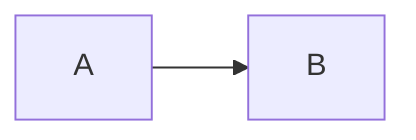

# html-render-shell

**Shared HTML scaffold for every rendered MD → HTML output in this framework.**

Both `render-workflow-docs.md` and `generate-html.md` MUST use the exact CSS, JS, and structural rules below. Single source of truth. If you find yourself hand-rolling a different palette or skipping the scripts, STOP and re-read this file.

This is a **specification + verbatim snippets to inline**. Do NOT load via `<link>` / `<script src=>`. Every rendered HTML is self-contained.

---

## 0. Output contract

Each rendered HTML file is:

- A **single self-contained `.html` file**, no external CSS, no external JS except the two `<script>` tags below (mermaid + svg-pan-zoom from jsdelivr CDN).
- Sibling to the source MD (same filename, `.html` extension).
- **Light + dark theme with a persisted toggle** (§2 + §3 + §7). Default is chosen by **time of day** on first open — light between 07:00 and 19:00 local, softened dark otherwise — then the user's explicit toggle choice (saved in `localStorage` as `tf-theme`) wins on every later visit. Light is a **warm off-white** (never harsh bright white); dark is a softened near-black. Monospace for code/pre, sans for body.
- **Only human-readable docs are ever rendered to HTML** (BRD, Architecture, UsageGuide, DevGuide, PROJECT-STATUS). The **checklists are AI-agent working documents — never render them to HTML** (they are read by agents in markdown; an HTML mirror just wastes tokens and drifts). If you are about to emit a `*-Checklist.html`, STOP — that is banned.
- Working anchor links from any auto-generated or hand-written TOC to its target heading.
- Copy buttons on every **code** `<pre>` — but NOT on `pre.mermaid` (a button injected there corrupts the diagram source mermaid reads → "Syntax error"; mermaid blocks get copy/export from their own diagram toolbar).
- Mermaid toolbar on every rendered diagram.
- Sidebar TOC **only when the document has more than 6 `<h2>` headings**; otherwise full-width main column with no sidebar.

If any of the above is missing, the render is broken — go back and fix.

---

## 1. Heading slug rule (CRITICAL — TOC links break when this differs)

The same slug function MUST produce the `id="..."` on each heading AND the `href="#..."` on every TOC entry. Otherwise the TOC links don't work — which is exactly the bug the user reported.

**Slug algorithm (apply to the raw heading text after stripping markdown):**

1. Lowercase.
2. Strip leading numbering like `1.`, `1.1`, `2.3.4`, ` § `, ` — `, ` - ` if it appears before the first letter (so `## 1. Executive summary` → `executive-summary`, not `1-executive-summary`). Keep numbers that are part of a name (e.g. `## REQ-FN-3 Order pipeline` → `req-fn-3-order-pipeline`).
3. Replace any run of non-alphanumeric characters with a single `-`.
4. Strip leading and trailing `-`.
5. If the resulting slug is empty (heading was all punctuation), fallback to `section-{N}` where N is the 1-based H2/H3 index.
6. Deduplicate: if the same slug occurs twice, suffix the second with `-2`, third with `-3`, etc.

The MD inline TOC and the HTML sidebar TOC use the SAME slug. The heading `id` uses the SAME slug. No exceptions.

---

## 2. CSS (inline at top of `<head>`, verbatim)

```css
/* LIGHT is the default theme — a warm off-white, easy on the eyes (never bright white). */
:root{
  --bg:#f4f1e9; --panel:#efe9db; --panel2:#e7e0cd; --line:#d8cfb6;
  --ink:#2e2a22; --muted:#6f6857; --accent:#2f6f9f; --accent2:#3f7d54;
  --warn:#9a6b15; --danger:#b03a52; --ok:#3f7d54;
  --code-bg:#ece5d3; --code-ink:#332f26; --row-alt:#eae2cf;
  --h3:#3a352b; --h4:#2f6f9f; --quote:#4a4537; --cta-bg:#e6eef5;
  --mono:ui-monospace,SFMono-Regular,Menlo,Consolas,"Liberation Mono",monospace;
  --sans:ui-sans-serif,system-ui,-apple-system,"Segoe UI",Roboto,Helvetica,Arial,sans-serif;
}
/* DARK — softened near-black (warmer / less harsh than pure #0f1115). */
html[data-theme="dark"]{
  --bg:#11141a; --panel:#171b23; --panel2:#1e2430; --line:#2b3240;
  --ink:#dfe3ea; --muted:#99a2b1; --accent:#7cc4ff; --accent2:#a6e3a1;
  --warn:#f9c74f; --danger:#f38ba8; --ok:#a6e3a1;
  --code-bg:#0c1016; --code-ink:#d8dde8; --row-alt:#141821;
  --h3:#cfd5e3; --h4:#7cc4ff; --quote:#cfd5e3; --cta-bg:#0d2030;
}
*{box-sizing:border-box}
html,body{margin:0;padding:0;background:var(--bg);color:var(--ink);font-family:var(--sans);line-height:1.55;font-size:15px}
a{color:var(--accent);text-decoration:none}
a:hover{text-decoration:underline}
code{font-family:var(--mono);font-size:13px;background:var(--code-bg);color:var(--code-ink);padding:1px 5px;border-radius:4px;border:1px solid var(--line)}
pre{font-family:var(--mono);font-size:12.5px;background:var(--code-bg);border:1px solid var(--line);border-radius:8px;padding:12px 14px;overflow:auto;color:var(--code-ink);position:relative}
pre code{background:none;border:none;padding:0}
.copy{position:absolute;top:8px;right:8px;background:var(--panel2);color:var(--muted);border:1px solid var(--line);border-radius:6px;padding:3px 8px;font-size:11px;font-family:var(--sans);cursor:pointer}
.copy:hover{color:var(--accent);border-color:var(--accent)}
/* floating light/dark toggle (top-right) */
.theme-toggle{position:fixed;top:12px;right:14px;z-index:10000;background:var(--panel);color:var(--ink);border:1px solid var(--line);border-radius:8px;padding:6px 12px;font-size:12.5px;font-family:var(--sans);cursor:pointer;box-shadow:0 1px 4px rgba(0,0,0,.15)}
.theme-toggle:hover{color:var(--accent);border-color:var(--accent)}

.layout{display:grid;grid-template-columns:260px 1fr;min-height:100vh}
.layout.no-toc{grid-template-columns:1fr}
nav.side{position:sticky;top:0;height:100vh;overflow-y:auto;border-right:1px solid var(--line);background:var(--panel);padding:18px 14px}
nav.side h1{font-size:14px;margin:0 0 4px;letter-spacing:.5px;color:var(--ink)}
nav.side .sub{font-size:11.5px;color:var(--muted);margin-bottom:14px}
nav.side ol,nav.side ul{list-style:none;padding:0;margin:0}
nav.side li{font-size:13px;margin:2px 0}
nav.side li a{display:block;padding:5px 8px;color:var(--ink);border-radius:6px}
nav.side li a:hover{background:var(--panel2);text-decoration:none}
nav.side li.h3 a{padding-left:22px;font-size:12.5px;color:var(--h3)}
nav.side .group{font-size:11px;color:var(--muted);text-transform:uppercase;letter-spacing:.7px;margin:14px 8px 4px}

main{padding:28px 40px 80px;max-width:1100px}
.layout.no-toc main{margin:0 auto}

h1{font-size:28px;margin:0 0 6px}
h2{font-size:22px;margin:32px 0 10px;padding-bottom:6px;border-bottom:1px solid var(--line);scroll-margin-top:16px}
h3{font-size:17px;margin:22px 0 6px;color:var(--h3);scroll-margin-top:16px}
h4{font-size:14px;margin:14px 0 4px;color:var(--h4);scroll-margin-top:16px}
.subtitle{color:var(--muted);font-size:14px;margin-top:-4px;margin-bottom:18px}
p{margin:6px 0 10px}
blockquote{border-left:3px solid var(--accent);background:var(--panel);margin:8px 0;padding:8px 14px;color:var(--quote)}
ul,ol{padding-left:22px}
li{margin:2px 0}

table{border-collapse:collapse;width:100%;font-size:13.5px;margin:8px 0}
th,td{border:1px solid var(--line);padding:8px 10px;text-align:left;vertical-align:top}
th{background:var(--panel2);color:var(--h3);font-weight:600}
tr:nth-child(even) td{background:var(--row-alt)}

hr{border:none;border-top:1px solid var(--line);margin:24px 0}
.anchor-link{color:var(--muted);font-weight:400;font-size:0.85em;margin-left:8px;opacity:0;transition:opacity .15s;text-decoration:none}
h2:hover .anchor-link,h3:hover .anchor-link,h4:hover .anchor-link{opacity:1}

/* inline TOC at top of main content */
.toc-inline{background:var(--panel);border:1px solid var(--line);border-radius:8px;padding:10px 16px;margin:14px 0 24px}
.toc-inline > div{font-size:11.5px;color:var(--muted);text-transform:uppercase;letter-spacing:.5px;margin-bottom:6px}
.toc-inline ol,.toc-inline ul{margin:4px 0;padding-left:18px}
.toc-inline li{font-size:13px;margin:1px 0}
.toc-inline a{color:var(--h3)}

/* mermaid diagram wrapper + toolbar */
.diagram{position:relative;border:1px solid var(--line);border-radius:8px;background:var(--code-bg);margin:14px 0;overflow:hidden}
.diagram .mermaid{padding:14px;margin:0;background:transparent;border:none;overflow:auto}
.diagram .dt{display:flex;gap:6px;justify-content:flex-end;padding:6px 8px;background:var(--row-alt);border-bottom:1px solid var(--line)}
.diagram .dt button{background:var(--panel2);color:var(--muted);border:1px solid var(--line);border-radius:6px;padding:3px 10px;font-size:12px;font-family:var(--sans);cursor:pointer;min-width:30px}
.diagram .dt button:hover{color:var(--accent);border-color:var(--accent)}
.diagram .dt .zlabel{padding:3px 6px;font-size:11px;color:var(--muted);font-family:var(--mono);align-self:center}
.diagram.fs{position:fixed;inset:0;z-index:9999;border-radius:0;border:none}
.diagram.fs .mermaid{height:calc(100vh - 40px);display:flex;align-items:center;justify-content:center}

@media(max-width:900px){.layout{grid-template-columns:1fr}nav.side{position:static;height:auto}}
```

---

## 3. Page skeleton

```html
<!doctype html>
<html lang="en">
<head>
<meta charset="utf-8">
<meta name="viewport" content="width=device-width,initial-scale=1">
<title>{Document title} — {AppName or short context}</title>
<script>
/* Resolve the theme BEFORE first paint (no flash). Saved choice wins; otherwise
   pick by time of day — light 07:00–19:00 local, softened dark at night. */
(function(){
  try{
    var t = localStorage.getItem('tf-theme');
    if(t!=='light' && t!=='dark'){ var h = new Date().getHours(); t = (h>=7 && h<19) ? 'light' : 'dark'; }
    document.documentElement.setAttribute('data-theme', t);
  }catch(e){ document.documentElement.setAttribute('data-theme','light'); }
})();
</script>
<style>{paste §2 CSS verbatim}</style>
</head>
<body>
<button id="themeToggle" class="theme-toggle" title="Toggle light / dark">☾ Dark</button>
<div class="layout {no-toc if H2-count <= 6}">
  <!-- sidebar TOC: include ONLY when there are MORE THAN 6 H2 headings -->
  <nav class="side">
    <h1>{Document title}</h1>
    <div class="sub">{Short context line — e.g. "Last rendered: 2026-05-27"}</div>
    <div class="group">Contents</div>
    <ol>
      <li><a href="#slug">{H2 text}</a></li>
      <li class="h3"><a href="#slug">{H3 text}</a></li>
      ...
    </ol>
  </nav>
  <main>
    <h1>{Document title}</h1>
    <div class="subtitle">{Subtitle}</div>

    <!-- inline content listing (always present when H2-count >= 2) -->
    <div class="toc-inline">
      <div>Contents</div>
      <ol>
        <li><a href="#slug">{H2 text}</a></li>
        ...
      </ol>
    </div>

    {converted body content — see §4–§6}
  </main>
</div>

<script src="https://cdn.jsdelivr.net/npm/mermaid/dist/mermaid.min.js"></script>
<script src="https://cdn.jsdelivr.net/npm/svg-pan-zoom@3.6.1/dist/svg-pan-zoom.min.js"></script>
<script>{paste §7 JS verbatim}</script>
</body>
</html>
```

Apply the `no-toc` class on `.layout` when the sidebar `<nav class="side">` is omitted (H2 count ≤ 6). When `no-toc`, do not emit the `<nav class="side">` element at all.

---

## 4. Heading conversion (anchor decoration)

Every H2/H3/H4 becomes:

```html
<h2 id="{slug}">{text}<a class="anchor-link" href="#{slug}">#</a></h2>
```

The trailing `<a class="anchor-link">` lets users grab a deep link by hovering.

**Preserve hand-written anchors.** Some source docs place explicit non-heading anchors like `<a id="d-req-ui-001"></a>` directly above a list item, and a table cell links to them with `[view](#d-req-ui-001)`. This is how the Requirements Status table's **Details** column jumps to each REQ's detail entry. Emit every such `<a id="...">` verbatim in the HTML and keep the matching `href="#..."` link intact — do NOT drop them, renumber them, or run them through the heading-slug function. Dropping them silently breaks the Details links (the exact class of bug the user keeps reporting).

---

## 5. Mermaid block conversion

Markdown fence:

````

````

Becomes:

```html
<div class="diagram">
  <div class="dt">
    <button data-zout title="Zoom out">−</button>
    <span class="zlabel">100%</span>
    <button data-zin title="Zoom in">+</button>
    <button data-fit title="Fit to width">Fit</button>
    <button data-one title="Actual size">1:1</button>
    <button data-fs title="Fullscreen">⛶</button>
    <button data-pop title="Open in new tab">↗</button>
  </div>
  <pre class="mermaid">{raw mermaid source verbatim, no escaping}</pre>
</div>
```

The toolbar wires up via the JS in §7.

---

## 5.5 Mermaid authoring rules (write VALID Mermaid — read before drafting ANY diagram)

Mermaid 11.x is **strict**. The single most common bug in this framework's rendered docs is a flowchart that shows *"Syntax error in text — mermaid version 11.x.x"* in the browser. It is almost always **unquoted special characters in a node or edge label**. Sequence diagrams rarely break (simple participant/message text); flowcharts break constantly because real labels contain `()`, `/`, `&`, etc. These rules eliminate the entire class of error. They apply to **whoever authors the `.md`** (analyst/day-1/architect tasks) AND to anyone hand-editing a diagram — not just the renderer.

**Rule 1 — Quote EVERY label.** Wrap all human-readable label text in double quotes, always. Quoting is never wrong, so when in doubt, quote.
- ✅ `A["Order Service (v2)"]`  ❌ `A[Order Service (v2)]`  ← parens break it
- ✅ `B["Azure AD / OAuth2"]`   ❌ `B[Azure AD / OAuth2]`    ← slash breaks it
- ✅ `C["Users & Roles"]`       ❌ `C[Users & Roles]`        ← ampersand breaks it
- These characters break an **unquoted** label: `(` `)` `/` `\` `&` `:` `,` `;` `[` `]` `{` `}` `#` `@` `<` `>` `"` `|` `` ` `` `%`, plus `-` runs and any markdown. Quoting the label makes all of them safe.

**Rule 2 — The quotes go INSIDE the shape brackets.** Combine shape + quoted string:
- Rectangle `N["text"]` · Round `N("text")` · Stadium `N(["text"])` · Cylinder/DB `N[("text")]` · Parallelogram `N[/"text"/]` · Decision `N{"text"}` · Hexagon `N{{"text"}}`.

**Rule 3 — Node IDs are code, not text.** An id is letters/digits only (no spaces, no punctuation) and is never shown. Put ALL human text in the quoted label. Never reuse a reserved word as an id — lowercase **`end`** silently breaks flowcharts; use `End`, `Endpoint`, `fin`. (`subgraph … end` as a block terminator is fine — that's syntax, not a node id.)

**Rule 4 — Line breaks:** use `<br/>` inside the quotes (`A["Line 1<br/>Line 2"]`), never a literal newline. No other HTML/markdown in labels (no `**bold**`, no backticks, no links).

**Rule 5 — subgraphs:** give an id, then a quoted title — `subgraph BE["Backend (.NET 9)"]`. Reference the subgraph elsewhere by its id (`BE`), not its title.

**Rule 6 — Edge labels:** quote them too — `A -->|"yes / no"| B` or `A -- "calls" --> B`.

**Rule 7 — One statement per line.** Never chain with `;`.

**Rule 8 — Sequence diagrams:** quote any participant alias containing spaces/punctuation — `participant A as "App API"`. `Note over A,B: text` and `alt/loop/opt` blocks are fine.

**Self-check before saving:** re-read every diagram; for each `[...]`, `(...)`, `{...}` label, if it contains anything other than letters, digits, and spaces, confirm it is wrapped in `"…"`. The renderer (`generate-html` / `render-workflow-docs`) MUST run this same scan (it is in their checklists) and fix any bare label it finds rather than emitting a diagram it knows will error.

---

## 6. Code block conversion

Every non-mermaid fenced block becomes:

```html
<pre><code class="language-{lang}">{escaped source}</code></pre>
```

The copy button is added by JS at load time (see §7). Do NOT manually inject `<button class="copy">` per block.

Escape `<`, `>`, `&` in the code content. Preserve newlines and whitespace.

---

## 7. JavaScript (inline at end of `<body>`, verbatim)

```javascript
// Light/dark toggle. The initial theme was already applied flash-free by the
// <head> script (saved choice, else time-of-day). Clicking flips it, saves the
// choice, and reloads so Mermaid re-renders in the matching theme.
(function(){
  var btn = document.getElementById('themeToggle');
  if(!btn) return;
  var relabel = function(){
    var dark = document.documentElement.getAttribute('data-theme') === 'dark';
    btn.textContent = dark ? '☀ Light' : '☾ Dark';
  };
  relabel();
  btn.addEventListener('click', function(){
    var next = document.documentElement.getAttribute('data-theme') === 'dark' ? 'light' : 'dark';
    try{ localStorage.setItem('tf-theme', next); }catch(e){}
    location.reload();
  });
})();

// Copy buttons on every code <pre> — but NEVER on a `pre.mermaid`:
// mermaid reads the <pre>'s textContent as the diagram source, so a button
// appended here glues "copy" onto the last line and breaks the parse
// (flowcharts → "Syntax error"; sequence diagrams silently absorb it).
// Mermaid blocks get copy/export from their own .diagram toolbar instead.
document.querySelectorAll('pre:not(.mermaid)').forEach(pre => {
  const btn = document.createElement('button');
  btn.className = 'copy';
  btn.textContent = 'copy';
  btn.addEventListener('click', () => {
    const text = pre.querySelector('code') ? pre.querySelector('code').innerText : pre.innerText;
    navigator.clipboard.writeText(text).then(() => {
      btn.textContent = 'copied';
      setTimeout(() => { btn.textContent = 'copy'; }, 1200);
    });
  });
  pre.appendChild(btn);
});

// Mermaid init — theme follows the resolved light/dark theme
if (window.mermaid) {
  var mermaidTheme = document.documentElement.getAttribute('data-theme') === 'dark' ? 'dark' : 'default';
  mermaid.initialize({ startOnLoad: true, theme: mermaidTheme, securityLevel: 'loose' });
}

// Mermaid toolbar wiring — run after mermaid renders
function wireMermaidToolbars() {
  document.querySelectorAll('.diagram').forEach(dia => {
    if (dia.dataset.wired) return;
    const merm = dia.querySelector('.mermaid');
    const svg = merm && merm.querySelector('svg');
    if (!svg) return;
    dia.dataset.wired = '1';
    let scale = 1;
    const label = dia.querySelector('.zlabel');
    const apply = () => {
      svg.style.transform = `scale(${scale})`;
      svg.style.transformOrigin = 'top left';
      if (label) label.textContent = Math.round(scale * 100) + '%';
    };
    const setScale = (s) => { scale = Math.max(0.25, Math.min(4, s)); apply(); };
    dia.querySelector('[data-zin]').onclick = () => setScale(scale * 1.2);
    dia.querySelector('[data-zout]').onclick = () => setScale(scale / 1.2);
    dia.querySelector('[data-fit]').onclick = () => {
      svg.style.transform = '';
      svg.removeAttribute('width');
      svg.style.maxWidth = '100%';
      svg.style.height = 'auto';
      scale = 1;
      if (label) label.textContent = 'Fit';
    };
    dia.querySelector('[data-one]').onclick = () => {
      svg.style.transform = '';
      svg.style.maxWidth = 'none';
      svg.style.width = '';
      svg.style.height = '';
      scale = 1;
      if (label) label.textContent = '100%';
    };
    dia.querySelector('[data-fs]').onclick = () => {
      dia.classList.toggle('fs');
      if (dia.classList.contains('fs')) {
        document.addEventListener('keydown', escFs);
      } else {
        document.removeEventListener('keydown', escFs);
      }
    };
    function escFs(e) { if (e.key === 'Escape') { dia.classList.remove('fs'); document.removeEventListener('keydown', escFs); } }
    dia.querySelector('[data-pop]').onclick = () => openInNewTab(svg);
    // Ctrl+wheel zoom
    merm.addEventListener('wheel', (e) => {
      if (!e.ctrlKey) return;
      e.preventDefault();
      setScale(scale * (e.deltaY < 0 ? 1.1 : 1/1.1));
    }, { passive: false });
  });
}

function openInNewTab(svg) {
  const svgSource = new XMLSerializer().serializeToString(svg);
  const html = `<!doctype html><html><head><meta charset="utf-8"><title>Diagram</title>
<style>
  html,body{margin:0;height:100%;background:#0f1115;color:#e6e8ee;font-family:system-ui,sans-serif}
  .bar{position:fixed;top:0;left:0;right:0;padding:8px 12px;background:#161a22;border-bottom:1px solid #2a3142;display:flex;gap:8px;z-index:10}
  .bar button{background:#1c2230;color:#9aa3b2;border:1px solid #2a3142;border-radius:6px;padding:5px 12px;font-size:13px;cursor:pointer}
  .bar button:hover{color:#7cc4ff;border-color:#7cc4ff}
  .bar .hint{margin-left:auto;color:#9aa3b2;font-size:11.5px;align-self:center}
  #stage{position:absolute;top:42px;bottom:0;left:0;right:0;overflow:hidden}
  #stage svg{width:100%;height:100%}
</style>
</head><body>
<div class="bar">
  <button onclick="zpz.zoomIn()">+</button>
  <button onclick="zpz.zoomOut()">−</button>
  <button onclick="zpz.fit();zpz.center()">Fit</button>
  <button onclick="zpz.resetZoom();zpz.center()">1:1</button>
  <button onclick="window.print()">Print</button>
  <button onclick="dlPng()">PNG</button>
  <button onclick="dlSvg()">SVG</button>
  <span class="hint">Drag to pan · Ctrl+wheel to zoom · + / − keys</span>
</div>
<div id="stage">${svgSource}</div>
<script src="https://cdn.jsdelivr.net/npm/svg-pan-zoom@3.6.1/dist/svg-pan-zoom.min.js"><\/script>
<script>
  const el = document.querySelector('#stage svg');
  const zpz = svgPanZoom(el, { zoomScaleSensitivity: .3, minZoom: .2, maxZoom: 10, controlIconsEnabled: false, fit: true, center: true });
  document.addEventListener('keydown', e => {
    if (e.key === '+' || e.key === '=') zpz.zoomIn();
    if (e.key === '-' || e.key === '_') zpz.zoomOut();
    if (e.key === '0') { zpz.resetZoom(); zpz.center(); }
  });
  function dlSvg() {
    const blob = new Blob([new XMLSerializer().serializeToString(el)], { type: 'image/svg+xml' });
    const a = document.createElement('a'); a.href = URL.createObjectURL(blob); a.download = 'diagram.svg'; a.click();
  }
  function dlPng() {
    const src = new XMLSerializer().serializeToString(el);
    const img = new Image();
    const url = 'data:image/svg+xml;base64,' + btoa(unescape(encodeURIComponent(src)));
    img.onload = () => {
      const c = document.createElement('canvas');
      c.width = el.clientWidth * 2; c.height = el.clientHeight * 2;
      const ctx = c.getContext('2d'); ctx.scale(2,2); ctx.drawImage(img, 0, 0);
      c.toBlob(b => { const a = document.createElement('a'); a.href = URL.createObjectURL(b); a.download = 'diagram.png'; a.click(); });
    };
    img.src = url;
  }
<\/script>
</body></html>`;
  const w = window.open();
  w.document.write(html);
  w.document.close();
}

// Run wiring after mermaid finishes (it renders async)
if (window.mermaid) {
  setTimeout(wireMermaidToolbars, 400);
  setTimeout(wireMermaidToolbars, 1200);  // safety re-run for slow renders
}
```

---

## 8. Inline (in-document) Table of Contents — applies to BOTH MD and HTML

**In MD source files (templates and generated docs):**

Place this section immediately after the H1 title block (and any leading metadata like `> Stable IDs:` or `**Last updated:**`), before the first H2:

```markdown
## Table of Contents

1. [Section name](#section-slug)
2. [Section name](#section-slug)
   - [Sub-section](#sub-slug)
```

Use the §1 slug rule when writing the links. When you write/update the doc, also update this section so links stay correct.

**In HTML output:**

The inline `<div class="toc-inline">` mirrors the MD Table of Contents. When there are more than 6 H2s, ALSO emit the sidebar `<nav class="side">` with the same slugs. Sidebar is always identical to inline TOC, just styled differently.

---

## 9. Render checklist (use after generating any HTML)

- [ ] CSS palette matches §2 verbatim (themed `:root` light + `html[data-theme="dark"]` overrides; no hardcoded hex colors reintroduced in the body rules)
- [ ] Page skeleton matches §3 — flash-free theme-init `<script>` in `<head>` + the `#themeToggle` button present; §7 JS wires the toggle and Mermaid's theme follows `data-theme`
- [ ] This is a human-readable doc (BRD / Architecture / UsageGuide / DevGuide / PROJECT-STATUS) — NOT a checklist (checklists are never rendered to HTML)
- [ ] Every H2/H3/H4 has `id="{slug}"` matching §1 algorithm
- [ ] Every TOC entry (MD inline AND HTML inline/sidebar) uses the same slug
- [ ] Every mermaid fence is wrapped in `<div class="diagram">` with the §5 toolbar
- [ ] Every mermaid diagram passes the §5.5 self-check — each non-trivial node/edge/subgraph label is double-quoted, no reserved-word (`end`) node ids; bare labels were fixed, not emitted
- [ ] Every non-mermaid code fence is `<pre><code>...</code></pre>` and JS in §7 adds the copy button
- [ ] Mermaid + svg-pan-zoom CDN scripts loaded
- [ ] §7 JS pasted at end of body
- [ ] Sidebar TOC present iff doc has >6 H2 headings
- [ ] File is self-contained (no missing local assets)
