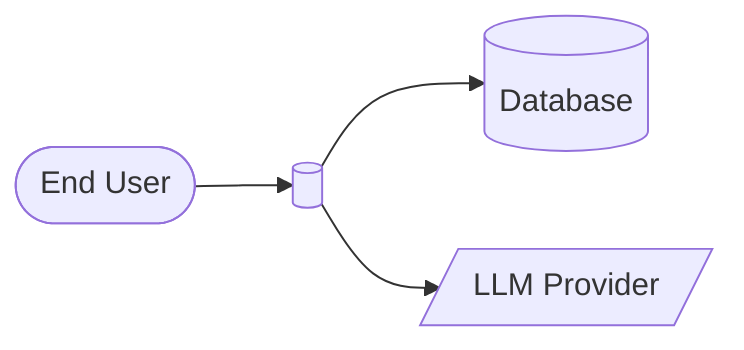
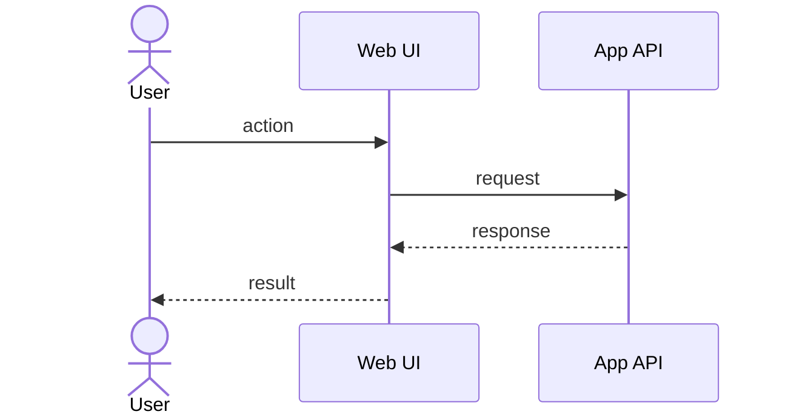
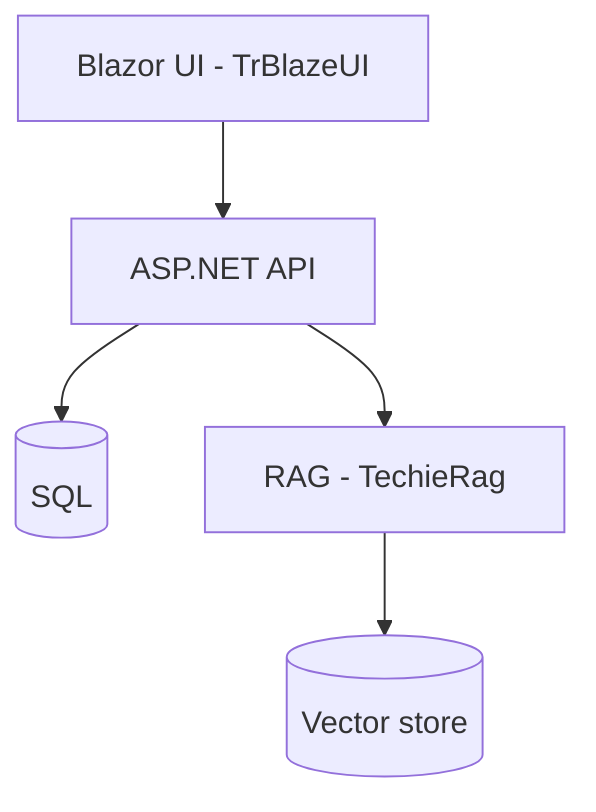
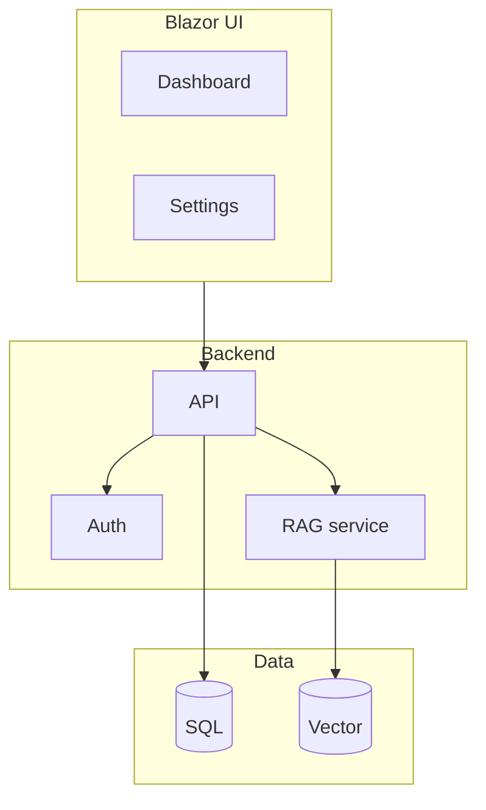
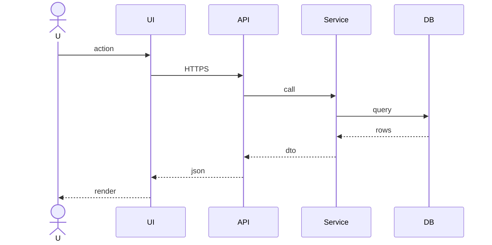
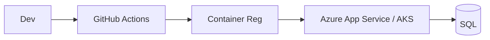
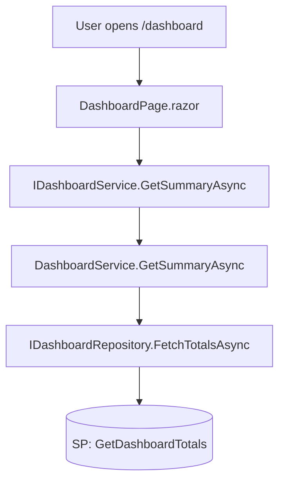

# TechieFlow — Solo-Dev Delivery Framework

> Custom AI-agent delivery workflow for Claude Max + WSL, tuned for a solo developer shipping .NET / Blazor / MAUI apps.
> This is the human-readable companion to `WORKFLOW.html` (open that in a browser for the styled version).
> AI agents working **on** this framework should read `WorkFlow-Context.md` first.

---

## 0. WSL bootstrap — DO ONCE, EVER

**Run this once per WSL distro.** Installs headless-Chromium system libs + the MAUI bridge.

```bash
sudo apt-get update && sudo apt-get install -y \
  libnss3 libatk1.0-0 libatk-bridge2.0-0 libcups2 libdrm2 libxkbcommon0 \
  libxcomposite1 libxdamage1 libxfixes3 libxrandr2 libgbm1 libpango-1.0-0 \
  libcairo2 libasound2 libgtk-3-0 libx11-xcb1

mkdir -p ~/bin && cat > ~/bin/winrun << 'SH'
#!/usr/bin/env bash
WINPATH=$(wslpath -w "$PWD")
powershell.exe -NoProfile -Command "cd '$WINPATH'; $*"
SH
chmod +x ~/bin/winrun
grep -q 'HOME/bin' ~/.bashrc || echo 'export PATH="$HOME/bin:$PATH"' >> ~/.bashrc
```

## 1. Overview & principles

#### Compress, don't expand

No story-by-story TechieFlow. One BRD + one Architecture + one Coding-Standards doc (all human-readable) feed the unified `build-phase` — which reads ONE AI-only doc (the app Checklist) and calls the library agents (`/trblazeui`, `/techierag`) as sub-agents.

#### Verify, don't trust

The `build-phase` self-smokes (data + visual) and then chains `verifier`. Headless Playwright + `dotnet test`, with a data-render gate AND a visual-truth gate. Verdicts written into the checklist's Requirements Status table.

#### Standards enforced from day 1

Every project has `docs/<APP>-Coding-Standards.md`. Every implementation agent prompt references it. `CLAUDE.md` at project root pins it for auto-load.

## 2. Pain points → solutions

#### 1. Agents miss requirements; verify-fix loop is exhausting

#### → `verifier` mandatory + ID-driven; chain in same prompt

#### 2. WSL has no GUI browser; Playwright MCP eats context

#### → Headless Playwright CLI from §0 bootstrap

#### 3. Can't build/run MAUI from WSL

#### → `winrun` WSL→Windows bridge (§9)

#### 4. Hard to scan markdown on cold re-entry

#### → `<APP>-BRD.html` + `<APP>-Architecture.html` + `PROJECT-STATUS.html` with Mermaid (§6 + §11)

#### 5. `npx techieflow install` grabs v6, breaks customizations

#### → `scaffold-brownfield.sh` / `scaffold-greenfield.sh` copy your v4 setup (§3)

#### 6. Claude Code prompts every Bash; `*yolo` doesn't help

#### → Pre-built `.claude/settings.json` (§12)

#### 7. Generated code uses inconsistent style across projects

#### → `<APP>-Coding-Standards.md` per project, referenced in every impl prompt; `CLAUDE.md` pin (§13)

## 3. Scaffolding a new project — copy, don't npm-install

You have a customized v4 setup. `npx techieflow install` would fetch v6 and lose your customizations. Use the scaffold script:

Three scripts: two scaffolders (one per flow) plus an updater for projects scaffolded earlier. All are idempotent (scaffolders use rsync `--ignore-existing` — existing files preserved on re-run; the updater force-refreshes framework files including `.claude/settings.json`, see below).

### Brownfield (existing app) — `scaffold-brownfield.sh`

```bash
cd /path/to/existing-app
/mnt/c/3AIGenCode/TechieFlow/scaffold-brownfield.sh .
```

Adds `.tfcore/`, `.claude/commands/`, `.opencode/command/TechieFlow/`, `WORKFLOW.html`, `opencode.jsonc`, and `.claude/settings.json`. **Does NOT touch** existing `src/`, `tests/`, or other `docs/` contents. Warns (non-blocking) if no `.csproj`/`.sln` found within 4 levels. Refuses if the target directory doesn't exist (use greenfield script for that).

### Greenfield (new app) — `scaffold-greenfield.sh`

```bash
mkdir /path/to/my-new-app && cd /path/to/my-new-app
git init
/mnt/c/3AIGenCode/TechieFlow/scaffold-greenfield.sh .

dotnet new sln -n MyNewApp
dotnet new blazor -n MyNewApp.Web -o src/MyNewApp.Web
dotnet sln add src/MyNewApp.Web
dotnet add src/MyNewApp.Web package TrBlazeUI    # if UI involved
dotnet add src/MyNewApp.Web package TechieRag    # if AI/RAG involved
dotnet build                                      # deploys library agent files
```

Same framework drop as brownfield, plus creates empty `src/`, `tests/playwright/`, `tests/unit/` folders ready for use.

### Updating an already-scaffolded project — `update-framework.sh`

When the reference framework at `/mnt/c/3AIGenCode/TechieFlow/` evolves (new tasks, updated templates, agent fixes), pull those changes into an existing project with the updater. Unlike the scaffolders (`--ignore-existing`: never touch a file that's already there), the updater **force-overwrites framework files** and preserves everything that contains your work product.

```bash
# Preview what would change (recommended first):
/mnt/c/3AIGenCode/TechieFlow/update-framework.sh /path/to/your-app --dry-run

# Apply:
/mnt/c/3AIGenCode/TechieFlow/update-framework.sh /path/to/your-app

# Run from inside the project (defaults to $PWD):
cd /path/to/your-app
/mnt/c/3AIGenCode/TechieFlow/update-framework.sh
```

Note: the script is NOT on your PATH — always invoke it with the full path shown above (a bare `update-framework.sh` gives *"command not found"*). Optional alias: `echo "alias update-framework.sh='/mnt/c/3AIGenCode/TechieFlow/update-framework.sh'" >> ~/.bashrc`.

| Force-overwritten (framework — reference repo wins) | Preserved (your work product — never touched) |
| --- | --- |
| `.tfcore/{tasks,templates,agents,checklists,data,utils,workflows,agent-teams}/` `.claude/commands/TechieFlow/` subtree            `.claude/commands/*.md` top-level commands (generate-html etc.)            `.opencode/command/TechieFlow/` subtree            `WORKFLOW.html` `.claude/settings.json` (refreshed to canonical config by default; old file → `settings.json.bak`; `--keep-permissions` to skip; `settings.local.json` never touched) | `docs/`, `src/`, `tests/` `PROJECT-STATUS.md`, `CLAUDE.md`, `.editorconfig` `.tfcore/core-config.yaml` `opencode.jsonc` `.claude/{trblazeui,techierag}.md` + `.opencode/command/{trblazeui,techierag}.md` (NuGet-deployed) |

## 4. File-naming convention — `<APP>` prefix

Every per-project document filename starts with the application name. Examples from the user's existing projects: `AppManager-Coding-Standards.md`, `AstroLyfe-Coding-Standards.md`. Same convention applies to every doc:

| Pattern | Example for app "AppManager" | Example for app "AstroLyfe" |
| --- | --- | --- |
| `<APP>-BRD.md` / `.html` | `AppManager-BRD.md` | `AstroLyfe-BRD.md` |
| `<APP>-Architecture.md` / `.html` | `AppManager-Architecture.md` | `AstroLyfe-Architecture.md` |
| `<APP>-Coding-Standards.md` | `AppManager-Coding-Standards.md` | `AstroLyfe-Coding-Standards.md` |
| `<APP>-Checklist.md` (ONE per app — all REQ-UI/FN/RAG/NFR-*) | `AppManager-Checklist.md` | `AstroLyfe-Checklist.md` |
| `<APP>-UIDesign.md` (greenfield mockups spec) | `AppManager-UIDesign.md` | `AstroLyfe-UIDesign.md` |
| `<APP>-<Library>-Feedback.md` (one per library) | `AppManager-TrBlazeUI-Feedback.md` | `AstroLyfe-TechieRag-Feedback.md` |
| `<APP>-UsageGuide.md` | `AppManager-UsageGuide.md` | `AstroLyfe-UsageGuide.md` |
| `<APP>-DevGuide.md` (developer code-map) | `AppManager-DevGuide.md` | `AstroLyfe-DevGuide.md` |
| `<APP>-ProductGuide.md` (end-user how-to manual) | `AppManager-ProductGuide.md` | `AstroLyfe-ProductGuide.md` |

Throughout this document, `<APP>` is a placeholder. When you paste a prompt to an agent, substitute it with your actual application name (no spaces; use PascalCase to match the user's two existing samples).

Files that stay generic (not `<APP>`-prefixed):

- `PROJECT-STATUS.md` / `.html` — one per repo, project-name is in its content
- `CLAUDE.md` — Claude Code's auto-loaded session memory; one per repo
- `WORKFLOW.html` — this file; identical across projects

## 5. Project structure

```
your-app/                              ← e.g. AppManager/
├── PROJECT-STATUS.md                  ← /analyst (day 1)
├── PROJECT-STATUS.html                ← /flow-master after each phase
├── CLAUDE.md                          ← /analyst (day 1) — pins coding standards
├── WORKFLOW.html                      ← from scaffold
│
├── .tfcore/                        ← from scaffold (your customized v4)
├── .claude/
│   ├── commands/TechieFlow/...              ← from scaffold
│   ├── settings.json                  ← from scaffold (yolo-except-git)
│   ├── trblazeui.md                   ← from `dotnet build` (TrBlazeUI NuGet)
│   └── techierag.md                   ← from `dotnet build` (TechieRag NuGet)
├── .opencode/command/
│   ├── TechieFlow/...                       ← from scaffold
│   ├── trblazeui.md                   ← from dotnet build
│   └── techierag.md                   ← from dotnet build
├── .trblazeui/TrBlazeUI-AI-Reference.md   ← from dotnet build
├── .techierag/TechieRag-AI-Reference.md   ← from dotnet build
│
├── .editorconfig                      ← /analyst (day 1) — machine-checkable subset of coding standards
│
├── docs/
│   ├── <APP>-BRD.md                ← /analyst — humans + AI
│   ├── <APP>-BRD.html              ← /flow-master renders BRD.md → humans
│   ├── <APP>-Architecture.md       ← /analyst — humans + AI (both flows!)
│   ├── <APP>-Architecture.html     ← /flow-master renders Architecture.md → humans
│   ├── <APP>-Coding-Standards.md   ← /analyst (day 1) — ALL agents follow this
│   ├── <APP>-Checklist.md          ← /analyst (*split-brd) — ONE checklist, all REQ-UI/FN/RAG/NFR-* — AI
│   ├── <APP>-UIDesign.md           ← /analyst (*mockups, greenfield) — per-screen spec + component map — humans
│   ├── <APP>-UIDesign.html         ← rendered for humans
│   ├── mockups/                    ← /analyst (*mockups, greenfield) — rendered *.html screens (TrBlazeUI-styled)
│   ├── screenshots/<APP>/          ← /flow-master (*devguide OBSERVE — any built app) — per-screen *.png (DevGuide + Product Guide source)
│   ├── <APP>-TrBlazeUI-Feedback.md ← agents log TrBlazeUI issues — one file PER library
│   ├── <APP>-TechieRag-Feedback.md ← agents log TechieRag issues — each goes to its team
│   ├── <APP>-UsageGuide.md  ← /flow-master — humans
│   ├── <APP>-UsageGuide.html       ← /flow-master — rendered for humans
│   ├── <APP>-DevGuide.md           ← /flow-master (*devguide) — humans (small app: single doc)
│   ├── <APP>-DevGuide.html         ← /flow-master — rendered for humans
│   ├── devguides/                  ← large app: split per-role DevGuide lives here (index + <APP>-DevGuide-<Role>.md/.html)
│   ├── <APP>-ProductGuide.md       ← /flow-master (*productguide) — END USERS / external (small app: single doc)
│   ├── <APP>-ProductGuide.html     ← /flow-master — rendered for end users
│   └── productguides/              ← large app: split per-role Product Guide lives here (index + <APP>-ProductGuide-<Role>.md/.html)
│
├── tests/{playwright,unit}/  …
└── src/  …
```

## 6. Doc artifacts & audiences

| File | Audience | Format | Created by | Purpose |
| --- | --- | --- | --- | --- |
| `docs/<APP>-BRD.md` | H AI | MD + Mermaid | `/analyst` | Business Requirements — the WHY. |
| `docs/<APP>-BRD.html` | H | Self-contained HTML | `/flow-master` | Browseable BRD for stakeholders / future-you. |
| `docs/<APP>-Architecture.md` | H AI | MD + Mermaid | `/analyst` (both flows) | Brownfield: current architecture + planned deltas. Greenfield: target architecture. |
| `docs/<APP>-Architecture.html` | H | Self-contained HTML | `/flow-master` | Browseable architecture diagrams. |
| `docs/<APP>-Coding-Standards.md` | H AI | Markdown | `/analyst` (day 1) | Every implementation agent follows this. Pinned by CLAUDE.md. |
| `docs/<APP>-Checklist.md` | AI | Markdown w/ `REQ-UI-*`, `REQ-FN-*`, `REQ-RAG-*`, `REQ-NFR-*` | `/analyst` (`*split-brd`) | The ONE checklist — every REQ class in a single Requirements Status table. Input for `*build-phase` (which routes REQ-UI-* to `/trblazeui` and REQ-RAG-* to `/techierag` as sub-agents). Scopes (`*verify ui\|functional\|all`) filter this one table by REQ prefix. Agent-only working doc — never rendered to HTML. |
| `docs/<APP>-UIDesign.md` + `.html` · `docs/mockups/*.html` | H | MD + HTML | `/analyst` (`*mockups`, greenfield) | Per-screen UI Design Spec with a `region → TrBlazeUI control` component map + rendered TrBlazeUI-styled mockups. Approved with the BRD + Architecture before build; what `/trblazeui` builds from; the verifier's visual baseline. |
| `PROJECT-STATUS.md` + `.html` | H AI | MD + HTML | `/analyst` then `/flow-master` | Single source of "where am I". |
| `CLAUDE.md` | AI | Markdown | `/analyst` (day 1) | Auto-loaded by Claude Code; points to coding standards, BRD, Architecture. |
| `.editorconfig` | AI (toolchain) | EditorConfig | `/analyst` (day 1) | Machine-checkable subset of coding standards (file-scoped namespace, async suffix, no-underscore field naming rule). |
| Requirements Status table (inside the one checklist) | AI H | MD table | build agents + `/verifier` | Per-REQ status/%/remarks — single source of truth; REQ ID → PASS/FAIL/Blocked evidence. |
| `docs/<APP>-TrBlazeUI-Feedback.md` `docs/<APP>-TechieRag-Feedback.md` | H | Markdown | All implementing agents | Issues to ship back to each library's team — **one file per library** (separate codebases, separate teams; each file is handed to its owning team, who use this same framework to fix them). |
| `docs/<APP>-UsageGuide.md` + `.html` | H | MD + HTML | `/flow-master` | Final handoff: install, run, test, smoke checklist. |
| `docs/<APP>-DevGuide.md` + `.html` (large apps: split per role into `docs/devguides/<APP>-DevGuide-{Role}.md` + index) | H (developers) | MD + HTML | `/flow-master` (`*devguide`) | Developer reference: every screen → control → service method → stored procedure, grouped by user role. Used to trace bugs and verify AI-generated code. Auto-generated at handoff; re-runnable anytime. See §13.12. |
| `docs/<APP>-ProductGuide.md` + `.html` (large apps: split per role into `docs/productguides/<APP>-ProductGuide-{Role}.md` + index) | H (end users / external) | MD + HTML | `/flow-master` (`*productguide`) | End-user how-to manual: what each screen is for and how to do each task, illustrated with the screenshots captured for the DevGuide. The user-facing sibling of the DevGuide (same screens, different audience). On-demand; `--update` refreshes changed screens; always emits MD + HTML. See §13.13. |
| `.tfcore/TOKEN-GUIDE.md` | H | Markdown | framework (ships with scaffold) | Token-efficiency guide — where AI tokens go and how to keep usage low. See §15. |

## 7. Workflows

1. Re-run the scaffold for this project: `scaffold-brownfield.sh .` or `scaffold-greenfield.sh .`. It includes a force-sync step that copies agent files from `.tfcore/agents/` to `.claude/commands/TechieFlow/agents/` and `.opencode/command/TechieFlow/agents/` (the paths the harnesses actually load).
2. **Restart Claude Code** in this project so it re-scans skills. The slash-command registry only refreshes at startup.

#### Reverse-doc + create all six day-1 deliverables

Produces, in ONE bulk pass (no per-section/per-requirement confirmation): `<APP>-Architecture.md`, `<APP>-BRD.md` (feature catalog + BRD ledger), `<APP>-Coding-Standards.md`, `.editorconfig`, `PROJECT-STATUS.md`, `CLAUDE.md`, the `<APP>-UsageGuide.md`, and — because brownfield already has built code — the screen-by-screen `<APP>-DevGuide.md` (§7.6) — **plus the HTML render of every doc** (no separate render step). Updates `core-config.yaml` with the app-specific doc paths.

`/analyst` `*day1-brownfield TrTools`

Substitute `TrTools` with your app name. Asks at most twice: app name (if omitted) and which existing docs to harvest (`all` = default / a selection / extra paths / drafting instructions). It never asks merge-vs-new: deliverables are always written fresh at canonical names and pre-existing/superseded docs are archived to `docs/OldDocs/`. If a dev/phase plan exists, it's migrated into the one `<APP>-Checklist.md` in the same run (completed phases pre-marked Done — skip step 3 below). **Brownfield-only:** because the repo already has built code, it also generates the screen-by-screen **DevGuide** (§7.6 — the as-built page → control → service → data-access → proc map). The DevGuide's OBSERVE pass boots the app, **captures a screenshot of every screen** to `docs/screenshots/<APP>/`, embeds them, and presents an **owner visual-review gate** ("here is how each screen renders — what needs to change?") — the brownfield counterpart to greenfield mockups. (Commonly `STATIC-ONLY` at day-1 until the stack is up; found defects land in the one checklist.) Greenfield day-1 has no code, so instead it produces UI **mockups** (§7.10). Task: `.tfcore/tasks/day1-brownfield.md`.

#### Review the rendered HTMLs — manual checkpoint (≈15 min)

No command — day-1 already rendered everything. Open `<APP>-BRD.html` (business intent right?), `<APP>-Architecture.html` (matches what you want?), `PROJECT-STATUS.html` (next command correct?), skim Coding Standards. Cheapest catch-mistakes point. Edit the `.md` sources directly for anything wrong, then re-render just those files: `/generate-html @docs/<APP>-BRD.md` (see §13.6).

#### Split BRD into the one Checklist

`/analyst` `*split-brd TrTools`

Every BRD-N maps to one or more REQ-UI-*/REQ-FN-*/REQ-RAG-*/REQ-NFR-* (all in the single `docs/<APP>-Checklist.md`, one Requirements Status table) with back-link to the source BRD. Each `REQ-UI-*` cites the mockup screen it realizes (greenfield). Task: `.tfcore/tasks/split-brd.md`.

**Manual checkpoint:** read the checklist, adjust if needed.

#### Build phase — ONE unified build (chains self-smoke + verifier)

`/flow-master` `*build-phase TrTools`

There is no longer a separate UI / RAG / functional build. `*build-phase` reads the one checklist, clusters ALL open REQs, and fans them out — **calling `/trblazeui` (REQ-UI-*, building from the approved mockups) and `/techierag` (REQ-RAG-*) as sub-agents**, and building REQ-FN-* / REQ-NFR-* itself. It then **self-smokes (data + visual)** and auto-chains `/verifier`. You never invoke `/trblazeui` or `/techierag` directly — flow-master orchestrates them. Task: `.tfcore/tasks/build-phase.md`.

#### Verify loop (until green)

`*build-phase` self-chains `/verifier`, which writes verdicts into the one checklist's Requirements Status table and applies BOTH gates — the **data-render gate** (§4a: every control renders its data) AND the **visual-truth gate** (§4b: no overlap, every control in-viewport and non-zero-size at desktop + mobile, screenshot inspected, diffed against the mockup when one exists). A REQ is `Verified` only if acceptance passes AND data renders AND the screen looks right.

If Vidur reports misses, just re-run `/flow-master *build-phase TrTools` — it detects FIX mode and fans out repair subagents (layout/visual fixes route back to `/trblazeui`). Or re-verify a scope directly with `/TechieFlow:agents:verifier *verify ui|functional|all` (it filters the one table by REQ prefix). Loop until green. `Blocked` (library-gap) items pass through.

In the verify pass Vidur also runs the **standards-compliance grep checks** from `<APP>-Coding-Standards.md` §"Enforcement" — flags any underscore-prefixed field, mis-prefixed parameter/local, or test method with underscores.

#### Handoff: usage doc + dev guide + status + library-feedback consolidation + HTML refresh

`/flow-master` `*handoff-phase TrTools`

Produces UsageGuide doc (test users + test plan + setup), runs `*devguide` (§3a — generates the screen-by-screen Developer Guide documenting the code as-built, capturing a screenshot of every screen), sets PROJECT-STATUS phase to Handoff, re-renders human-facing HTMLs (BRD, Architecture, UIDesign, UsageGuide, DevGuide, PROJECT-STATUS — **not** the checklist), consolidates each per-library feedback file with summary counts. It also points owners at `*productguide <APP>` (§13.13) — the optional end-user how-to manual, built from the same screens + screenshots the DevGuide just captured. Task: `.tfcore/tasks/handoff-phase.md`.

**Manual checkpoint:** 15-min UAT against the smoke checklist. Then hand each `<APP>-<Library>-Feedback.md` to its team / file as GitHub issues (§9.2).

#### Brief + BRD + Architecture + Coding-Standards + CLAUDE.md + PROJECT-STATUS + .editorconfig

`/analyst` `*day1-greenfield MyNewApp`

Asks once for the concept (ANY length — sentence, bullets, half-baked notes) and once for optional harvest paths / drafting instructions, then produces the day-1 artifacts in bulk — including a TARGET architecture with stack defaults (Blazor Server + TrBlazeUI + TechieRag-if-AI + SQLite-for-dev) and the UI **mockups** (`docs/<APP>-UIDesign.md` + `docs/mockups/*.html`, §7.10) — **plus the HTML render of every doc** (no separate render step). Substitute `MyNewApp` with your actual app name. Task: `.tfcore/tasks/day1-greenfield.md`.

#### Review the rendered HTMLs AND the mockups — manual checkpoint (approve before build)

No command — day-1 already rendered everything. Read the BRD/Architecture HTMLs AND open `docs/mockups/*.html` + `docs/<APP>-UIDesign.md`: this is the visual design the UI will be built to match, so flag any screen that's wrong NOW. Edit the `.md` sources, re-render with `/generate-html @docs/file.md`, or run `*mockups <APP> --update`. The BRD + Architecture + mockups are **approved together** before any build.

This is your last cheap chance to redirect before code gets written.

#### Split BRD → Build phase → Verify → Handoff

Identical to brownfield steps 3–6. Same prompts, same one checklist, same unified `*build-phase` (which builds REQ-UI-* from your approved mockups via `/trblazeui`), same data + visual gates, same standards-compliance discipline.

### 7.9 Evolving the day-1 docs (the concept/requirements changed)

A project keeps moving — the greenfield concept is still under discussion, or a requirement shifts mid-development. Don't hand-edit and hope, and don't let the docs drift. Pick by how big the change is:

| Situation | Command | What it does |
|-----------|---------|--------------|
| **Concept/requirements evolved** (add/reword/drop features, new integration, stack tweak) but most docs still right | `*amend-docs <APP> "<what changed>"` (analyst or flow-master) | Surgically amends BRD + Architecture **in place**: appends new `BRD-N` (append-only — modified IDs edited in place, removed struck through, never renumbered), updates the feature catalog + §4 Development-status, ripples new/changed REQs into the checklist (appends rows, flags modified for re-verify — never blindly re-splits), re-renders HTML, runs the status gate. Confirms the change-set once, then bulk-applies. **Preserves unchanged sections — no `OldDocs` archive.** |
| **Pure additions**, confirm each requirement | `*create-brd <APP> <topic>` → `author-brd` (analyst) | Interactive per-item elicitation; appends confirmed `BRD-N`. (`*amend-docs` defers to this for the additive part on request.) |
| **"What's built" refresh** (not requirements) | automatic, or `*refresh-status <APP>` | The status gate re-derives PROJECT-STATUS + BRD §4 at the end of every phase; `*refresh-status` rebuilds on demand (§8a). |
| **Full pivot** (most of the BRD/Architecture now wrong) | re-run `*day1-greenfield` / `*day1-brownfield` | §1.6 collision policy archives the old docs to `docs/OldDocs/` and writes fresh. Wholesale redo only — never for an incremental change. |
| **Hand-edited a `.md`** | `/generate-html @docs/<file>.md` | Re-renders that one doc's HTML. |

Rule of thumb: **amend, don't regenerate.** `*amend-docs` is the default for an evolving project; re-running day-1 is the escape hatch for a true restart. After amending an already-split project with new requirements, run `*split-brd` (or the build phase the report points at) to carry them into the build.

### 7.10 Greenfield UI mockups (`*mockups`)

A greenfield app has no code, so its UI is built freehand from prose — which is exactly why a new app's UI comes out broken (overlapping controls, wrong layout, nothing to verify against). The analyst produces **mockups at day-1** to give the build an approved visual contract and the verifier a baseline to diff against:

`/analyst` `*mockups MyNewApp`

Reads the TrBlazeUI component catalog FIRST (so it designs only with controls that exist), then produces `docs/<APP>-UIDesign.md` — a per-screen spec with a `region → TrBlazeUI control` component map — plus rendered `docs/mockups/*.html` styled to look like TrBlazeUI, one per key screen from the BRD §9 feature catalog. Auto-run inside `*day1-greenfield`; re-runnable with `*mockups <APP> --update` to refresh only changed screens after an `*amend-docs` that added UI. The mockups are approved alongside the BRD + Architecture, are what `/trblazeui` builds from, and are the image the visual-truth gate diffs the live screen against. **Mockups are greenfield only** — a greenfield app has no code to screenshot yet, so its mockups are the pre-build visual contract; brownfield already has built code and instead reviews real screenshots in the DevGuide's OBSERVE pass (§7.6). Note this is about *mockups*, not screenshots: once a greenfield app is built, its DevGuide OBSERVE pass captures real per-screen screenshots exactly like brownfield (§13.12). Task: `.tfcore/tasks/mockups.md`.

### 7.11 Fixing issues you found by running the app (`*fix-issues`)

When the verifier passed but the running UI is still broken — overlapping controls, blank screens, wrong data — there is ONE front door:

`/flow-master` `*fix-issues MyApp ./bugshots`

Drop a folder of **screenshots** (plus an optional `bugs.md` describing what's wrong on each) and flow-master: reads every screenshot (vision), reproduces each issue live with Playwright, triages it (layout / data / logic / RAG), and **fans the fix out to the right builder** — `/trblazeui` for layout, its own subagents for data/logic, `/techierag` for RAG. **You never invoke a builder agent yourself — flow-master calls them as sub-agents.** It then re-smokes (data + visual) and re-verifies the affected REQs, and updates the DevGuide + the one checklist + PROJECT-STATUS. This is the answer to "the verifier passed but the UI is broken — who do I call?". Task: `.tfcore/tasks/fix-issues.md`.

## 8. Resuming a cold project

Two flavours of resume. Pick by asking one question: **do you trust `PROJECT-STATUS.md`?**

If the last session died in the middle of a build or verify — lost internet, model access revoked/changed mid-run, terminal killed, agent crashed — then the mandatory status gate never ran. `PROJECT-STATUS.md` is now *stale or wrong*: it may point at an old "Next command", undercount committed work, or claim a passing build that's since broken. Do NOT trust it. Run the recovery command, which rebuilds PROJECT-STATUS from *ground-truth evidence* (working tree + checklist Requirements Status table + a fresh `dotnet build`) and tells you the exact command to resume with:

`/TechieFlow:agents:flow-master` `*refresh-status <APP>`  —  OpenCode: `/flow-master *refresh-status <APP>`  ·  add `verify` to also re-run the verifier on any REQ whose true state is ambiguous.

It never edits source code — it only reconstructs status. When it finishes, follow its "next command", then drop into the clean flow below. This is the answer to "an experimental model lost access mid-development and I don't know where it left things."

**8b. Clean cold resume** (you came back to a project whose last phase *did* finish and wrote PROJECT-STATUS): trust the file and walk the four steps.

#### Open three HTML files in browser

`PROJECT-STATUS.html` (where am I), `<APP>-BRD.html` (why was I doing this), `<APP>-Architecture.html` (what's the shape). < 5 min.

#### "What changed" check

```bash
cd /path/to/project
git log --oneline -20 && git status
dotnet build
```

#### Re-verify

`/verifier` → *"Re-verify the checklist's Requirements Status table and run standards-compliance greps from docs/<APP>-Coding-Standards.md. Note regressions."*

#### Execute the "Next command" from `PROJECT-STATUS.md`

## 9. Custom library agents — routing rules

`/trblazeui` and `/techierag` are **library agents** — flow-master calls them as **sub-agents** during `*build-phase` and `*fix-issues` (and the analyst calls `/trblazeui` for its component catalog during `*mockups`). You drive the build/fix through flow-master; it routes each REQ cluster to the right builder by its prefix.

| Trigger | Routed (by `*build-phase` / `*fix-issues`) to | Reads (besides <APP>-Coding-Standards.md) |
| --- | --- | --- |
| `REQ-UI-*` — UI work (pages, components, forms, dashboards) | `/trblazeui` (sub-agent) — builds from the mockups | `.trblazeui/TrBlazeUI-AI-Reference.md` + the Checklist + `docs/mockups/*.html` |
| `REQ-RAG-*` — AI/RAG/LLM (embedding, vector store, chat, tools) | `/techierag` (sub-agent) | `.techierag/TechieRag-AI-Reference.md` + the Checklist |
| `REQ-FN-*` / `REQ-NFR-*` — backend / business logic / data / APIs / non-functional | `/flow-master` own subagents | the Checklist + Architecture |
| Reverse-doc, BRD/Architecture/Standards, requirements splitting, mockups | `/analyst` | codebase / brief |
| Verification of any scope (data + visual gates) | `/verifier` | the Checklist + DevGuide + running app + standards grep checks |
| Unified build / fix-issues / HTML renders / status / handoff / consolidation | `/flow-master` | everything |

### 9.1 Adding a new custom library agent

1. Library's NuGet adds an MSBuild target that copies on consumer build: `.<libname>/<LibName>-AI-Reference.md`, `.claude/<libname>.md`, `.opencode/command/<libname>.md`.
2. Agent file's frontmatter: `description`, `mode: primary`, `tools`. Body: load reference doc on activation + REQUIRED READING clause for `docs/<APP>-Coding-Standards.md`.
3. Add routing row to the table above.
4. The new library gets its OWN feedback file — `<APP>-<LibName>-Feedback.md` with its own issue-ID prefix, from the shared template (§13.9). Never share a feedback file between libraries.
5. Update `build-phase`'s cluster-routing (and `fix-issues`'s triage) to route the new ID prefix to the new sub-agent.

### 9.2 Library issue tracking flow

1. Implementing agents log on encounter — into the OWNING library's file (`<APP>-TrBlazeUI-Feedback.md` for TR-NNN, `<APP>-TechieRag-Feedback.md` for TR-RAG-NNN). Clause baked into §7 prompts.
2. Verifier escalates library bugs → `Blocked` status in the checklist's Requirements Status table + entry in that library's feedback file.
3. `/flow-master` consolidates each file separately at handoff: dedupe, severity sort, summary header (splits + archives any legacy combined `<APP>-Library-Feedback.md`).
4. You hand each file to its team — they use this same framework, so the file drops straight into their flow — or file as GitHub issues: `gh issue create --repo your-org/TrBlazeUI --title "…" --body-file …`

## 10. Coding standards — how enforcement actually works

"Every agent follows the standards" is achieved through **three layered mechanisms**. None alone is sufficient; all three together close the gaps.

#### 1. Prompt-level (every session)

Every implementation prompt in §7 starts with "REQUIRED READING: docs/<APP>-Coding-Standards.md". The agent loads it before writing any code. Cross-harness reliable.

#### 2. `CLAUDE.md` auto-load

Claude Code auto-loads `CLAUDE.md` at project root into every session. It says "Always follow docs/<APP>-Coding-Standards.md before any code write." Catches even direct user prompts that forgot the boilerplate.

#### 3. `.editorconfig` + verifier greps

Machine-checkable rules go in `.editorconfig` (Roslyn enforces in the IDE / build). Non-checkable rules (a/v prefixes, test-name underscores) become grep patterns the verifier runs in the verify pass.

The grep patterns belong inside `docs/<APP>-Coding-Standards.md` under an "Enforcement" section. Sample grep block (already in §11.3 template):

```bash
# Forbidden field forms
grep -rE "private(\s+readonly)?\s+\w+\s+_[a-z]" src/    # underscore prefix
# Instance field must start with `obj` (not bare PascalCase, not _underscore)
grep -rE "private(\s+readonly)?\s+\w+\s+(?!obj)[A-Z]\w+\s*[;=]" src/ | grep -v "static\|const"

# Forbidden test-method form
grep -rE "public\s+(async\s+)?Task\s+\w+_\w+\s*\(" tests/

# Parameter without a-prefix (heuristic; grep catches "(string Foo" but not all cases)
grep -rE "\(\s*\w+\s+[A-Z]\w+\s*[,)]" src/
```

## 11. MAUI builds & runs from WSL

```bash
cd /mnt/c/path/to/maui-project
winrun "dotnet build -c Release"
winrun "dotnet test"
winrun "dotnet build -t:Run -f net9.0-windows10.0.19041.0"
```

For verifier on a MAUI app: *"This is a MAUI Windows app. Build/run/test via `winrun`. UI automation: FlaUI or Appium-Windows-driver Windows-side, NOT Playwright. Output evidence the same as Blazor projects."*

## 12. Permissions (yolo-except-git)

The pre-built config **auto-allows** Read/Glob/Grep/Edit/Write/MultiEdit and **all Bash** (bare `"Bash"`) — so create/update/**move** run with zero prompts. **Asks** for **deletes** (`Bash(rm *)`, `Bash(rmdir *)`) and for `Bash(git *)`, `Bash(gh *)`, `Bash(sudo *)`. **Denies** catastrophic `rm -rf` root/home paths. Permission precedence is `deny → ask → allow`, so the delete/git/sudo *ask* rules still fire even though everything is allowed. *(Cross-project tip: to let a session work in another app's folder without per-path prompts, add that root to `permissions.additionalDirectories` in this project's settings.json — keep those machine-specific paths out of any shared template.)*

**Q: Config (canonical version in scaffold-brownfield.sh / scaffold-greenfield.sh)**

```json
{
  "permissions": {
    "defaultMode": "acceptEdits",
    "allow": [
      "Bash",
      "Edit", "Write", "MultiEdit", "NotebookEdit",
      "Read", "Glob", "Grep", "TodoWrite", "WebFetch", "WebSearch", "Task"
    ],
    "ask": [ "Bash(rm *)", "Bash(rmdir *)", "Bash(git *)", "Bash(gh *)", "Bash(sudo *)" ],
    "deny": [ "Bash(rm -rf /)", "Bash(rm -rf /*)", "Bash(rm -rf ~)", "Bash(rm -rf ~/*)" ]
  }
}
```

```bash
/mnt/c/3AIGenCode/TechieFlow/update-framework.sh /path/to/app
```

## 13. Document templates

### 13.1 `docs/<APP>-BRD.md` schema

```markdown
# <APP> — Business Requirements

## 1. Executive summary
<2-3 paragraphs: what we're building/changing and why it matters.>

## 2. Business objectives
- <measurable objective 1>
- <measurable objective 2>

## 3. Scope
**In scope:** …
**Out of scope (explicit):** …

## 4. Stakeholders / users
| Role | Needs |
|------|-------|
| End user | … |
| Admin    | … |

## 5. Context diagram


## 6. User journey — primary use case


## 7. Component sketch


## 8. Functional requirements (high-level)
- F1. …
- F2. …

## 9. Non-functional requirements
- N1. Performance: …
- N2. Security: …
- N3. Accessibility: …

## 10. Constraints & assumptions
- …

## 11. Success metrics
- …

## 12. Risks
| Risk | Likelihood | Impact | Mitigation |

## 13. Glossary
- TrBlazeUI, TechieRag, REQ-UI-*, REQ-FN-*, REQ-RAG-*
```

### 13.2 `docs/<APP>-Architecture.md` schema

```markdown
# <APP> — Architecture

**Last updated:** YYYY-MM-DD
**Status:** Current (brownfield) | Target (greenfield) | Current + planned target (brownfield with structural change)

## 1. Tech stack
| Layer | Choice | Version | Notes |
|-------|--------|---------|-------|
| Runtime | .NET 9 | … | … |
| UI | Blazor [Server/WASM/Auto] + TrBlazeUI | … | … |
| AI/RAG | TechieRag | … | If applicable |
| DB | SQL Server / SQLite / Postgres | … | … |
| Vector store | SqliteVec / PgVector / Qdrant | … | If RAG |
| Auth | … | … | … |

## 2. Component map


## 3. Data flow — primary path


## 4. Module responsibilities
| Module | Responsibility | Depends on |
|--------|----------------|------------|
| `src/<App>.Web` | UI host | Domain, Infra |
| `src/<App>.Domain` | Entities, business rules | (none) |
| `src/<App>.Infrastructure` | EF, external services | Domain |
| `src/<App>.Rag` | TechieRag wiring (if applicable) | Domain |

## 5. Cross-cutting concerns
- Logging — Serilog / ILogger<T>
- Error handling — global middleware; ProblemDetails responses
- Auth — JWT / cookie / Azure AD
- Caching — IMemoryCache / Redis
- Telemetry — OpenTelemetry / Application Insights

## 6. Deployment architecture


## 7. Architectural decisions (ADR-style log)
- **ADR-001 — Blazor Server over WASM.** Reason: …
- **ADR-002 — SqliteVec for dev, PgVector for prod.** Reason: …

## 8. Target architecture (brownfield only — if enhancement changes structure)
```mermaid
flowchart TB
  …diff highlighting new modules / removed boxes…
```
Describe deltas: what's added, what's removed, what's renamed, migration path.

## 9. Open questions / risks
- …
```

### 13.3 `docs/<APP>-Coding-Standards.md` schema

```markdown
# <APP> Coding Standards

**Last Updated:** YYYY-MM-DD
**Status:** Authoritative for all code under `src/` and `tests/`. Conformance enforced via repo-root `.editorconfig` + verifier grep checks in §"Enforcement".

## Database Naming Conventions

### Tables and Columns
- PascalCase: `CustomerOrder` NOT `customer_order`
- Singular: `CustomerOrder` NOT `CustomerOrders`
- **NEVER use underscores** in any DB object name
- FK columns: `{TableName}Id` (e.g., `CustomerId`)
- PK: `{TableName}Id` (e.g., `UserId`)

### Stored Procedures & Functions
- PascalCase verb prefix: `GetCustomerOrders`, `InsertOrder`, `CalculateTotal`
- Action prefixes: Get / Insert / Update / Delete / Calculate

### Indexes & Constraints
- Index: `IX{Table}{Column}` · PK: `Pk{Table}` · FK: `Fk{Table}{Ref}` · Unique: `Uc{Table}{Column}`

## C# Conventions

### Classes & Interfaces
- PascalCase for classes; `I` prefix for interfaces; descriptive names.
- Async methods end with `Async`.

### Fields, Parameters, Locals (project convention)

**NEVER use underscores** anywhere in any identifier.

| Kind | Convention | Example |
|------|-----------|---------|
| **Instance fields** | PER-PROJECT day-1 decision. Default: `obj` prefix + PascalCase tail (no underscores). Some projects (e.g. AstroLyfe) use bare PascalCase, no prefix — THIS project's Coding-Standards.md is authoritative | `private readonly ILogger<X> objLogger;``private readonly HttpClient objHttpClient;``private string objCachedPublicKey;` |
| **Static / `const` fields** | PascalCase, no prefix | `private const string CachePrefix = "…";` |
| **Method parameters** | `a` prefix + PascalCase | `LoginAsync(string aEmail, string aPassword)` |
| **Local variables** | `v` prefix + PascalCase | `var vResponse = await …` |
| **Booleans** | same prefix + `Is`/`Has`/`Can` | `IsAuthenticated`, `vIsValid`, `aHasAccess` |
| **Properties** | PascalCase, no prefix | `public string ConnectionString { get; set; }` |
| **Constants** | PascalCase, no underscores | `MaxRetryCount` NOT `MAX_RETRY_COUNT` |
| **Test methods** | Short PascalCase, no underscores — full scenario in XML `<summary>` | `LoginRejectsBadPassword` not `Login_BadPassword_ReturnsUnauthorized` |

**Rejected forms:**
- `_underscore` field prefixes (Microsoft default style)
- snake_case anywhere
- Hungarian-style type prefixes (`strName`, `intCount`)
- Underscores in test method names

### Controller-action parameters
The `a`-prefix applies uniformly, including `[FromRoute]`/`[FromQuery]`/`[FromBody]`. Parameter name flows through to OpenAPI schema. Body DTO **property** names stay PascalCase no prefix; only the parameter symbol holding the deserialized DTO gets the `a` prefix.

```csharp
[HttpPost("login")]
public async Task<IActionResult> LoginAsync([FromBody] LoginRequest aRequest)
{
    // aRequest.Email — DTO property is PascalCase, no prefix
}
```

### Environment Variables
**PascalCase, no separators.** `AppManagerBaseUrl` NOT `APPMANAGER_BASE_URL` and NOT `AppManager__BaseUrl`. Requires a custom configuration provider that maps PascalCase env vars → `:`-nested config paths. Application code reads via `IConfiguration["Section:Key"]` only — never `Environment.GetEnvironmentVariable(...)`.

### File Structure
```csharp
// 1. Usings
using System;

// 2. File-scoped namespace
namespace <App>.Services.Example;

// 3. Class
public class DatabaseService
{
    // 4. Instance fields — obj prefix (no underscores)
    private readonly ILogger<DatabaseService> objLogger;
    private readonly IConfiguration objConfiguration;

    // 5. Constructor — a-prefix params
    public DatabaseService(ILogger<DatabaseService> aLogger) { objLogger = aLogger; }

    // 6. Properties — no prefix
    public string ConnectionString { get; set; }

    // 7. Methods — async + v-prefix locals
    public async Task<DataTable> GetDataAsync(string aQueryName)
    {
        var vConnString = objLogger /* … */;
        return …;
    }
}
```

### Best Practices
- One class per file. File name matches class.
- File-scoped namespaces. Nullable reference types enabled.
- Methods small (<20 lines). Single responsibility.
- Max 3 nesting levels. Early returns for validation.
- ConfigureAwait(false) in libraries.
- StringBuilder for loop concatenation. Dispose IDisposable. Cache expensive ops.

### XML Documentation (MANDATORY on public members)
```csharp
/// <summary>Brief description.</summary>
/// <remarks>Detailed flow.</remarks>
/// <param name="aQuery">…</param>
/// <returns>…</returns>
/// <exception cref="…">…</exception>
public async Task<DataTable> ExecuteQueryAsync(string aQuery) …
```

### Testing
- Short PascalCase test name, no underscores. Full scenario in `<summary>`.
- Arrange-Act-Assert. One assertion per test where practical.
```csharp
/// <summary>
/// Verifies GetConnectionAsync returns Open state for a valid connection string.
/// </summary>
[Test]
public async Task ConnReturnsOpen() { … }
```

### Security
- Never hardcode credentials. Parameterized queries. Validate all inputs. Log security events.

## Enforcement

### `.editorconfig` (machine-checkable subset — see §11.4 template)
- File-scoped namespaces (`warning`)
- Async-method suffix (`warning`)
- `var` for locals (so `v`-prefix rule applies cleanly)
- Nullable reference types enabled
- No `_` prefix on private fields (`warning` via custom naming rule)

### Verifier grep checks (non-machine-enforceable rules)
The verifier runs these every functional-verify pass; non-zero exit = standards violation logged as a coverage miss.

```bash
# Forbidden underscore-prefix fields
grep -rE "private(\s+readonly)?\s+\w+\s+_[a-z]" src/

# Forbidden test-method underscores
grep -rE "public\s+(async\s+)?Task\s+\w+_\w+\s*\(" tests/

# Field missing obj prefix (must start with `obj`, not bare PascalCase)
grep -rE "private(\s+readonly)?\s+\w+\s+(?!obj)[A-Z]\w+\s*[;=]" src/ \
  | grep -v "static\|const"
```

### Severity
- **Error** — must fix pre-commit (file-scoped namespace, underscore field prefix)
- **Warning** — fix before merge (nullable, async suffix)
- **Info** — consider fixing
```

### 13.4 `.editorconfig` at repo root

```ini
root = true

[*]
indent_style = space
indent_size = 4
end_of_line = lf
charset = utf-8
trim_trailing_whitespace = true
insert_final_newline = true

[*.cs]
# File-scoped namespaces
csharp_style_namespace_declarations = file_scoped:warning

# Async suffix
dotnet_naming_rule.async_methods_end_in_async.severity = warning
dotnet_naming_rule.async_methods_end_in_async.symbols  = async_methods
dotnet_naming_rule.async_methods_end_in_async.style    = end_in_async
dotnet_naming_symbols.async_methods.applicable_kinds = method
dotnet_naming_symbols.async_methods.required_modifiers = async
dotnet_naming_style.end_in_async.required_suffix = Async
dotnet_naming_style.end_in_async.capitalization = pascal_case

# Prefer var
csharp_style_var_for_built_in_types     = true:warning
csharp_style_var_when_type_is_apparent  = true:warning
csharp_style_var_elsewhere              = true:warning

# Forbid _underscore on private fields
dotnet_naming_rule.private_fields_no_underscore.severity = warning
dotnet_naming_rule.private_fields_no_underscore.symbols  = private_fields
dotnet_naming_rule.private_fields_no_underscore.style    = pascal_no_underscore
dotnet_naming_symbols.private_fields.applicable_kinds           = field
dotnet_naming_symbols.private_fields.applicable_accessibilities = private
dotnet_naming_style.pascal_no_underscore.required_prefix =
dotnet_naming_style.pascal_no_underscore.capitalization  = pascal_case

# Nullable reference types
dotnet_diagnostic.CS8600.severity = warning
dotnet_diagnostic.CS8602.severity = warning
dotnet_diagnostic.CS8603.severity = warning

# Suppress StyleCop conflicts (uncomment if StyleCop.Analyzers added)
# dotnet_diagnostic.SA1101.severity = none   # don't require this. qualification
```

### 13.5 `PROJECT-STATUS.md` schema

```markdown
---
project: <APP>
stack: .NET 9 / Blazor [Server|WASM|Auto] / TrBlazeUI / TechieRag / [MAUI]
last_updated: 2026-05-23
current_phase: Discovery | Build | Verify | Handoff | Released
last_verified_build: PASS | FAIL | not-run
last_verified_date: 2026-05-23
---

# <APP> — Status

## Where I am
<one short paragraph — current STATE only (phase, what's built/verified, what's open); NOT a technical to-do list>

## Next command to run
<!-- command-against-checklist ONLY; no prose narrative of the technical work (that lives in the checklist REQ rows) -->
```
/<agent> <exact prompt>
```
<one optional line naming the target checklist or REQ IDs>

## Open requirements
- [ ] REQ-UI-013 — <desc>
- [ ] REQ-FN-007 — <desc>

## Known blockers
- None / <list>

## Verification log
| Date | Phase | Result | Status table |
|------|-------|--------|--------------|
| 2026-05-23 | Verify | 14/14 Verified | docs/<APP>-Checklist.md#requirements-status |

## Library feedback summary
- TrBlazeUI: 1 major, 0 minor — docs/<APP>-TrBlazeUI-Feedback.md
- TechieRag: 0 major, 1 minor — docs/<APP>-TechieRag-Feedback.md

## Standards compliance (last verifier check)
- Underscore fields: 0 hits
- Test method underscores: 0 hits
- Mis-prefixed fields: 0 hits

## Deferred / future
- <parked ideas>
```

### 13.6 HTML rendering — `/generate-html` & friends

**You normally don't run anything:** the day-1 tasks auto-render every human deliverable (BRD, Architecture, UIDesign/mockups, UsageGuide, PROJECT-STATUS) to a sibling `.html` as their final step (§7.5 in the task files). The commands below are for *re-renders after you edit an MD* and for ad-hoc files. (The one `<APP>-Checklist.md` is markdown-only — never rendered.)

**`/generate-html` — render any markdown, no agent needed** (same short form in Claude Code and OpenCode):

```bash
# Single file
/generate-html @docs/AstroLyfe-BRD.md

# Multiple specific files
/generate-html @docs/AstroLyfe-BRD.md @docs/AstroLyfe-Architecture.md @docs/AstroLyfe-UIDesign.md

# All .md files in a folder — TOP-LEVEL ONLY, non-recursive (docs/OldDocs/ untouched)
/generate-html @docs/

# Forgot to render something during a phase? Run it now:
/generate-html @ImplDocs/FinOpsDocs/
```

- Output: sibling `.html` next to each source (`docs/X.md` → `docs/X.html`), overwritten if present.
- Missing paths are skipped with a note; the task halts only if *zero* paths resolve.
- Fallback if the short form doesn't resolve (session not restarted since framework update): `/TechieFlow:tasks:generate-html` (Claude Code) / `/techieflow:tasks:generate-html` (OpenCode), or `*generate-html` inside `/TechieFlow:agents:flow-master`.

**`*render-workflow-docs <APP>`** (on `/TechieFlow:agents:flow-master`) — re-renders just the canonical trio: BRD + Architecture + PROJECT-STATUS with the big "NEXT COMMAND TO RUN" call-to-action box. If multiple BRD/Architecture variants exist (legacy pre-OldDocs projects), it asks which one to render.

**Which docs get HTML?** Only human-readable deliverables: BRD, Architecture, UIDesign (mockups spec), UsageGuide, DevGuide, ProductGuide, PROJECT-STATUS. The one `<APP>-Checklist.md` is an AI-agent working document and is **never rendered to HTML** — rendering it burns tokens and lets the HTML drift from the markdown source. This rule is enforced in day-1-greenfield, day-1-brownfield, mockups, split-brd, build-phase, verify-phase, handoff-phase, refresh-status, amend-docs, the status-update-gate, generate-html, and render-workflow-docs.

**`PROJECT-STATUS.html` is re-rendered on every status update.** Updating PROJECT-STATUS always means *both* the `.md` and the `.html` — the status-update-gate (run at the end of every build/verify/handoff phase) re-renders `PROJECT-STATUS.html` in the same turn it edits the markdown, because the owner reads the HTML page. A status update that touches only the markdown is treated as **incomplete**. (Likewise, the "Next command to run" section is a command-against-checklist pointer, not a paragraph describing the technical work to do next — that *what* lives in the checklist REQ rows.)

**What every rendered page contains** (single source of truth: `.tfcore/templates/v4custom/html-render-shell.md` — agents must use it, never hand-roll):

- Self-contained single file; only CDN deps are mermaid + svg-pan-zoom.
- **Light/dark theme toggle** — floating top-right button. Default is set by time of day on first open (light 07:00–19:00 local, softened dark at night); the user's explicit choice is then remembered in `localStorage`. Light mode uses a warm off-white background (not bright white); dark is softened.
- **Copy button** on every code/command block.
- **Mermaid toolbar** per diagram: − / + zoom (also Ctrl+wheel), Fit, 1:1, ⛶ full-screen, ↗ open in new tab with print, PNG/SVG export, full pan-and-zoom, keyboard shortcuts.
- **Table of contents**: inline TOC when the doc has ≥2 H2s; sticky sidebar TOC when >6 H2s. Heading ids and TOC links use one slug rule (shell §1) so anchors always work.

### 13.7 `docs/<APP>-Checklist.md` schema — the ONE checklist

One file holds EVERY REQ class (UI / FN / RAG / NFR) in a SINGLE Requirements Status table. `*build-phase`, the self-smoke, and the verifier all write into this one table; `*verify ui|functional|all` filter it by REQ prefix (they do not pick a separate file). Markdown-only — never rendered to HTML.

```markdown
# <APP> — Checklist

## Goal
<one paragraph; ties back to BRD §1>

## Requirements Status

<!-- SINGLE SOURCE OF TRUTH: build, self-smoke, and the verifier ALL write
     their outcomes into THIS one table — never into a separate dated docs/qa file. -->

| ID | Requirement | Status | % | Remarks | Details |
|----|-------------|--------|---|---------|---------|
| REQ-UI-001  | Dashboard top nav | Not Started | 0% | — | [view](#d-req-ui-001) |
| REQ-FN-001  | <short name> | Not Started | 0% | — | [view](#d-req-fn-001) |
| REQ-RAG-001 | <short name> | Not Started | 0% | — | [view](#d-req-rag-001) |
| REQ-NFR-001 | <short name> | Not Started | 0% | — | [view](#d-req-nfr-001) |

**Status values:** `Not Started` · `In Progress` · `Implemented` · `Verified` ·
`Done (pre-existing)` · `PARTIAL` · `FAIL` · `Blocked` (library gap) · `N/A`

**% guide:** 0 not started · 25 scaffolded · 50 in progress · 75 implemented-unverified · 100 verified.

## UI / Pages

### Page: Dashboard (`/dashboard`)

<a id="d-req-ui-001"></a>
- **REQ-UI-001** — TrBlazeUI top nav (logo, user menu, theme toggle). *Mockup:* docs/mockups/dashboard.html.
  - *Acceptance:* page renders; nav fixed-top; theme toggle persists; controls do not overlap at desktop + mobile (visual gate).

## Functional requirements

<a id="d-req-fn-001"></a>
- **REQ-FN-001** — <trigger / acceptance> (BRD-X).

## RAG / AI requirements (→ /techierag)

<a id="d-req-rag-001"></a>
- **REQ-RAG-001** — <trigger / acceptance via TechieRag> (BRD-X).

## Non-functional

<a id="d-req-nfr-001"></a>
- **REQ-NFR-001** — <perf / security / accessibility> (BRD-X).
```

### 13.8 `docs/<APP>-UIDesign.md` + `docs/mockups/*.html` — greenfield UI mockups

Produced by `*mockups <APP>` (auto-run at greenfield day-1; §7.10). The analyst reads the TrBlazeUI component catalog first and designs ONLY with controls that exist, so `/trblazeui` can reproduce the screens 1:1. `UIDesign.md` is a human doc (rendered to HTML); the `docs/mockups/*.html` screens are HTML by construction. These are approved with the BRD + Architecture, are what `*build-phase` builds REQ-UI-* from, and are the baseline the verifier's visual-truth gate (§4b) diffs the live screen against. **Mockups are greenfield only** (a new app has no code to screenshot yet); once built, every app — greenfield or brownfield — gets real per-screen screenshots from the DevGuide's OBSERVE pass (`docs/screenshots/<APP>/`, §13.12).

```markdown
# <APP> — UI Design / Mockups

## Design system
- Layout shell: <TrBlazeUI shell> · Theme: <name> · Controls used: <inventory>

## Screens

### Screen: Dashboard (`/dashboard`)
- **Mockup:** docs/mockups/dashboard.html
- **Component map** (region → TrBlazeUI control):

  | Region | TrBlazeUI control | Shows | Empty / loading / error |
  |--------|-------------------|-------|--------------------------|
  | Top nav | `<TrNavBar>` | logo, user menu, theme toggle | — |
  | KPI row | `<StatCard>` ×3 | totals | skeleton → "no data" |
  | Orders grid | `<TrDataGrid>` | recent orders | spinner → "no orders" |

- **Layout:** nav fixed-top; KPI row above a full-width grid.
- **Interaction / state notes:** <…>
```

### 13.9 `docs/<APP>-<Library>-Feedback.md` schema — ONE FILE PER LIBRARY

TrBlazeUI and TechieRag are separate codebases with separate teams — each gets its own file (`<APP>-TrBlazeUI-Feedback.md` with `TR-NNN` IDs, `<APP>-TechieRag-Feedback.md` with `TR-RAG-NNN` IDs) so you can hand the file to its owning team directly. Created on the first issue for that library; never combined.

```markdown
# <Library> Feedback — surfaced during <APP>

## Summary (filled by /flow-master on consolidation)
- 1 blocker, 1 major, 0 minor, 0 nice-to-have
- Last consolidated: YYYY-MM-DD

## Issues

### TR-001 — <short title>          ← TR-RAG-NNN in the TechieRag file
- **Severity:** blocker | major | minor | nice-to-have
- **Repro:** <code snippet>
- **Expected:** …
- **Actual:** …
- **Encountered in:** REQ-UI-013
- **Workaround:** …
- **Suggested fix:** …
```

### 13.10 `docs/<APP>-UsageGuide.md` schema

Created at day-1 (`day1-*` §7.4), finalized at handoff. It is the **canonical registry of test users** and the **screen-by-screen test plan** — every self-smoke, the verifier, and the human UAT use the SAME accounts from here, so nobody invents throwaway users (`.tfcore/tasks/_smoke-test-policy.md`).

```markdown
# <APP> — Usage Guide (Test Users · Test Plan · Setup)

## Test users (canonical — use THESE for all smoke / verify / UAT)
| # | Username / Email | Password | Role | Created? | Notes |
|---|------------------|----------|------|----------|-------|
| 1 | admin@<app>.test | <pass>   | Admin| ✅ / ⬜  | …     |
<!-- Created? ✅ = exists in DB; ⬜ = planned (create only after confirming with owner) -->

## How to test — screen by screen / menu by menu
### <Screen / Menu name>
- Log in as: <user # from table>
- Steps: 1) … 2) …
- Expected: …
- Covers: <BRD-N / REQ-*>

## Prerequisites
- .NET 9 SDK
- <other>

## Setup / Deployment steps (runbook — one command per line)
1. git clone <repo> && cd <repo>
2. dotnet restore
3. <db setup / test-user seed>
4. dotnet build
5. <run backend>  6. <run frontend>  7. Open http://localhost:5099

## Test
```bash
dotnet test
```

## Smoke checklist
- [ ] …

## Known limitations
- <TR-001, etc.>
```

### 13.11 `CLAUDE.md` at repo root (auto-loaded by Claude Code)

```markdown
# <APP> — Claude Code session memory

## Required reading before any code change
ALWAYS read and follow:
- **docs/<APP>-Coding-Standards.md** — strict compliance for every line of code you write or modify.
- **docs/<APP>-Architecture.md** — respect module boundaries.
- **PROJECT-STATUS.md** — for current phase & next-step context.

## Project basics
- Stack: .NET 9, Blazor [Server], TrBlazeUI, [TechieRag if AI features].
- Field-prefix convention: instance-field prefix per this project's Coding Standards (`obj` prefix or no-prefix — day-1 decision; e.g. `private readonly ILogger<X> objLogger;`). See Coding Standards §"Fields, Parameters, Locals".
- Test naming: short PascalCase, NO underscores. Full scenario in XML `<summary>` doc.

## Requirement ID prefixes used in this repo
- `REQ-UI-*` — UI work, routed to /trblazeui
- `REQ-FN-*` — backend, routed to /flow-master
- `REQ-RAG-*` — AI/RAG, routed to /techierag
- `REQ-NFR-*` — non-functional

Always reference REQ IDs in commit messages: `[REQ-UI-007] add settings form validation`.

## Verification
After every implementation phase, /verifier is invoked to write verdicts into the one checklist's Requirements Status table.
Library issues go in the owning library's feedback file — docs/<APP>-TrBlazeUI-Feedback.md
or docs/<APP>-TechieRag-Feedback.md (one file per library) — not silently worked around.

## Permissions
.claude/settings.json auto-allows everything inside the project; only rm/rmdir/git/gh/sudo prompt.
```

### 13.12 `docs/<APP>-DevGuide.md` — screen-by-screen Developer Guide

Generated by `*devguide {AppName}` on `/flow-master`. Task: `.tfcore/tasks/devguide.md`. Template: `.tfcore/templates/v4custom/app-devguide-tmpl.md`. Output: `docs/{AppName}-DevGuide.md` + sibling `.html` for a small app. Large apps (≥3 roles, or >12 screens total, or any single role with >8 screens) are split per role into a dedicated `docs/devguides/` subfolder — an index `docs/devguides/{AppName}-DevGuide.md` + one `docs/devguides/{AppName}-DevGuide-{Role}.md` per role (each with a sibling `.html`) — so the many files don't clutter `docs/`.

The DevGuide documents the code *as built* — not the plan — so a human developer can trace any screen, control, or value from the UI down to the database. Grouped by user role; covers the full stack: Razor page → control → service method → data-access method → stored procedure / query. Use it to find bugs, verify AI-generated code, and understand what was actually implemented.

**When:** auto-run at **brownfield day-1** (day1-brownfield §7.6 — the repo already has code to map) and at handoff (handoff-phase §3a); re-runnable anytime with `*devguide {AppName}`; use `--update` to refresh only screens whose source files changed since the last run.

#### Three-pass generation model

DevGuide generation is a closed, runtime-grounded verification loop — not a static code-read:

1. **MAP** — Static read: trace every page → control → service → data-access method → stored procedure / query. The post-login landing screen is READ from the redirect code in the auth flow, never inferred.
2. **OBSERVE** — Boot the app via the build-invocation ladder, log in as each role's canonical test user from the UsageGuide, navigate every screen, capture a per-screen screenshot to `docs/screenshots/<APP>/`, and record for EVERY control whether it actually renders its data or is blank / empty / error. This pass reuses the verifier as the runtime engine. **Screenshot capture happens for BOTH brownfield and greenfield-built apps** — any time there is built code to boot. (Brownfield's DevGuide runs at day-1 because the repo already has code; a greenfield DevGuide is generated post-build at handoff and gets screenshots exactly the same way — screenshots are NOT brownfield-only.) The captured images serve three purposes: a runtime **visual baseline**, the **owner visual-review** gate, and the **source images the Product Guide (§13.13) reuses**.
3. **RECONCILE** — Diff documented vs observed. Log any deviation to the checklist. Write each control's render-status as an OBSERVED fact. The Controls table gains an **Observed** column: `✅ renders` / `⚠ blank` / `❌ error`.

> **If the app cannot be booted** (build fails, environment not available), the DevGuide is stamped `⚠ STATIC-ONLY — not runtime-verified` at the top. Render-status fields are omitted rather than faked. The OBSERVE and RECONCILE passes are deferred until the app can be booted.

**The DevGuide is the verifier's per-control test map.** The verifier's render gate (verify-phase §4a) uses the DevGuide Controls table as its assertion list: for every in-scope screen it asserts each listed control actually renders its data. A REQ can reach `Verified` only if its acceptance test passes AND all its controls render (no blank table, no count-over-zero-rows that shows empty, no empty chart). After each verify run, Vidur writes the verdict back to the checklist AND refreshes the DevGuide's observed render-status tags — keeping DevGuide ⇄ Checklist ⇄ Verifier runtime-true.

```markdown
# <APP> — Developer Guide

## Roles covered
- Admin · Member · Guest  (adjust per app)

---

## Role: Admin

### Screen: Dashboard (`/dashboard`)

#### Flowchart


#### Controls
| Control | Type | Bound to | Notes |
|---------|------|----------|-------|
| Summary cards | TrBlazeUI `<StatCard>` | `DashboardSummaryDto.TotalOrders` | … |

#### Data lineage
| UI value | Razor property | Service method | Data-access method | DB object |
|----------|---------------|----------------|--------------------|-----------|
| Total orders | `Model.TotalOrders` | `DashboardService.GetSummaryAsync` | `DashboardRepository.FetchTotalsAsync` | `SP: GetDashboardTotals` |
```

### 13.13 `docs/<APP>-ProductGuide.md` — end-user Product Guide

Generated by `*productguide {AppName} [scope] [--update]` on `/flow-master`. Task: `.tfcore/tasks/productguide.md`. Output: `docs/{AppName}-ProductGuide.md` + sibling `.html` for a small app; large apps fan out per role into a `docs/productguides/` subfolder — an index `docs/productguides/{AppName}-ProductGuide.md` + one `docs/productguides/{AppName}-ProductGuide-{Role}.md` per role (each with a sibling `.html`). It **always emits both MD and HTML** (it's a human-facing doc). On-demand; `--update` refreshes only the screens that changed.

**DevGuide vs ProductGuide — same screens, opposite audience.** The DevGuide (§13.12) is the *developer-facing code map*: page → control → service → data-access → stored procedure, used to trace bugs and verify AI-generated code. The ProductGuide is the *end-user how-to manual* for EXTERNAL users: what each screen is for and how to accomplish each task, written in plain language and **illustrated with screenshots**. Both are built from the SAME screen inventory and the SAME images — the per-screen screenshots the DevGuide's OBSERVE pass captured under `docs/screenshots/<APP>/` (the Product Guide re-shoots any missing screen via the verifier render sweep). The DevGuide tells a developer *how it works*; the ProductGuide tells a user *how to use it*.

**When:** on-demand, owned by `/flow-master` (the doc hub that already owns the DevGuide, HTML generation, and handoff). The handoff step points owners at it once the DevGuide screenshots exist. Re-run with `--update` after a UI change to refresh only the affected screens.

```markdown
# <APP> — Product Guide

## What this app does
<one short paragraph for an end user — the value, not the architecture>

## Role: Member

### Screen: Dashboard


**What this screen is for:** <plain-language purpose>

**How to …**
1. <step> 2. <step> 3. <step>

**Tips / gotchas:** <…>
```

## 14. Agent cheat sheet

- Starting or re-documenting a project → `/analyst` (day-1 tasks, mockups, split-brd).
- Writing code → `/flow-master *build-phase` (the ONE unified build — it calls `/trblazeui` and `/techierag` as sub-agents; you don't invoke them directly).
- Proving it works → `/verifier` (`*verify ui|functional|all` — filters the one checklist; data + visual gates).
- The verifier passed but the running UI is broken → `/flow-master *fix-issues` (drop screenshots; it triages + routes the fix).
- Developer code-map (screen → control → service → proc) → `/flow-master *devguide`.
- End-user how-to manual (what each screen is for + how to do things) → `/flow-master *productguide`.
- Docs/HTML/status/handoff chores → `/flow-master`.
- Architecture deep-dive beyond what day-1 produced → `/architect` (optional).

| Command | Role | Best for | Writes |
| --- | --- | --- | --- |
| `/analyst` | Chanakya, business analyst | Reverse-doc; BRD; Architecture; Coding Standards; **mockups** (`*mockups`, greenfield); the one Checklist (`*split-brd`); status init; .editorconfig; CLAUDE.md | `<APP>-BRD.md`, `<APP>-Architecture.md`, `<APP>-Coding-Standards.md`, `<APP>-UIDesign.md` + `docs/mockups/*.html`, `<APP>-Checklist.md`, `PROJECT-STATUS.md`, `CLAUDE.md`, `.editorconfig` |
| `/trblazeui` | Blazor + TrBlazeUI **(library agent — called as a sub-agent by `*build-phase` / `*fix-issues`)** | REQ-UI-* per the mockups; reads coding standards | `src/` (Razor), `<APP>-TrBlazeUI-Feedback.md` |
| `/techierag` | TechieRag RAG/LLM **(library agent — called as a sub-agent by `*build-phase` / `*fix-issues`)** | REQ-RAG-* items; reads coding standards | `src/` (RAG services), `<APP>-TechieRag-Feedback.md` |
| `/flow-master` | Madhav, master & orchestrator | The single super-agent. Runs the **unified `*build-phase`** (clusters all open REQs, calls `/trblazeui` + `/techierag` as sub-agents, builds REQ-FN-*/REQ-NFR-* itself, self-smokes data+visual, chains the verifier); the **`*fix-issues`** bug-fix front door (triages screenshots → routes the fix); HTML renders, status refresh, consolidation, handoff doc; the screen-by-screen Developer Guide (`*devguide`) and the end-user Product Guide (`*productguide`) | `src/`, `tests/unit/`, `<APP>-BRD.html`, `<APP>-Architecture.html`, `PROJECT-STATUS.md/html`, `<APP>-UsageGuide.md`, `<APP>-DevGuide.md/html`, `<APP>-ProductGuide.md/html`, `<APP>-Checklist.md` (verdicts), `<APP>-<Library>-Feedback.md` (per-library consolidation) |
| `/verifier` | Vidur, autonomous test runner | Verifying any scope + standards grep checks + the **render gate (§4a)** (every control listed in the DevGuide renders its data) AND the **visual-truth gate (§4b)** (no overlap, every control in-viewport and non-zero-size at desktop + mobile, screenshot inspected, diffed against the mockup when one exists). A REQ is `Verified` only if acceptance passes AND data renders AND the screen looks right. `Done (pre-existing)` gets the full sweep — stays Done only if it runtime-renders + looks right, else `Needs re-verify`. After each run Vidur writes verdicts to the one checklist AND refreshes the DevGuide's observed render/visual tags. | `<APP>-Checklist.md` Requirements Status table (verdicts), DevGuide observed render/visual tags, `tests/playwright/*`, `<APP>-<Library>-Feedback.md` (on library bugs — the owning library's file) |
| `/architect` | Solutions architect | Optional deep arch dive; `/analyst` does basic architecture by default | `<APP>-Architecture.md` (delegated by analyst, optional) |

## 15. Quick command reference

| Goal | Command (Claude Code form) |
| --- | --- |
| Scaffold (brownfield) | `./scaffold-brownfield.sh /path/to/existing-app` (or run from the template repo) |
| Scaffold (greenfield) | `./scaffold-greenfield.sh /path/to/new-app` (or run from the template repo) |
| Update framework in existing project (§3) | `/mnt/c/3AIGenCode/TechieFlow/update-framework.sh /path/to/app` (add `--dry-run` to preview; restart Claude Code after) |
| Render any MD → HTML (ad-hoc) | `/generate-html @docs/File.md` (multiple `@paths` ok; `@dir/` = top-level *.md, non-recursive; day-1 auto-renders its own docs — this is for re-renders after edits) |
| Day-1 brownfield (6 deliverables + UsageGuide + DevGuide) | `/TechieFlow:agents:analyst *day1-brownfield {AppName}` |
| Day-1 greenfield (6 deliverables) | `/TechieFlow:agents:analyst *day1-greenfield {AppName}` |
| Re-render BRD/Architecture/Status trio (day-1 renders these automatically) | `/TechieFlow:agents:flow-master *render-workflow-docs {AppName}` |
| Greenfield UI mockups (§7.10) | `/TechieFlow:agents:analyst *mockups {AppName}` — per-screen UIDesign spec + TrBlazeUI-styled `docs/mockups/*.html`; auto-run at greenfield day-1; `--update` refreshes changed screens. The visual contract the build matches and the verifier diffs against. |
| Split BRD → the one Checklist | `/TechieFlow:agents:analyst *split-brd {AppName}` — writes `docs/{AppName}-Checklist.md` (all REQ-UI/FN/RAG/NFR-* in one Requirements Status table). |
| **Amend docs as the project evolves** (§7.9) | `/TechieFlow:agents:analyst *amend-docs {AppName} "<what changed>"` (or `/flow-master`) — surgically updates BRD + Architecture in place (append-only IDs), ripples to PROJECT-STATUS / BRD §4 / the checklist, re-renders. Incremental alternative to re-running day-1. |
| **Build — ONE unified phase** (chains self-smoke + verifier) | `/TechieFlow:agents:flow-master *build-phase {AppName}` (OpenCode: `/flow-master *build-phase {AppName}`) — clusters all open REQs, calls `/trblazeui` (REQ-UI-*, from the mockups) and `/techierag` (REQ-RAG-*) as sub-agents, builds REQ-FN-*/REQ-NFR-* itself, self-smokes (data + visual), then chains the verifier. Re-run for FIX mode on flagged REQs. (The old separate UI / RAG / functional build commands are dissolved into this one.) |
| **Fix issues found by running the app** (§7.11) | `/TechieFlow:agents:flow-master *fix-issues {AppName} {folder}` — drop a folder of screenshots (+ optional `bugs.md`); flow-master reproduces each with Playwright, triages (layout/data/logic/RAG), fans the fix to the right builder (trblazeui / its subagents / techierag), re-smokes + re-verifies, updates DevGuide + checklist + PROJECT-STATUS. The answer to "verifier passed but the UI is broken." |
| Verify + standards greps + data & visual gates | `/TechieFlow:agents:verifier *verify <scope>` — scope is `ui` \| `functional` \| `all` \| explicit REQ IDs; **filters the one checklist by REQ prefix** (no separate file). Runs standards-compliance greps, acceptance tests, the **render gate** (verify-phase §4a: every control renders its data) AND the **visual-truth gate** (§4b: no overlap, every control in-viewport and non-zero-size at desktop + mobile, screenshot inspected, mockup-diffed where one exists). A REQ is `Verified` only if acceptance passes AND data renders AND the screen looks right. `Done (pre-existing)` gets the full sweep. Verdicts land in the checklist; Vidur also refreshes the DevGuide's observed render/visual tags. |
| End-of-session | `/TechieFlow:agents:flow-master Update PROJECT-STATUS.md (phase, next, log); regenerate PROJECT-STATUS.html.` |
| Final handoff (incl. DevGuide) | `/TechieFlow:agents:flow-master *handoff-phase {AppName}` |
| Generate / refresh Developer Guide | `/TechieFlow:agents:flow-master *devguide {AppName}` — generates `docs/{AppName}-DevGuide.md` + `.html` (split per role for large apps) via the 3-pass MAP → OBSERVE → RECONCILE model (§13.12). Add `--update` to refresh only changed screens. Stamped `⚠ STATIC-ONLY` if the app cannot be booted. Auto-run at handoff; re-runnable anytime. The DevGuide is the verifier's per-control test map — see §13.12. |
| Generate / refresh end-user Product Guide (§13.13) | `/TechieFlow:agents:flow-master *productguide {AppName} [scope] [--update]` — the screenshot-illustrated, task-oriented how-to manual for EXTERNAL users (what each screen is for + how to do things). Reuses the DevGuide's screen inventory + the screenshots under `docs/screenshots/<APP>/` (re-shoots any missing via the verifier render sweep); fans out per role, splitting large apps into `docs/productguides/`. **Always emits MD + HTML.** On-demand; `--update` refreshes only changed screens. The user-facing sibling of the DevGuide. |
| Token efficiency guide | `.tfcore/TOKEN-GUIDE.md` — ships with every project. Explains where AI tokens go and the levers to keep usage low (don't load whole docs/repos; checklists markdown-only; fan out to subagents; incremental updates via `*amend-docs` / `*devguide --update`; recover with `*refresh-status` instead of re-running). |
| **Recover broken session** (status stale/wrong) | `/TechieFlow:agents:flow-master *refresh-status {AppName}` — rebuilds PROJECT-STATUS from ground truth (checklist tables + working-tree files & mtimes + fresh build; no git — git is manual) when a phase died before its status gate ran. Add `verify` to re-verify ambiguous REQs. Never edits source. See §8a. |
| MAUI from WSL | `winrun "dotnet build && dotnet test"` |
| Resume cold project (status trustworthy) | Open `PROJECT-STATUS.html` + `<APP>-BRD.html` + `<APP>-Architecture.html` → `git status && dotnet build` → `/TechieFlow:agents:verifier` re-verify → execute "Next command". If the last session was cut off mid-phase, run `*refresh-status` first (row above). |

The trblazeui and techierag personas are NuGet-deployed to `.claude/<name>.md` and `.opencode/command/<name>.md`. Claude Code only scans `.claude/commands/`, so the scaffold/update scripts copy them to `.claude/commands/<name>.md` (the short `/trblazeui` `/techierag` forms then work). If the short form is missing: `dotnet build`, then re-run `update-framework.sh`.

## 16. FAQ & gotchas

**Q: What if the agent ignores the coding standards mid-implementation?**

The verifier's standards-compliance grep checks (§10, item 3) catch the most common violations and produce coverage misses. When you see a miss like `STANDARDS: underscore-field in src/Foo.cs:42` flagged in the checklist's Requirements Status table, tell the implementing agent: *"Fix the standards violations flagged in the Requirements Status table of docs/<APP>-Checklist.md per docs/<APP>-Coding-Standards.md."* Loop until clean.

**Q: What if existing brownfield code doesn't use the `obj` field prefix?**

First: the prefix only applies if THIS project chose `obj` — the field prefix is a per-project day-1 decision recorded in `docs/<APP>-Coding-Standards.md` (e.g. AstroLyfe uses bare PascalCase, no prefix). If it did, the analyst flags it as standards drift in the day-1 output summary. You then either: (a) let the standards-compliance grep checks in the verify pass catch them and fold the fixes into the regular build loop (the implementing agent renames as it touches the file), or (b) explicitly ask flow-master for a one-shot rename pass: *"Rename every non-obj-prefixed instance field in src/ to use the obj prefix per docs/<APP>-Coding-Standards.md, in one commit per file."* Option (a) is lower-risk; option (b) is faster if you want a clean baseline.

**Q: I want to change the coding standards mid-project. Will the agents pick it up?**

Yes — they read `docs/<APP>-Coding-Standards.md` on every invocation. Update the file, then in the next implementation prompt include *"NOTE: the coding standards file was updated; conform new code to it and flag any existing non-conforming areas in your output summary."*

**Q: Should the architecture document be updated as the code changes?**

Yes. Handoff includes "if the architecture changed during implementation, update Architecture.md first to reflect 'as-built', then regenerate the HTML." For mid-flight structural changes, the implementing agent should note it; `/flow-master` reconciles at handoff. For a deliberate scope/structure change, run `*amend-docs <APP> "<what changed>"` (§7.9).

**Q: `scaffold-brownfield.sh` / `scaffold-greenfield.sh` re-run wiped my work?**

No for your work product — framework files copy with `rsync --ignore-existing`. EXCEPTION: the harness agent mirrors under `.claude/commands/TechieFlow/agents/` and `.opencode/command/TechieFlow/agents/` are force-synced from `.tfcore/agents/` on every run — edit agents only in `.tfcore/agents/`.

**Q: `*yolo` doesn't stop Bash prompts.**

Right — `*yolo` is agent-side (elicitation skipping). Tool permissions are `.claude/settings.json` (already in place from scaffold).

**Q: Mermaid not rendering in BRD.html / Architecture.html.**

(1) Offline + CDN script blocked — inline mermaid.min.js instead. (2) Missing `mermaid.initialize` — check end of HTML. (3) Malformed code fence — confirm ````mermaid` on its own line and valid Mermaid syntax.

**Q: Verifier says "Playwright not installed".**

Vidur self-heals browser binaries. If install fails: did you run §0?

**Q: Agent implemented things *not* in the requirements doc.**

*"Revert anything not tied to a REQ-* ID."* Add new REQ first if you actually want it.

**Q: Slash command `/trblazeui` shows "no skill".**

Run `dotnet build` once to fire the TrBlazeUI NuGet deploy target. If still missing: `dotnet build -t:TrBlazeUIRedeployAgentFiles`. Restart Claude Code so it rescans skills.

**Q: Should I commit the HTML files?**

Yes for all of `PROJECT-STATUS.html`, `<APP>-BRD.html`, `<APP>-Architecture.html`, `<APP>-<Library>-Feedback.md`. Browseable on GitHub without cloning, and they're the human-facing artifacts.

**Q: Standard TechieFlow story-by-story flow — ever?**

Only with a second person. For solo + Claude Max, the compressed flow is strictly faster. The stock story-flow agents and tasks no longer ship with this scaffold (trimmed 2026-06-12) — obtain a full story-by-story agent set separately if that day comes.

**Q: How do I keep token usage down?**

Read `.tfcore/TOKEN-GUIDE.md` (ships with every project). Key levers: don't load whole docs or repo trees into context; checklists stay markdown-only (never rendered to HTML — HTML adds weight with no AI benefit); fan work out to subagents instead of loading everything in one session; use `*amend-docs` and `*devguide --update` for incremental refreshes instead of re-running phases from scratch; use `*refresh-status` to recover a broken session instead of re-running the whole phase.

**Q: A screen passed verification but was rendering blank OR was visually broken — how is it prevented now?**

Before the gates, verification only checked acceptance-test pass/fail (HTTP 200, no exception, element present). A screen could pass while its data table showed zero rows, or while every control rendered its data but the controls **overlapped / sat off-screen / were clipped** so the running app was unusable. Two gates close both holes:

- **Render gate (verify-phase §4a):** the verifier asserts every control listed in the DevGuide actually renders its data — no blank table, no count-over-zero-rows, no empty chart.
- **Visual-truth gate (§4b):** it then asserts the screen LOOKS right — no control overlap, every control in-viewport and non-zero-size, checked at desktop + mobile widths, the screenshot inspected, and diffed against the mockup when one exists.

A REQ is `Verified` only if acceptance passes AND data renders AND the screen looks right; otherwise it drops to `Needs re-verify` / `FAIL`. `Done (pre-existing)` is treated as an unverified migrated claim and gets the same sweep. The DevGuide's observed render/visual tags are refreshed each run, keeping DevGuide ⇄ Checklist ⇄ Verifier runtime-true.

**Q: The verifier passed but the running UI is broken — who do I call?**

`/TechieFlow:agents:flow-master *fix-issues {AppName} {folder}` (§7.11). Drop a folder of screenshots of the broken screens (optionally a `bugs.md` naming what's wrong on each). Flow-master reads them (vision), reproduces each issue live with Playwright, triages it (layout / data / logic / RAG), and **fans the fix out to the right builder** — `/trblazeui` for layout, its own subagents for data/logic, `/techierag` for RAG. You never invoke a builder agent yourself. It then re-smokes (data + visual), re-verifies the affected REQs, and updates the DevGuide + checklist + PROJECT-STATUS.

**Q: How does a developer understand or verify the AI-generated code?**

Run `/TechieFlow:agents:flow-master *devguide {AppName}` (also auto-run at handoff). It produces `docs/{AppName}-DevGuide.md` + a styled `.html`: every screen grouped by user role, each with a flowchart tracing the full stack (Razor page → service → data-access → stored procedure/query), a Controls table (with observed render-status from the OBSERVE pass), and a Data-lineage table. Use it to find the right service method for a bug, confirm the correct stored procedure is called, or check that a control is bound to the right DTO property. Re-run with `--update` after implementing changes to refresh only the affected screens. See §13.12 for the full schema and the 3-pass generation model.

## 17. Running on macOS / native Windows / Linux

TechieFlow was authored on the owner's **WSL-on-Windows** machine, so §0/§11 and the build-invocation ladder describe that setup. The framework itself is **portable** — agents, tasks, templates, and `/TechieFlow:*` slash-commands are plain Markdown and run identically under Claude Code / OpenCode on **macOS, native Windows, or native Linux**. Only two things are environment-specific: how `dotnet` is invoked, and the headless-Playwright / MAUI bridge.

**Same everywhere:** the `scaffold-*.sh` / `update-framework.sh` scripts (bash + `rsync` + `realpath`), all slash commands, the day-1 → split → build → verify → handoff flow, every template, and the permission model. On native Windows run the bash scripts from **WSL or Git Bash**.

| Concern | WSL-on-Windows | macOS | native Windows | native Linux |
|---|---|---|---|---|
| `dotnet` | ladder §B (`~/.dotnet/dotnet`, `cmd.exe`, `winrun`) | **§A: `dotnet build`** | **§C: `dotnet build`** | **§A: `dotnet build`** |
| MAUI iOS / Mac Catalyst | Windows side via `cmd.exe` | native (Xcode + `dotnet workload install maui`) | needs paired Mac | not supported |
| MAUI Android | Windows side | native (Android SDK + JDK) | native | native |
| MAUI Windows head | Windows side | not supported | native | not supported |

The build ladder (`.tfcore/templates/v4custom/build-invocation-ladder.md`) auto-detects the host (`uname -a` → `Darwin` = macOS, `…microsoft…` = WSL, plain `Linux` = native Linux, absent = native Windows) and picks §A/§B/§C. On macOS/Windows/Linux there is one rung — `dotnet build` — and a missing workload is a one-time `dotnet workload install maui`, never a project blocker. Running the scaffold scripts needs `bash` + `rsync` + `realpath` (preinstalled on macOS 12.3+ and Linux; on native Windows run them from **WSL or Git Bash**).

**macOS quick start:**
1. Install the .NET SDK (`brew install dotnet-sdk` or the official installer); confirm `dotnet --info`.
2. For MAUI: `dotnet workload install maui`; install **Xcode** (iOS / Mac Catalyst) and/or the Android SDK + a JDK.
3. Scaffold: `/path/to/TechieFlow/scaffold-brownfield.sh /path/to/your-app` (or `scaffold-greenfield.sh`).
4. Start Claude Code in the app folder: `/TechieFlow:agents:analyst *day1-brownfield <AppName>` — identical to WSL. The `winrun`/`cmd.exe` rungs don't apply once `uname` reports `Darwin`.

**native Windows quick start (Claude Code / OpenCode on Windows, not WSL):**
1. Install the .NET SDK (winget / official installer); confirm `dotnet --info`.
2. For MAUI: `dotnet workload install maui`. Windows + Android heads build natively; **iOS / Mac Catalyst need a paired Mac build host**.
3. Run the scaffold scripts from **WSL or Git Bash**, then drive the framework from Claude Code on Windows — the ladder uses §C (`dotnet build`).

**native Linux quick start:** install the .NET SDK; MAUI supports the **Android** head only (iOS / Mac Catalyst / Windows heads can't build without their toolchains — a genuine platform limit). Scaffold and run exactly as on macOS (ladder §A).

The framework never *requires* MAUI — many apps are Blazor-only and build with plain `dotnet build` everywhere. The full per-platform `dotnet` detail lives in `.tfcore/templates/v4custom/build-invocation-ladder.md`.

---

Last revised 2026-06-26. Edit freely. When the workflow changes, update `~/.claude/projects/-mnt-c-3AIGenCode-TechieFlow/memory/MEMORY.md` and `WorkFlow-Context.md` (the AI-agent context doc) too.
