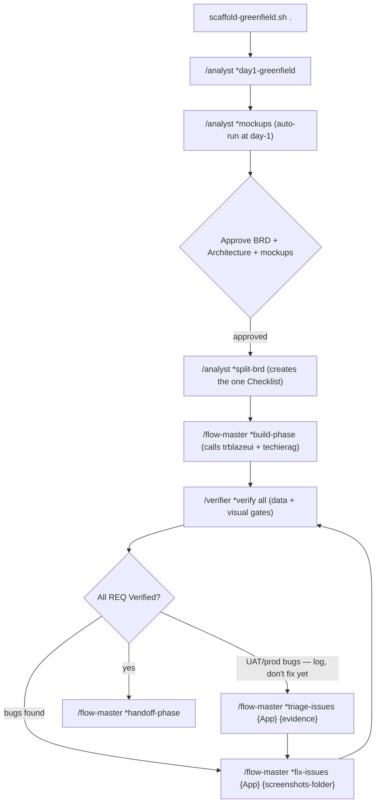
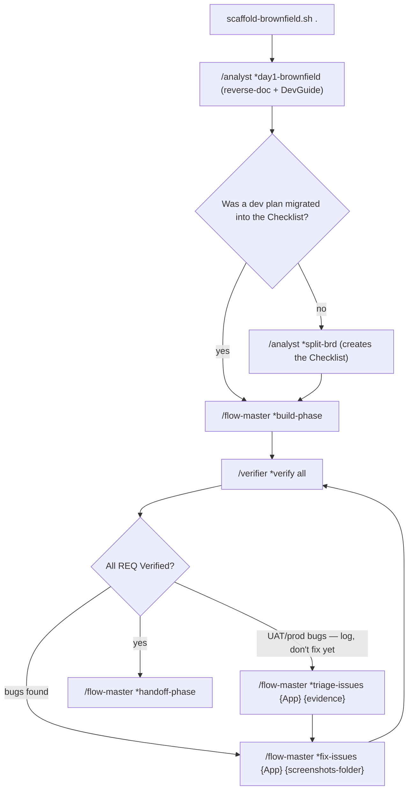
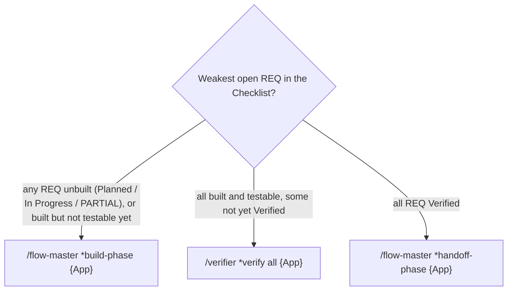
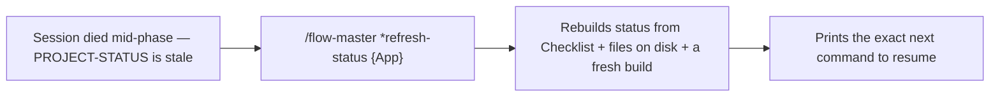
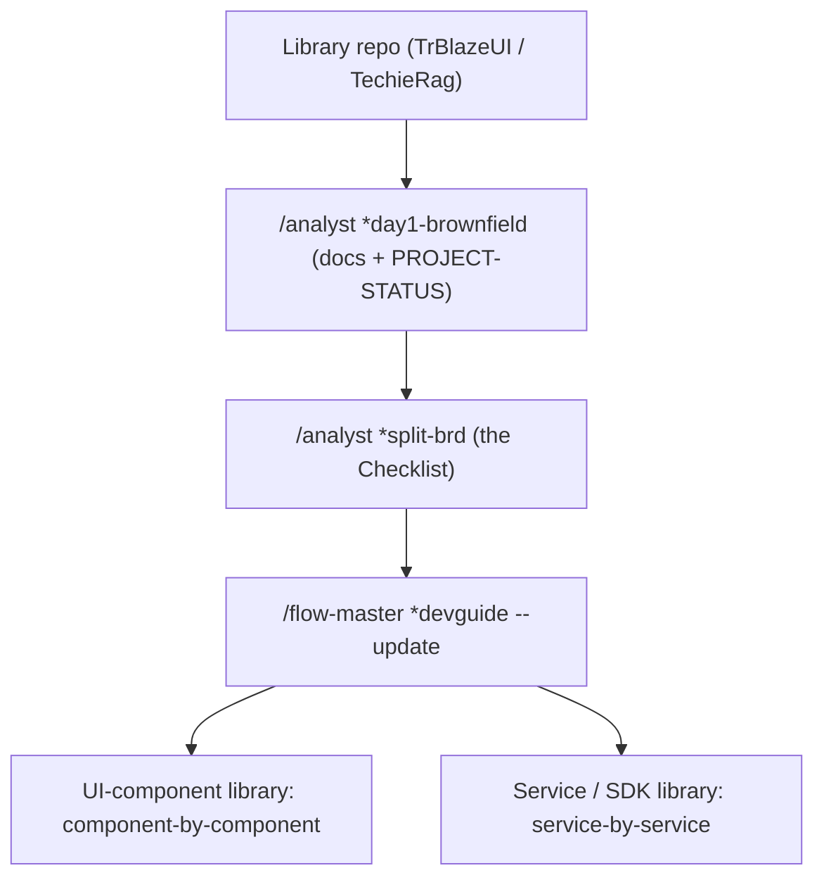

# TechieFlow — Solo-Dev Delivery Framework

> Custom AI-agent delivery workflow for Claude Max + WSL, tuned for a solo developer shipping .NET / Blazor / MAUI apps.
> This is the human-readable companion to `WORKFLOW.html` (open that in a browser for the styled version).
> AI agents working **on** this framework should read `WorkFlow-Context.md` first.

> **This is the solo edition of a two-edition family.**
> The **team edition** is the [AI-First Development Playbook](https://github.com/techierathore/AI-First-Playbook) —
> the same philosophy scaled to an engineering team. See [§18](#18-team-edition--the-ai-first-playbook).

---

## Process at a glance — flowcharts (quick reference)

The whole process on one screen — each box is the exact command to run (agent + `*task`). The sections below explain each step; loops mean "repeat until the gate passes". (GitHub renders these; the styled versions are in `WORKFLOW.html`.)

**A · Greenfield — new app from scratch**



**B · Brownfield — existing app**



**C · Which command next? — the Build → Verify → Handoff ladder** (pick by the *weakest* open REQ; when in doubt, build)



**D · Recovering a cold / interrupted project**



**E · Library project (TrBlazeUI / TechieRag) — docs & DevGuide** (a NuGet library is a first-class project)



---

## 0. WSL bootstrap — DO ONCE, EVER

**Run this once per WSL distro.** Installs headless-Chromium system libs + the MAUI bridge.

> **On macOS: skip this section — your one-time setup is §0a instead.** There is no `winrun` bridge on a Mac (`dotnet` and MAUI run natively) and Playwright's Chromium needs no apt libraries.

```bash
sudo apt-get update && sudo apt-get install -y \
  libnss3 libatk1.0-0 libatk-bridge2.0-0 libcups2 libdrm2 libxkbcommon0 \
  libxcomposite1 libxdamage1 libxfixes3 libxrandr2 libgbm1 libpango-1.0-0 \
  libcairo2 libasound2 libgtk-3-0 libx11-xcb1

mkdir -p ~/bin && cat > ~/bin/winrun << 'SH'
#!/usr/bin/env bash
WINPATH=$(wslpath -w "$PWD")
powershell.exe -NoProfile -Command "cd '$WINPATH'; $*"
SH
chmod +x ~/bin/winrun
grep -q 'HOME/bin' ~/.bashrc || echo 'export PATH="$HOME/bin:$PATH"' >> ~/.bashrc
```

## 0a. macOS bootstrap — DO ONCE, EVER

**Run this once per Mac.** The native equivalent of §0: everything the agents need to build, run, and *see* your apps on macOS. There is no `winrun` bridge to install — `dotnet`, Playwright, and Appium all run natively — but the machine still needs its toolchain once.

```bash
# 1. Xcode Command Line Tools — provides git AND python3 (the framework's
#    guard-status/guard-verify hooks silently fail open without python3)
xcode-select --install

# If full Xcode is installed (required for MAUI iOS / Mac Catalyst builds),
# accept its license once or python3/git error out with a license prompt:
sudo xcodebuild -license accept

# 2. Homebrew (skip if `brew --version` already works)
/bin/bash -c "$(curl -fsSL https://raw.githubusercontent.com/Homebrew/install/HEAD/install.sh)"

# 3. The toolchain: .NET SDK + Node.js (Node powers Playwright and Appium)
brew install dotnet-sdk node

# 4. MAUI workload — only if any of your apps ships a MAUI head.
#    sudo is REQUIRED on macOS: the SDK lives in root-owned /usr/local/share/dotnet,
#    so without it this (and any `dotnet workload update` / SDK update) fails with
#    "Inadequate permissions. Run the command with elevated privileges."
sudo dotnet workload install maui
```

**Playwright — nothing for you to do.** The verifier **self-provisions** it per project the first time it runs (`verify-phase.md §1`, also used by every self-smoke): it creates `package.json` if missing, runs `npm install -D @playwright/test` + `npx playwright install chromium`, and writes a minimal `playwright.config.ts`. The only machine-level prerequisite is **Node** (step 3 above). The Chromium download is cached once under `~/Library/Caches/ms-playwright` and shared by every project, so only the first project ever pays it — and unlike WSL there are no system libraries to install.

**Verify:** `dotnet --info` prints an SDK, `node --version` answers, and `python3 --version` answers *without* an Xcode-license error. The agents handle everything else per project.

**MAUI native-UI testing** (Android emulator / iOS Simulator / Mac Catalyst): continue with §0b — on a Mac-native setup every piece of it (Android Studio + emulator, Appium + drivers, the Simulator) runs on this same machine, and all endpoints are `http://localhost:4723`.

## 0b. Device-host bootstrap (MAUI Android / iOS / Mac Catalyst) — DO ONCE PER HOST

Only needed for apps that ship a MAUI **mobile or Mac desktop** head. It lets the verifier (and the smoke / devguide-OBSERVE gates) **drive the running native UI** and apply the same data-render + visual-truth gates it applies to Blazor — closing the blind spot where a MAUI app passes every gate while its screens overlap, clip, or render blank. The driver is **Appium** (the native analogue of headless Playwright: same WebDriver protocol, returns a screenshot + an element tree). The WSL side only talks to an **HTTP endpoint** — no `adb`, emulator, or Xcode inside WSL. Builds are unchanged (§9 ladder); this is the *runtime-observe* leg.

**Step 1 — enable Win11 mirrored networking** (once) so WSL reaches the Windows-host Appium on plain `localhost`. In `%UserProfile%\.wslconfig`:

```ini
[wsl2]
networkingMode=mirrored
```

then `wsl --shutdown` and reopen WSL.

**Step 2 — Android, on the Windows host** (Android SDK already present):

```powershell
sdkmanager "system-images;android-34;google_apis;x86_64"
avdmanager create avd -n Pixel_API_34 -k "system-images;android-34;google_apis;x86_64"
npm install -g appium
appium driver install uiautomator2
# session helper (start-android-verify.ps1) boots the emulator + Appium the verifier calls itself
```

**Step 3 — iOS + Mac Catalyst, on a Mac on the same LAN** (also your iOS build host — Xcode + .NET + `dotnet workload install maui` already there); give it a stable IP:

```bash
npm install -g appium
appium driver install xcuitest      # iOS Simulator
appium driver install mac2          # Mac Catalyst desktop
appium --address 0.0.0.0 --port 4723
```

**Step 4 — register the endpoints per app** in `core-config.yaml → runtimeVerification.appium` (only the heads that app ships). The verifier auto-discovers them; an absent/unreachable endpoint degrades that head to `⚠ STATIC-ONLY`, never a faked pass.

**WSL-on-Windows setup (Android on this PC, Apple on the LAN Mac):**

```yaml
runtimeVerification:
  appium:
    android:     { url: http://localhost:4723, avd: Pixel_API_34, launch: 'winrun "powershell -File start-android-verify.ps1"' }
    ios:         { url: http://192.168.1.50:4723, simulator: "iPhone 15" }
    maccatalyst: { url: http://192.168.1.50:4723 }
```

**macOS-native setup (everything on this Mac — no winrun, no LAN address):**

```yaml
runtimeVerification:
  appium:
    android:     { url: http://localhost:4723, avd: Pixel_API_34 }
    ios:         { url: http://localhost:4723, simulator: "iPhone 15" }
    maccatalyst: { url: http://localhost:4723 }
```

**Running Claude Code natively on a Mac?** Everything above collapses onto the one machine: do Step 3 (and Step 2's Android pieces if needed) in the Mac's own Terminal, skip Step 1 (mirrored networking) entirely, and use `http://localhost:4723` for every head.

**Verify:** from WSL, `curl http://localhost:4723/status` (Android) and `curl http://<mac-ip>:4723/status` (iOS/Catalyst); on a Mac-native setup it's `curl http://localhost:4723/status` for everything. Reliable selectors need a stable `AutomationId` on key controls (a coding standard — see §10).

## 1. Overview & principles

#### Compress, don't expand

No story-by-story TechieFlow. One BRD + one Architecture + one Coding-Standards doc (all human-readable) feed the unified `build-phase` — which reads ONE AI-only doc (the app Checklist) and calls the library agents (`/trblazeui`, `/techierag`) as sub-agents.

#### Verify, don't trust

The `build-phase` self-smokes (data + visual) and then chains `verifier`. Headless Playwright + `dotnet test`, with a data-render gate, a visual-truth gate, and a perf gate for REQs that declare a budget. Verdicts written into the checklist's Requirements Status table.

#### Standards enforced from day 1

Every project has `docs/<APP>-Coding-Standards.md`. Every implementation agent prompt references it. `CLAUDE.md` at project root pins it for auto-load.

## 2. Pain points → solutions

#### 1. Agents miss requirements; verify-fix loop is exhausting

#### → `verifier` mandatory + ID-driven; chain in same prompt

#### 2. WSL has no GUI browser; Playwright MCP eats context

#### → Headless Playwright CLI from §0 bootstrap

#### 3. Can't build/run MAUI from WSL

#### → `winrun` WSL→Windows bridge (§9)

#### 4. Hard to scan markdown on cold re-entry

#### → `<APP>-BRD.html` + `<APP>-Architecture.html` + `PROJECT-STATUS.html` with Mermaid (§6 + §11)

#### 5. `npx techieflow install` grabs v6, breaks customizations

#### → `scaffold-brownfield.sh` / `scaffold-greenfield.sh` copy your v4 setup (§3)

#### 6. Claude Code prompts every Bash; `*yolo` doesn't help

#### → Pre-built `.claude/settings.json` (§12)

#### 7. Generated code uses inconsistent style across projects

#### → `<APP>-Coding-Standards.md` per project, referenced in every impl prompt; `CLAUDE.md` pin

#### 8. The data + visual gates only reached Blazor + the MAUI Windows head — Android/iOS/Mac-desktop screens were build-only (never run/observed)

#### → Appium runtime bridge (§0b): the verifier drives MAUI Android (emulator on the Windows host), iOS (Simulator on a LAN Mac), and Mac Catalyst (same Mac) over an HTTP WebDriver endpoint that returns the same screenshot + element tree, so the §4a/§4b gates run unchanged. Endpoints in `core-config.yaml → runtimeVerification.appium`; an unreachable host → `⚠ STATIC-ONLY`, never a faked pass.

## 3. Scaffolding a new project — copy, don't npm-install

You have a customized v4 setup. `npx techieflow install` would fetch v6 and lose your customizations. Use the scaffold script:

Three scripts: two scaffolders (one per flow) plus an updater for projects scaffolded earlier. All are idempotent (scaffolders use rsync `--ignore-existing` — existing files preserved on re-run; the updater force-refreshes framework files including `.claude/settings.json`, see below).

### Brownfield (existing app) — `scaffold-brownfield.sh`

**WSL (Windows):**

```bash
cd /path/to/existing-app
/mnt/c/3AIGenCode/TechieFlow/scaffold-brownfield.sh .
```

**macOS:**

```bash
cd /path/to/existing-app
/Volumes/MacD/MyCode/TechieFlow/scaffold-brownfield.sh .
```

Adds `.tfcore/`, `.claude/commands/`, `WORKFLOW.html`, `opencode.jsonc`, and `.claude/settings.json`. **Does NOT touch** existing `src/`, `tests/`, or other `docs/` contents. Warns (non-blocking) if no `.csproj`/`.sln` found within 4 levels. Refuses if the target directory doesn't exist (use greenfield script for that). (No `.opencode/command/TechieFlow/` mirror is deployed — OpenCode loads agents/tasks from `opencode.jsonc` `{file:./.tfcore/...}` references instead.)

### Greenfield (new app) — `scaffold-greenfield.sh`

**WSL (Windows):**

```bash
mkdir /path/to/my-new-app && cd /path/to/my-new-app
git init
/mnt/c/3AIGenCode/TechieFlow/scaffold-greenfield.sh .
```

**macOS:**

```bash
mkdir /path/to/my-new-app && cd /path/to/my-new-app
git init
/Volumes/MacD/MyCode/TechieFlow/scaffold-greenfield.sh .
```

**Then, on either machine:**

```bash
dotnet new sln -n MyNewApp
dotnet new blazor -n MyNewApp.Web -o src/MyNewApp.Web
dotnet sln add src/MyNewApp.Web
dotnet add src/MyNewApp.Web package TrBlazeUI    # if UI involved
dotnet add src/MyNewApp.Web package TechieRag    # if AI/RAG involved
dotnet build                                      # deploys library agent files
```

Same framework drop as brownfield, plus creates empty `src/`, `tests/playwright/`, `tests/unit/` folders ready for use.

### Updating an already-scaffolded project — `update-framework.sh`

When the reference framework repo (WSL: `/mnt/c/3AIGenCode/TechieFlow` · macOS: `/Volumes/MacD/MyCode/TechieFlow`) evolves (new tasks, updated templates, agent fixes), pull those changes into an existing project with the updater. Unlike the scaffolders (`--ignore-existing`: never touch a file that's already there), the updater **force-overwrites framework files** and preserves everything that contains your work product. The scripts self-locate — invoke whichever machine's copy you're on and it uses itself as the source.

**WSL (Windows):**

```bash
# Preview what would change (recommended first):
/mnt/c/3AIGenCode/TechieFlow/update-framework.sh /path/to/your-app --dry-run

# Apply:
/mnt/c/3AIGenCode/TechieFlow/update-framework.sh /path/to/your-app

# Or run from inside the project (defaults to $PWD):
cd /path/to/your-app
/mnt/c/3AIGenCode/TechieFlow/update-framework.sh
```

**macOS:**

```bash
# Preview what would change (recommended first):
/Volumes/MacD/MyCode/TechieFlow/update-framework.sh /path/to/your-app --dry-run

# Apply:
/Volumes/MacD/MyCode/TechieFlow/update-framework.sh /path/to/your-app

# Or run from inside the project (defaults to $PWD):
cd /path/to/your-app
/Volumes/MacD/MyCode/TechieFlow/update-framework.sh
```

Note: the script is NOT on your PATH — always invoke it with the full path shown above (a bare `update-framework.sh` gives *"command not found"*). Optional alias — WSL: `echo "alias update-framework.sh='/mnt/c/3AIGenCode/TechieFlow/update-framework.sh'" >> ~/.bashrc` · macOS (zsh): `echo "alias update-framework.sh='/Volumes/MacD/MyCode/TechieFlow/update-framework.sh'" >> ~/.zshrc`.

| Force-overwritten (framework — reference repo wins) | Preserved (your work product — never touched) |
| --- | --- |
| `.tfcore/{tasks,templates,agents,checklists,data,utils,workflows,agent-teams}/` `.claude/commands/TechieFlow/` subtree            `.claude/commands/*.md` top-level commands (generate-html etc.)            `.opencode/command/*.md` top-level commands (generate-html etc.)            `WORKFLOW.html` `.claude/settings.json` (refreshed to canonical config by default; old file → `settings.json.bak`; `--keep-permissions` to skip; `settings.local.json` never touched) | `docs/`, `src/`, `tests/` `PROJECT-STATUS.md`, `CLAUDE.md`, `.editorconfig` `.tfcore/core-config.yaml` `opencode.jsonc` `.claude/{trblazeui,techierag}.md` + `.opencode/command/{trblazeui,techierag}.md` (NuGet-deployed) |

The scaffolders and the updater also **ensure the project's `.gitignore` ignores the deployed framework copies** (`.tfcore/`, `.claude/`, `.opencode/`, `/CLAUDE.md`, `/WORKFLOW.html`, `/opencode.jsonc`, `/.tf-scaffold-note.txt`). Everything the framework drops into an app is a *copy* — the source of truth is this reference repo (or the NuGet package, for the library personas) — so it must never be committed in the app repo. The step is append-only and idempotent: existing entries in any anchored/slash variant are respected, and your own `.gitignore` content is never rewritten. Note git never *un*tracks a file just because it became ignored — if a framework file was committed before the entry existed, run `git rm -r --cached <path>` once yourself (git is manual in TechieFlow; agents never run it).

They also manage a second block — **agent test-harness & log artifacts** (`node_modules/`, `/package.json`, `/package-lock.json`, `tests/.artifacts/`, `test-results/`, `test-results-*/`, `/scripts-*/`, `playwright-report/`, `.verify/`, `logs/`, `/docs/.last-verify.json`, `.DS_Store`). These are machine-generated by the verifier's npm/Playwright self-provisioning (verify-phase §1) and the standing Serilog default, and are fully regenerable — **you should never have to triage them at commit time**. verify-phase §1 also self-heals the block whenever it provisions, so even a project scaffolded before this block existed gets it on its next verify. `playwright.config.ts` deliberately stays *tracked* — committed test suites depend on it. Same caveat as above: already-tracked artifacts need a one-time `git rm -r --cached <path>` from you.

**Where test artifacts live — `tests/.artifacts/`, never the repo root** (rule added 2026-08-10). Screenshots, traces, videos and Playwright/Appium output are *failure evidence with a session lifetime*, not work product: they exist so a verify run can cite a path in a checklist Remark, and Playwright wipes the directory at the start of the next run. verify-phase §1 now pins `outputDir: './tests/.artifacts/test-results'` in `playwright.config.ts` — creating the config if absent and **editing it if it lacks the setting** — and bans the two habits that used to litter your repos: a repo-root `test-results/`, and per-cluster siblings like `test-results-cluster-a/` from a fan-out passing `--output test-results-<slug>`. Those siblings were the real damage: `test-results/` does not match `test-results-cluster-a/`, so they were never ignored, they showed up untracked at every commit, and they accumulated one directory per run (TechieBlog reached fourteen). If a parallel run genuinely needs isolation, the only permitted form is a subfolder — `--output tests/.artifacts/<slug>`. The bare `test-results/` and the `test-results-*/` glob stay in the ignore block purely to cover legacy trees; a compliant run writes neither, and verify-phase §1 deletes any it finds at the repo root on its next pass. Deliberately tracked screenshots — the DevGuide's reviewed set under `docs/screenshots/<APP>/` — are untouched by all of this.

**The rule covers the harness too, not just its output** (extended 2026-08-10). The first version of this rule pinned where the *tools write* and said nothing about where the agent *puts the scripts it writes* — so the next fan-out stopped creating `test-results-cluster-a/` and created `scripts-cluster-b/` instead: same defect, different noun, same four untracked folders in your commit view. A throwaway smoke/verify/load/cleanup script an agent authors for a run is scratch, and it now lands in **`tests/.artifacts/harness/`**, named per cluster *inside* that folder. Two things follow. Your project's own **`scripts/`** — release, publish, dev-setup scripts you track and own — is off limits to agents in both directions: nothing writes a run harness into it, and no sweep ever deletes it (the ignore entry is `/scripts-*/`, which requires the hyphen and the root anchor, so plain `scripts/` can never match). And a harness that does `import { chromium } from 'playwright'` drives the **library**, not the test runner — it never loads `playwright.config.ts`, so `outputDir` does not apply and nothing wipes what it writes; such a script must place its own captures under `tests/.artifacts/` and must never hardcode an absolute path. The general lesson, worth stating because the first fix missed it: a location rule has to name the *class of thing* (everything this run generates that is not a deliverable), not the specific filenames a tool happened to default to.

## 4. File-naming convention — `<APP>` prefix

Every per-project document filename starts with the application name. Examples from the user's existing projects: `AppManager-Coding-Standards.md`, `AstroLyfe-Coding-Standards.md`. Same convention applies to every doc:

| Pattern | Example for app "AppManager" | Example for app "AstroLyfe" |
| --- | --- | --- |
| `<APP>-BRD.md` / `.html` | `AppManager-BRD.md` | `AstroLyfe-BRD.md` |
| `<APP>-Architecture.md` / `.html` | `AppManager-Architecture.md` | `AstroLyfe-Architecture.md` |
| `<APP>-Coding-Standards.md` | `AppManager-Coding-Standards.md` | `AstroLyfe-Coding-Standards.md` |
| `<APP>-Checklist.md` (ONE per app — all REQ-UI/FN/RAG/NFR-*) | `AppManager-Checklist.md` | `AstroLyfe-Checklist.md` |
| `<APP>-UIDesign.md` (greenfield mockups spec) | `AppManager-UIDesign.md` | `AstroLyfe-UIDesign.md` |
| `<APP>-<Library>-Feedback.md` (one per library) | `AppManager-TrBlazeUI-Feedback.md` | `AstroLyfe-TechieRag-Feedback.md` |
| `<APP>-UsageGuide.md` | `AppManager-UsageGuide.md` | `AstroLyfe-UsageGuide.md` |
| `<APP>-DevGuide.md` (developer code-map) | `AppManager-DevGuide.md` | `AstroLyfe-DevGuide.md` |
| `<APP>-ProductGuide.md` (end-user how-to manual) | `AppManager-ProductGuide.md` | `AstroLyfe-ProductGuide.md` |

Throughout this document, `<APP>` is a placeholder. When you paste a prompt to an agent, substitute it with your actual application name (no spaces; use PascalCase to match the user's two existing samples).

Files that stay generic (not `<APP>`-prefixed):

- `PROJECT-STATUS.md` / `.html` — one per repo, project-name is in its content
- `CLAUDE.md` — Claude Code's auto-loaded session memory; one per repo
- `WORKFLOW.html` — this file; identical across projects

## 5. Project structure

```
your-app/                              ← e.g. AppManager/
├── PROJECT-STATUS.md                  ← /analyst (day 1)
├── PROJECT-STATUS.html                ← /flow-master after each phase
├── CLAUDE.md                          ← /analyst (day 1) — pins coding standards
├── WORKFLOW.html                      ← from scaffold
│
├── .tfcore/                        ← from scaffold (your customized v4)
├── .claude/
│   ├── commands/TechieFlow/...              ← from scaffold
│   ├── settings.json                  ← from scaffold (yolo-except-git)
│   ├── trblazeui.md                   ← from `dotnet build` (TrBlazeUI NuGet)
│   └── techierag.md                   ← from `dotnet build` (TechieRag NuGet)
├── .opencode/command/
│   ├── generate-html.md               ← from update-framework.sh
│   ├── trblazeui.md                   ← from dotnet build
│   └── techierag.md                   ← from dotnet build
├── .trblazeui/TrBlazeUI-AI-Reference.md   ← from dotnet build
├── .techierag/TechieRag-AI-Reference.md   ← from dotnet build
│
├── .editorconfig                      ← /analyst (day 1) — machine-checkable subset of coding standards
│
├── docs/
│   ├── <APP>-BRD.md                ← /analyst — humans + AI
│   ├── <APP>-BRD.html              ← /flow-master renders BRD.md → humans
│   ├── <APP>-Architecture.md       ← /analyst — humans + AI (both flows!)
│   ├── <APP>-Architecture.html     ← /flow-master renders Architecture.md → humans
│   ├── <APP>-Coding-Standards.md   ← /analyst (day 1) — ALL agents follow this
│   ├── <APP>-Checklist.md          ← /analyst (*split-brd) — ONE checklist, all REQ-UI/FN/RAG/NFR-* — AI
│   ├── <APP>-UIDesign.md           ← /analyst (*mockups, greenfield) — per-screen spec + component map — humans
│   ├── <APP>-UIDesign.html         ← rendered for humans
│   ├── mockups/                    ← /analyst (*mockups, greenfield) — rendered *.html screens (TrBlazeUI-styled)
│   ├── screenshots/<APP>/          ← /flow-master (*devguide OBSERVE — any built app) — per-screen *.png (DevGuide + Product Guide source)
│   ├── <APP>-TrBlazeUI-Feedback.md ← agents log TrBlazeUI issues — one file PER library
│   ├── <APP>-TechieRag-Feedback.md ← agents log TechieRag issues — each goes to its team
│   ├── <APP>-UsageGuide.md  ← /flow-master — humans
│   ├── <APP>-UsageGuide.html       ← /flow-master — rendered for humans
│   ├── <APP>-DevGuide.md           ← /flow-master (*devguide) — humans (small app: single doc)
│   ├── <APP>-DevGuide.html         ← /flow-master — rendered for humans
│   ├── devguides/                  ← large app: split per-role DevGuide lives here (index + <APP>-DevGuide-<Role>.md/.html)
│   ├── <APP>-ProductGuide.md       ← /flow-master (*productguide) — END USERS / external (small app: single doc)
│   ├── <APP>-ProductGuide.html     ← /flow-master — rendered for end users
│   └── productguides/              ← large app: split per-role Product Guide lives here (index + <APP>-ProductGuide-<Role>.md/.html)
│
├── tests/{playwright,unit}/  …
└── src/  …
```

## 6. Doc artifacts & audiences

**Agent-facing authoring notes never render.** The doc templates carry drafting-agent instructions (the "Depth mandate" / "Mermaid mandate" notes) as HTML comments, so they are invisible in both the generated `.md` and the rendered HTML — the human reader must never see them. Docs generated from pre-2026-07 templates may still show them as visible blockquotes; the next HTML render strips them automatically (`html-render-shell.md §6b`).

| File | Audience | Format | Created by | Purpose |
| --- | --- | --- | --- | --- |
| `docs/<APP>-BRD.md` | H AI | MD + Mermaid | `/analyst` | Business Requirements — the WHY. |
| `docs/<APP>-BRD.html` | H | Self-contained HTML | `/flow-master` | Browseable BRD for stakeholders / future-you. |
| `docs/<APP>-Architecture.md` | H AI | MD + Mermaid | `/analyst` (both flows) | Brownfield: current architecture + planned deltas. Greenfield: target architecture. |
| `docs/<APP>-Architecture.html` | H | Self-contained HTML | `/flow-master` | Browseable architecture diagrams. |
| `docs/<APP>-Coding-Standards.md` | H AI | Markdown | `/analyst` (day 1) | Every implementation agent follows this. Pinned by CLAUDE.md. |
| `docs/<APP>-Checklist.md` | AI | Markdown w/ `REQ-UI-*`, `REQ-FN-*`, `REQ-RAG-*`, `REQ-NFR-*` | `/analyst` (`*split-brd`) | The ONE checklist — every REQ class in a single Requirements Status table. Input for `*build-phase` (which routes REQ-UI-* to `/trblazeui` and REQ-RAG-* to `/techierag` as sub-agents). Scopes (`*verify ui\|functional\|all`) filter this one table by REQ prefix. Agent-only working doc — never rendered to HTML. |
| `docs/<APP>-UIDesign.md` + `.html` · `docs/mockups/*.html` | H | MD + HTML | `/analyst` (`*mockups`, greenfield) | Per-screen UI Design Spec with a `region → TrBlazeUI control` component map + rendered TrBlazeUI-styled mockups. Approved with the BRD + Architecture before build; what `/trblazeui` builds from; the verifier's visual baseline. |
| `PROJECT-STATUS.md` + `.html` | H AI | MD + HTML | `/analyst` then `/flow-master` | Single source of "where am I". |
| `CLAUDE.md` | AI | Markdown | `/analyst` (day 1) | Auto-loaded by Claude Code; points to coding standards, BRD, Architecture. |
| `.editorconfig` | AI (toolchain) | EditorConfig | `/analyst` (day 1) | Machine-checkable subset of coding standards (file-scoped namespace, async suffix, no-underscore field naming rule). |
| Requirements Status table (inside the one checklist) | AI H | MD table | build agents + `/verifier` | Per-REQ status/%/remarks — single source of truth; REQ ID → PASS/FAIL/Blocked evidence. |
| `docs/<APP>-TrBlazeUI-Feedback.md` `docs/<APP>-TechieRag-Feedback.md` | H | Markdown | All implementing agents | Issues to ship back to each library's team — **one file per library** (separate codebases, separate teams; each file is handed to its owning team, who use this same framework to fix them). |
| `docs/<APP>-UsageGuide.md` + `.html` | H | MD + HTML | `/flow-master` | Final handoff: install, run, test, smoke checklist. |
| `docs/<APP>-DevGuide.md` + `.html` (large apps: split per role into `docs/devguides/<APP>-DevGuide-{Role}.md` + index) | H (developers) | MD + HTML | `/flow-master` (`*devguide`) | Developer reference: every screen → control → service method → stored procedure, grouped by user role. Used to trace bugs and verify AI-generated code. Auto-generated at handoff; re-runnable anytime. See §6. |
| `docs/<APP>-ProductGuide.md` + `.html` (large apps: split per role into `docs/productguides/<APP>-ProductGuide-{Role}.md` + index) | H (end users / external) | MD + HTML | `/flow-master` (`*productguide`) | End-user how-to manual: what each screen is for and how to do each task, illustrated with the screenshots captured for the DevGuide. The user-facing sibling of the DevGuide (same screens, different audience). On-demand; `--update` refreshes changed screens; always emits MD + HTML. See §6. |
| `.tfcore/TOKEN-GUIDE.md` | H | Markdown | framework (ships with scaffold) | Token-efficiency guide — where AI tokens go and how to keep usage low. See §14. |

## 7. Workflows

1. Re-run the scaffold for this project: `scaffold-brownfield.sh .` or `scaffold-greenfield.sh .`. It includes a force-sync step that copies agent files from `.tfcore/agents/` to `.claude/commands/TechieFlow/agents/` (the path Claude Code actually loads — OpenCode reads agents from `opencode.jsonc`, no mirror).
2. **Restart Claude Code** in this project so it re-scans skills. The slash-command registry only refreshes at startup.

#### Reverse-doc + create all six day-1 deliverables

Produces, in ONE bulk pass (no per-section/per-requirement confirmation): `<APP>-Architecture.md`, `<APP>-BRD.md` (feature catalog + BRD ledger), `<APP>-Coding-Standards.md`, `.editorconfig`, `PROJECT-STATUS.md`, `CLAUDE.md`, the `<APP>-UsageGuide.md`, and — because brownfield already has built code — the screen-by-screen `<APP>-DevGuide.md` (§7.6) — **plus the HTML render of every doc** (no separate render step). Updates `core-config.yaml` with the app-specific doc paths.

`/analyst` `*day1-brownfield TrTools`

Substitute `TrTools` with your app name. Asks at most twice: app name (if omitted) and which existing docs to harvest (`all` = default / a selection / extra paths / drafting instructions). It never asks merge-vs-new: deliverables are always written fresh at canonical names and pre-existing/superseded docs are archived to `docs/OldDocs/`. If a dev/phase plan exists, it's migrated into the one `<APP>-Checklist.md` in the same run (completed phases pre-marked Done — skip step 3 below). **Brownfield-only:** because the repo already has built code, it also generates the screen-by-screen **DevGuide** (§7.6 — the as-built page → control → service → data-access → proc map). The DevGuide's OBSERVE pass boots the app, **captures a screenshot of every screen** to `docs/screenshots/<APP>/`, embeds them, and presents an **owner visual-review gate** ("here is how each screen renders — what needs to change?") — the brownfield counterpart to greenfield mockups. (Commonly `STATIC-ONLY` at day-1 until the stack is up; found defects land in the one checklist.) Greenfield day-1 has no code, so instead it produces UI **mockups** (§7.10). Task: `.tfcore/tasks/day1-brownfield.md`.

#### Review the rendered HTMLs — manual checkpoint (≈15 min)

No command — day-1 already rendered everything. Open `<APP>-BRD.html` (business intent right?), `<APP>-Architecture.html` (matches what you want?), `PROJECT-STATUS.html` (next command correct?), skim Coding Standards. Cheapest catch-mistakes point. Edit the `.md` sources directly for anything wrong, then re-render just those files: `/generate-html @docs/<APP>-BRD.md` (see §10.6).

#### Split BRD into the one Checklist

`/analyst` `*split-brd TrTools`

Every BRD-N maps to one or more REQ-UI-*/REQ-FN-*/REQ-RAG-*/REQ-NFR-* (all in the single `docs/<APP>-Checklist.md`, one Requirements Status table) with back-link to the source BRD. Each `REQ-UI-*` cites the mockup screen it realizes (greenfield). Task: `.tfcore/tasks/split-brd.md`.

**Manual checkpoint:** read the checklist, adjust if needed.

#### Build phase — ONE unified build (chains self-smoke + verifier)

`/flow-master` `*build-phase TrTools`

There is no longer a separate UI / RAG / functional build. `*build-phase` reads the one checklist, clusters ALL open REQs, and fans them out — **calling `/trblazeui` (REQ-UI-*, building from the approved mockups) and `/techierag` (REQ-RAG-*) as sub-agents**, and building REQ-FN-* / REQ-NFR-* itself. It then **self-smokes (data + visual)** and auto-chains `/verifier`. You never invoke `/trblazeui` or `/techierag` directly — flow-master orchestrates them. Task: `.tfcore/tasks/build-phase.md`.

#### Verify loop (until green)

`*build-phase` self-chains `/verifier`, which writes verdicts into the one checklist's Requirements Status table and applies BOTH gates — the **data-render gate** (§4a: every control renders its data) AND the **visual-truth gate** (§4b: no overlap, every control in-viewport and non-zero-size at desktop + mobile, screenshot inspected, diffed against the mockup when one exists). A REQ is `Verified` only if acceptance passes AND data renders AND the screen looks right.

**The performance gate (§4c, added 2026-08-10) — opt-in by declaring a number.** Render and visual say nothing about speed: a page that shows every control perfectly and takes nine seconds passed every gate the framework had. §4c closes that, and it is deliberately the narrowest of the four. It grades a REQ **only** if that REQ's acceptance criteria carry a machine-read budget line:

```
perf-budget: p95 load <= 2000ms @ concurrency 1
perf-budget: p95 ttfb <= 500ms  @ concurrency 50
```

No line, no gate — and that is the correct outcome, not a gap. A threshold you never agreed to would produce failures you never asked for, and the first false failure is the moment you stop believing verdicts. Measurement is the shipped harness `.tfcore/utils/tf-perf.sh` (TTFB and full-load p50/p95/max at graded concurrency, warm-up discarded, per-path breakdown so you can see *which* page is slow). Grading has three bands: **≤ budget** passes; **≤ budget × 1.25** is `PERF-MARGINAL` — a dated remark that never blocks `Verified`, so drift is visible before it's a failure; **> budget × 1.25** is `PERF-FAIL` → `Needs re-verify`. The gate refuses to fail a REQ on a Debug build, on fewer than 20 samples, when errors occurred during the run, or on a visibly contended host — each becomes `PERF-UNMEASURED` with the reason, because a wrong perf failure costs more than a missing one. MAUI native heads are not perf-gated (no HTTP surface; app-launch timing is a different discipline). Write budgets in the BRD's §11 Performance NFR; `*split-brd` copies the line verbatim into the REQ.

If Vidur reports misses, just re-run `/flow-master *build-phase TrTools` — it detects FIX mode and fans out repair subagents (layout/visual fixes route back to `/trblazeui`). Or re-verify a scope directly with `/TechieFlow:agents:verifier *verify ui|functional|all` (it filters the one table by REQ prefix). Loop until green. `Blocked` (library-gap) items pass through.

In the verify pass Vidur also runs the **standards-compliance grep checks** from `<APP>-Coding-Standards.md` §"Enforcement" — flags any underscore-prefixed field, mis-prefixed parameter/local, or test method with underscores.

#### Handoff: usage doc + dev guide + status + library-feedback consolidation + HTML refresh

`/flow-master` `*handoff-phase TrTools`

Produces UsageGuide doc (test users + test plan + setup), runs `*devguide` (§3a — generates the screen-by-screen Developer Guide documenting the code as-built, capturing a screenshot of every screen), sets PROJECT-STATUS phase to Handoff, re-renders human-facing HTMLs (BRD, Architecture, UIDesign, UsageGuide, DevGuide, PROJECT-STATUS — **not** the checklist), consolidates each per-library feedback file with summary counts. It also points owners at `*productguide <APP>` (§6) — the optional end-user how-to manual, built from the same screens + screenshots the DevGuide just captured. Task: `.tfcore/tasks/handoff-phase.md`.

**Manual checkpoint:** 15-min UAT against the smoke checklist. Then hand each `<APP>-<Library>-Feedback.md` to its team / file as GitHub issues (§9.2).

#### Brief + BRD + Architecture + Coding-Standards + CLAUDE.md + PROJECT-STATUS + .editorconfig

`/analyst` `*day1-greenfield MyNewApp`

Asks once for the concept (ANY length — sentence, bullets, half-baked notes) and once for optional harvest paths / drafting instructions, then produces the day-1 artifacts in bulk — including a TARGET architecture with stack defaults (Blazor Server + TrBlazeUI + TechieRag-if-AI + SQLite-for-dev) and the UI **mockups** (`docs/<APP>-UIDesign.md` + `docs/mockups/*.html`, §7.10) — **plus the HTML render of every doc** (no separate render step). Substitute `MyNewApp` with your actual app name. Task: `.tfcore/tasks/day1-greenfield.md`.

#### Review the rendered HTMLs AND the mockups — manual checkpoint (approve before build)

No command — day-1 already rendered everything. Read the BRD/Architecture HTMLs AND open `docs/mockups/*.html` + `docs/<APP>-UIDesign.md`: this is the visual design the UI will be built to match, so flag any screen that's wrong NOW. Edit the `.md` sources, re-render with `/generate-html @docs/file.md`, or run `*mockups <APP> --update`. The BRD + Architecture + mockups are **approved together** before any build.

This is your last cheap chance to redirect before code gets written.

#### Split BRD → Build phase → Verify → Handoff

Identical to brownfield steps 3–6. Same prompts, same one checklist, same unified `*build-phase` (which builds REQ-UI-* from your approved mockups via `/trblazeui`), same data + visual gates, same standards-compliance discipline.

### 7.9 Evolving the day-1 docs (the concept/requirements changed)

A project keeps moving — the greenfield concept is still under discussion, or a requirement shifts mid-development. Don't hand-edit and hope, and don't let the docs drift. Pick by how big the change is:

| Situation | Command | What it does |
|-----------|---------|--------------|
| **Concept/requirements evolved** (add/reword/drop features, new integration, stack tweak) but most docs still right | `*amend-docs <APP> "<what changed>"` (analyst or flow-master) | Surgically amends BRD + Architecture **in place**: appends new `BRD-N` (append-only — modified IDs edited in place, removed struck through, never renumbered), updates the feature catalog + §4 Development-status, ripples new/changed REQs into the checklist (appends rows, flags modified for re-verify — never blindly re-splits), re-renders HTML, runs the status gate. Confirms the change-set once, then bulk-applies. **Preserves unchanged sections — no `OldDocs` archive.** |
| **Pure additions**, confirm each requirement | `*create-brd <APP> <topic>` → `author-brd` (analyst) | Interactive per-item elicitation; appends confirmed `BRD-N`. (`*amend-docs` defers to this for the additive part on request.) |
| **"What's built" refresh** (not requirements) | automatic, or `*refresh-status <APP>` | The status gate re-derives PROJECT-STATUS + BRD §4 at the end of every phase; `*refresh-status` rebuilds on demand (§8a). |
| **Full pivot** (most of the BRD/Architecture now wrong) | re-run `*day1-greenfield` / `*day1-brownfield` | §1.6 collision policy archives the old docs to `docs/OldDocs/` and writes fresh. Wholesale redo only — never for an incremental change. |
| **Hand-edited a `.md`** | `/generate-html @docs/<file>.md` | Re-renders that one doc's HTML. |

Rule of thumb: **amend, don't regenerate.** `*amend-docs` is the default for an evolving project; re-running day-1 is the escape hatch for a true restart. After amending an already-split project with new requirements, run `*split-brd` (or the build phase the report points at) to carry them into the build.

### 7.10 Greenfield UI mockups (`*mockups`)

A greenfield app has no code, so its UI is built freehand from prose — which is exactly why a new app's UI comes out broken (overlapping controls, wrong layout, nothing to verify against). The analyst produces **mockups at day-1** to give the build an approved visual contract and the verifier a baseline to diff against:

`/analyst` `*mockups MyNewApp`

Reads the TrBlazeUI component catalog FIRST (so it designs only with controls that exist), then produces `docs/<APP>-UIDesign.md` — a per-screen spec with a `region → TrBlazeUI control` component map — plus rendered `docs/mockups/*.html` styled to look like TrBlazeUI, one per key screen from the BRD §9 feature catalog. Auto-run inside `*day1-greenfield`; re-runnable with `*mockups <APP> --update` to refresh only changed screens after an `*amend-docs` that added UI. The mockups are approved alongside the BRD + Architecture, are what `/trblazeui` builds from, and are the image the visual-truth gate diffs the live screen against. **Mockups are greenfield only** — a greenfield app has no code to screenshot yet, so its mockups are the pre-build visual contract; brownfield already has built code and instead reviews real screenshots in the DevGuide's OBSERVE pass (§7.6). Note this is about *mockups*, not screenshots: once a greenfield app is built, its DevGuide OBSERVE pass captures real per-screen screenshots exactly like brownfield (§6). Task: `.tfcore/tasks/mockups.md`.

### 7.11 Fixing issues you found by running the app (`*fix-issues`)

When the verifier passed but the running UI is still broken — overlapping controls, blank screens, wrong data — there is ONE front door:

`/flow-master` `*fix-issues MyApp ./bugshots`

Drop a folder of **screenshots** (plus an optional `bugs.md` describing what's wrong on each) and flow-master: reads every screenshot (vision), reproduces each issue live with Playwright, triages it (layout / data / logic / RAG), and **fans the fix out to the right builder** — `/trblazeui` for layout, its own subagents for data/logic, `/techierag` for RAG. **You never invoke a builder agent yourself — flow-master calls them as sub-agents.** It then re-smokes (data + visual) and re-verifies the affected REQs, and updates the DevGuide + the one checklist + PROJECT-STATUS. This is the answer to "the verifier passed but the UI is broken — who do I call?". Task: `.tfcore/tasks/fix-issues.md`. Only want the bugs *analyzed and logged*, not fixed? That's `*triage-issues` (§7.12).

### 7.12 Analyzing UAT / production bugs WITHOUT fixing (`*triage-issues`)

Bugs found at UAT or in production usually need a **plan and a paper trail before anyone touches code**: which REQs regressed, what's a brand-new defect, what still passes. `*fix-issues` is the wrong tool for that moment — its deliverable is fixed code. The analyze-only front door is:

`/flow-master` `*triage-issues MyApp ./uat-bugs` — add `verify` to also regression-re-verify sibling features

Hand it a folder of screenshots *and/or a written bug list* (UAT reports often arrive as prose). Flow-master reproduces each issue live with Playwright and delivers **documentation only**: regressed REQs are demoted to `Needs re-verify` with a dated `⚠ UAT bug` remark, unspecified defects become new `Planned` REQ rows with acceptance criteria, the DevGuide's known-issues lines are refreshed, and PROJECT-STATUS's "Next command" points at `*fix-issues {App} {folder}` naming the REQ IDs. With the optional `verify` argument it also EXECUTES a scoped verify-phase over the affected screens' sibling REQs ("check the rest still works"). **It never edits `src/` or `tests/` and never spawns a builder sub-agent** — fixing is a separate decision you make afterwards by running `*fix-issues`. Task: `.tfcore/tasks/triage-issues.md`.

## 8. Resuming a cold project

Two flavours of resume. Pick by asking one question: **do you trust `PROJECT-STATUS.md`?**

If the last session died in the middle of a build or verify — lost internet, model access revoked/changed mid-run, terminal killed, agent crashed — then the mandatory status gate never ran. `PROJECT-STATUS.md` is now *stale or wrong*: it may point at an old "Next command", undercount committed work, or claim a passing build that's since broken. Do NOT trust it. Run the recovery command, which rebuilds PROJECT-STATUS from *ground-truth evidence* (working tree + checklist Requirements Status table + a fresh `dotnet build`) and tells you the exact command to resume with:

`/TechieFlow:agents:flow-master` `*refresh-status <APP>`  —  OpenCode: `/flow-master *refresh-status <APP>`  ·  add `verify` to also re-run the verifier on any REQ whose true state is ambiguous.

It never edits source code — it only reconstructs status. When it finishes, follow its "next command", then drop into the clean flow below. This is the answer to "an experimental model lost access mid-development and I don't know where it left things."

**8b. Clean cold resume** (you came back to a project whose last phase *did* finish and wrote PROJECT-STATUS): trust the file and walk the four steps.

#### Open three HTML files in browser

`PROJECT-STATUS.html` (where am I), `<APP>-BRD.html` (why was I doing this), `<APP>-Architecture.html` (what's the shape). < 5 min.

#### "What changed" check

```bash
cd /path/to/project
git log --oneline -20 && git status
dotnet build
```

#### Re-verify

`/verifier` → *"Re-verify the checklist's Requirements Status table and run standards-compliance greps from docs/<APP>-Coding-Standards.md. Note regressions."*

#### Execute the "Next command" from `PROJECT-STATUS.md`

## 9. Custom library agents — routing rules

`/trblazeui` and `/techierag` are **library agents** — flow-master calls them as **sub-agents** during `*build-phase` and `*fix-issues` (and the analyst calls `/trblazeui` for its component catalog during `*mockups`). You drive the build/fix through flow-master; it routes each REQ cluster to the right builder by its prefix.

| Trigger | Routed (by `*build-phase` / `*fix-issues`) to | Reads (besides <APP>-Coding-Standards.md) |
| --- | --- | --- |
| `REQ-UI-*` — UI work (pages, components, forms, dashboards) | `/trblazeui` (sub-agent) — builds from the mockups | `.trblazeui/TrBlazeUI-AI-Reference.md` + the Checklist + `docs/mockups/*.html` |
| `REQ-RAG-*` — AI/RAG/LLM (embedding, vector store, chat, tools) | `/techierag` (sub-agent) | `.techierag/TechieRag-AI-Reference.md` + the Checklist |
| `REQ-FN-*` / `REQ-NFR-*` — backend / business logic / data / APIs / non-functional | `/flow-master` own subagents | the Checklist + Architecture |
| Reverse-doc, BRD/Architecture/Standards, requirements splitting, mockups | `/analyst` | codebase / brief |
| Verification of any scope (data + visual gates) | `/verifier` | the Checklist + DevGuide + running app + standards grep checks |
| Unified build / fix-issues / HTML renders / status / handoff / consolidation | `/flow-master` | everything |

### 9.1 Adding a new custom library agent

1. Library's NuGet adds an MSBuild target that copies on consumer build: `.<libname>/<LibName>-AI-Reference.md`, `.claude/<libname>.md`, `.opencode/command/<libname>.md`.
2. Agent file's frontmatter: `description`, `mode: primary`, `tools`. Body: load reference doc on activation + REQUIRED READING clause for `docs/<APP>-Coding-Standards.md`.
3. Add routing row to the table above.
4. The new library gets its OWN feedback file — `<APP>-<LibName>-Feedback.md` with its own issue-ID prefix, from the shared template. Never share a feedback file between libraries.
5. Update `build-phase`'s cluster-routing (and `fix-issues`'s triage) to route the new ID prefix to the new sub-agent.

### 9.2 Library issue tracking flow

1. Implementing agents log on encounter — into the OWNING library's file (`<APP>-TrBlazeUI-Feedback.md` for TR-NNN, `<APP>-TechieRag-Feedback.md` for TR-RAG-NNN). Clause baked into §7 prompts.
2. Verifier escalates library bugs → `Blocked` status in the checklist's Requirements Status table + entry in that library's feedback file.
3. `/flow-master` consolidates each file separately at handoff: dedupe, severity sort, summary header (splits + archives any legacy combined `<APP>-Library-Feedback.md`).
4. You hand each file to its team — they use this same framework, so the file drops straight into their flow — or file as GitHub issues: `gh issue create --repo your-org/TrBlazeUI --title "…" --body-file …`

## 10. Coding standards — how enforcement actually works

"Every agent follows the standards" is achieved through **three layered mechanisms**. None alone is sufficient; all three together close the gaps.

#### 1. Prompt-level (every session)

Every implementation prompt in §7 starts with "REQUIRED READING: docs/<APP>-Coding-Standards.md". The agent loads it before writing any code. Cross-harness reliable.

#### 2. `CLAUDE.md` auto-load

Claude Code auto-loads `CLAUDE.md` at project root into every session. It says "Always follow docs/<APP>-Coding-Standards.md before any code write." Catches even direct user prompts that forgot the boilerplate.

#### 3. `.editorconfig` + verifier greps

Machine-checkable rules go in `.editorconfig` (Roslyn enforces in the IDE / build). Non-checkable rules (a/v prefixes, test-name underscores) become grep patterns the verifier runs in the verify pass.

**Standing standard — Serilog file logging in EVERY .NET app (2026-07-09).** Every executable head — Blazor web, API, MAUI, desktop, console/CLI, background service — wires **Serilog with a rolling file sink** (`logs/<app>-.log`, daily rolling; MAUI/desktop root it in the per-app data dir) at startup, logs unhandled exceptions, and exposes app logging only through `ILogger<T>` (class libraries reference logging abstractions, never Serilog). This is baked in end-to-end so you never have to ask: the BRD template carries a standing Observability NFR, day-1 always emits it (brownfield marks it `Done (pre-existing)` when an equivalent stack is already wired), `*split-brd` turns it into a `REQ-NFR-*` row, the coding-standards §Logging block carries the wiring recipe, and `*build-phase` wires Serilog into any new head it scaffolds even when no REQ names logging.

**Standing standard — the primary head carries the PRODUCT name (2026-07-10).** The product's primary executable head project is named exactly `<APP>` (`src/<APP>/<APP>.csproj`); a single-head product's one head IS `<APP>`. **`<APP>.App` is banned** — "App" says nothing the product name doesn't. Secondary heads of a multi-head product take a *descriptive* dotted suffix (`<APP>.Api`, `<APP>.Desktop`, `<APP>.Cli`); satellites keep their conventional names (`<APP>.Core`, `<APP>UI` RCL, `<APP>.Core.Tests`). Baked into the coding-standards canonical block (day1-brownfield §4 → "Project & solution naming") and `*build-phase` §3 (scaffold-time rule; an existing `<APP>.App` gets a rename REQ, never propagated).

The grep patterns belong inside `docs/<APP>-Coding-Standards.md` under an "Enforcement" section. Sample grep block (already in §11.3 template):

```bash
# Forbidden field forms
grep -rE "private(\s+readonly)?\s+\w+\s+_[a-z]" src/    # underscore prefix
# Instance field must start with `obj` (not bare PascalCase, not _underscore)
grep -rE "private(\s+readonly)?\s+\w+\s+(?!obj)[A-Z]\w+\s*[;=]" src/ | grep -v "static\|const"

# Forbidden test-method form
grep -rE "public\s+(async\s+)?Task\s+\w+_\w+\s*\(" tests/

# Parameter without a-prefix (heuristic; grep catches "(string Foo" but not all cases)
grep -rE "\(\s*\w+\s+[A-Z]\w+\s*[,)]" src/
```

## 11. MAUI builds & runs — from WSL (bridged) or macOS (native)

**WSL (Windows) — bridge every dotnet call to the Windows side via `winrun` (§0):**

```bash
cd /mnt/c/path/to/maui-project
winrun "dotnet build -c Release"
winrun "dotnet test"
winrun "dotnet build -t:Run -f net9.0-windows10.0.19041.0"
```

**macOS — no bridge; dotnet runs natively (ladder §A):**

```bash
cd /path/to/maui-project
dotnet build -c Release
dotnet test
dotnet build -t:Run -f net9.0-maccatalyst      # desktop head on Mac = Mac Catalyst
dotnet build -t:Run -f net9.0-android          # Android head (emulator via Android Studio)
```

On macOS the Windows head (`net9.0-windows…`) can't build — the Mac desktop head is **Mac Catalyst**, and iOS builds natively too (Xcode required, §16). The `winrun` lines apply only inside WSL.

For verifier on a MAUI **Windows** app: *"This is a MAUI Windows app. Build/run/test via `winrun`. UI automation: FlaUI or Appium-Windows-driver Windows-side, NOT Playwright. Output evidence the same as Blazor projects."* On a Mac the equivalent prompt names the **Catalyst** head and the local `mac2` Appium driver instead.

### Mobile & Mac-desktop heads — runtime-observe over Appium

The §4a data-render and §4b visual-truth gates reach the MAUI **Android / iOS / Mac Catalyst** heads through an **Appium** WebDriver endpoint — the native analogue of Playwright (same screenshot + element-tree evidence, so the gates run unchanged). One-time host setup is §0b; the per-head driver map lives in `build-invocation-ladder.md §D`. **Builds don't change** — on WSL, Android still builds via `cmd.exe` (ladder rung #4) and iOS/Catalyst on the paired Mac; on a Mac-native setup all three build locally with plain `dotnet build` and the Appium endpoints are all `localhost`. This is purely how the verifier reaches the *running* UI after a green build.

| Head | Where it runs (WSL setup) | Appium driver | WSL reaches it via | macOS-native reaches it via |
|------|---------------|---------------|--------------------|------------------------------|
| MAUI Android | emulator on the Windows host (Android SDK) | `uiautomator2` | `http://localhost:4723` (mirrored networking); verifier boots emulator + Appium itself | `http://localhost:4723` — emulator + Appium run on the Mac itself |
| MAUI iOS | Simulator on a LAN Mac | `xcuitest` | `http://<mac-ip>:4723`; Mac must be up or head is `⚠ STATIC-ONLY` | `http://localhost:4723` — local Simulator (Xcode) |
| MAUI Mac Catalyst | the same LAN Mac (desktop .app) | `mac2` | `http://<mac-ip>:4723` | `http://localhost:4723` — the .app runs right here |
| MAUI Windows | Windows side | FlaUI / Appium-Windows (unchanged) | `winrun` / `cmd.exe` | n/a — this head doesn't exist on a Mac |

Selectors target each control's `AutomationId` (a coding standard, §10). A head with no registered endpoint in `core-config.yaml → runtimeVerification.appium`, or an unreachable host, is stamped `⚠ STATIC-ONLY` for that head — never a faked `Verified`.

**Window binding & input discipline (all native heads, especially MAUI Windows):** the driver session is bound to the app under test *by identity* — the PID the agent launched → that process's top-level window handle (Appium Windows `appium:appTopLevelWindow` / FlaUI `Application.Attach(pid)`), or the app package/bundle id on mobile — and every interaction is **element-scoped via `AutomationId` inside that bound window**, with focus verified before input and handles re-resolved after dialogs. Global keyboard/mouse injection (FlaUI `Keyboard.Type`, coordinate clicks, `SendKeys`) is **banned**: it types into whatever window happens to hold focus — historically, a completely different window than the app. Full rules: `verify-phase.md §3b`.

## 12. Permissions (yolo-except-git)

The pre-built config **auto-allows** Read/Glob/Grep/Edit/Write/MultiEdit and **all Bash** (bare `"Bash"`) — so create/update/**move** run with zero prompts. **Asks** for **deletes** (`Bash(rm *)`, `Bash(rmdir *)`) and `Bash(sudo *)`. **Denies** catastrophic `rm -rf` root/home paths **and `git`/`gh` outright** — git is manual in TechieFlow; agents never run it, so it is a hard deny, not an ask. Permission precedence is `deny → ask → allow`. *(Cross-project tip: to let a session work in another app's folder without per-path prompts, add that root to `permissions.additionalDirectories` in this project's settings.json — keep those machine-specific paths out of any shared template.)*

**The git deny is TWO layers, because prefix rules alone leak.** `Bash(git *)` is a literal prefix match — it never sees `cd src && git log` or `echo done; git add -A`, which the bare `"Bash"` allow would wave straight through. That is exactly how agents kept "accidentally" running git during status updates. So the config also wires a **PreToolUse hook** — `.tfcore/hooks/block-git.sh` — that inspects every Bash call and blocks `git`/`gh` used as a command word anywhere in the command line, replying with the local-evidence recipe (checklist tables + working-tree files + fresh build) so the agent continues correctly instead of flailing. You still run git yourself: in a separate terminal, or by typing `!git …` in the session (user-typed bang commands bypass agent tool permissions).

**Q: Config (canonical version in scaffold-brownfield.sh / scaffold-greenfield.sh)**

```json
{
  "permissions": {
    "defaultMode": "acceptEdits",
    "allow": [
      "Bash",
      "Edit", "Write", "MultiEdit", "NotebookEdit",
      "Read", "Glob", "Grep", "TodoWrite", "WebFetch", "WebSearch", "Task"
    ],
    "ask": [ "Bash(rm *)", "Bash(rmdir *)", "Bash(sudo *)" ],
    "deny": [
      "Bash(rm -rf /)", "Bash(rm -rf /*)", "Bash(rm -rf ~)", "Bash(rm -rf ~/*)",
      "Bash(git)", "Bash(git *)", "Bash(gh)", "Bash(gh *)"
    ]
  },
  "hooks": {
    "PreToolUse": [
      { "matcher": "Bash",
        "hooks": [ { "type": "command",
                     "command": "bash \"$CLAUDE_PROJECT_DIR/.tfcore/hooks/block-git.sh\"" } ] },
      { "matcher": "Write|Edit|MultiEdit",
        "hooks": [ { "type": "command",
                     "command": "bash \"$CLAUDE_PROJECT_DIR/.tfcore/hooks/guard-status.sh\"" },
                   { "type": "command",
                     "command": "bash \"$CLAUDE_PROJECT_DIR/.tfcore/hooks/guard-verify.sh\"" } ] }
    ]
  }
}
```

**PROJECT-STATUS shape is enforced mechanically too (2026-07-09).** A second PreToolUse hook — `.tfcore/hooks/guard-status.sh`, matcher `Write|Edit|MultiEdit` — blocks any write to `PROJECT-STATUS.md` that violates the crisp fixed-shape snapshot rule: an H2 outside the template's section set (per-run dated sections like `## *verify all — coverage matrix (DATE)` are the classic disease), a heading naming a command run, a paragraph stuffed into `current_phase:`, or a full-file write past ~120 lines. The block message tells the agent exactly how to reshape (overwrite the template sections in place, ONE Verification-log row per run, detail into the checklist Remarks). Same philosophy as the git ban: prose rules kept failing, so the harness enforces it. See `.tfcore/tasks/_status-update-gate.md`.

**`Verified` verdicts are enforced mechanically too (2026-07-10).** A third PreToolUse hook — `.tfcore/hooks/guard-verify.sh`, matcher `Write|Edit|MultiEdit` — blocks any write to a `*-Checklist.md` that *introduces* a `Verified` status cell unless a same-day run ledger `docs/.last-verify.json` exists, which only an *executed* `verify-phase` run writes (verify-phase §6: boot → scoped tests → §4a data-render + §4b visual-truth gates → ledger → verdicts). This exists because a build orchestrator did its own smoke and wrote the `Verified` verdicts itself (TrSetup, 2026-07-09) — self-attestation the "chain the verifier" prose didn't stop. A self-smoke's ceiling is `Implemented` (`_smoke-test-policy.md §"Smoke is NOT verify"`); `*refresh-status` may reconcile a lagging Status column to a row's *pre-existing* dated verdict by writing the ledger with `"mode":"reconcile"`. Demotions (e.g. `Verified → Needs re-verify`) are never blocked.

**WSL (Windows):**

```bash
/mnt/c/3AIGenCode/TechieFlow/update-framework.sh /path/to/app
```

**macOS:**

```bash
/Volumes/MacD/MyCode/TechieFlow/update-framework.sh /path/to/app
```

## 13. Agent cheat sheet

- Starting or re-documenting a project → `/analyst` (day-1 tasks, mockups, split-brd).
- Writing code → `/flow-master *build-phase` (the ONE unified build — it calls `/trblazeui` and `/techierag` as sub-agents; you don't invoke them directly).
- Proving it works → `/verifier` (`*verify ui|functional|all` — filters the one checklist; data + visual gates).
- The verifier passed but the running UI is broken → `/flow-master *fix-issues` (drop screenshots; it triages + routes the fix).
- UAT / production bugs you want analyzed + logged in the checklist, NOT fixed yet → `/flow-master *triage-issues` (docs-only deliverable; fixing stays your call).
- Developer code-map (screen → control → service → proc) → `/flow-master *devguide`.
- End-user how-to manual (what each screen is for + how to do things) → `/flow-master *productguide`.
- Docs/HTML/status/handoff chores → `/flow-master`.
- Architecture deep-dive beyond what day-1 produced → `/architect` (optional).

| Command | Role | Best for | Writes |
| --- | --- | --- | --- |
| `/analyst` | Chanakya, business analyst | Reverse-doc; BRD; Architecture; Coding Standards; **mockups** (`*mockups`, greenfield); the one Checklist (`*split-brd`); status init; .editorconfig; CLAUDE.md | `<APP>-BRD.md`, `<APP>-Architecture.md`, `<APP>-Coding-Standards.md`, `<APP>-UIDesign.md` + `docs/mockups/*.html`, `<APP>-Checklist.md`, `PROJECT-STATUS.md`, `CLAUDE.md`, `.editorconfig` |
| `/trblazeui` | Blazor + TrBlazeUI **(library agent — called as a sub-agent by `*build-phase` / `*fix-issues`)** | REQ-UI-* per the mockups; reads coding standards | `src/` (Razor), `<APP>-TrBlazeUI-Feedback.md` |
| `/techierag` | TechieRag RAG/LLM **(library agent — called as a sub-agent by `*build-phase` / `*fix-issues`)** | REQ-RAG-* items; reads coding standards | `src/` (RAG services), `<APP>-TechieRag-Feedback.md` |
| `/flow-master` | Madhav, master & orchestrator | The single super-agent. Runs the **unified `*build-phase`** (clusters all open REQs, calls `/trblazeui` + `/techierag` as sub-agents, builds REQ-FN-*/REQ-NFR-* itself, self-smokes data+visual, chains the verifier); the **`*fix-issues`** bug-fix front door (triages screenshots → routes the fix) and its analyze-only sibling **`*triage-issues`** (logs UAT/prod bugs in the checklist, never fixes); HTML renders, status refresh, consolidation, handoff doc; the screen-by-screen Developer Guide (`*devguide`) and the end-user Product Guide (`*productguide`) | `src/`, `tests/unit/`, `<APP>-BRD.html`, `<APP>-Architecture.html`, `PROJECT-STATUS.md/html`, `<APP>-UsageGuide.md`, `<APP>-DevGuide.md/html`, `<APP>-ProductGuide.md/html`, `<APP>-Checklist.md` (verdicts), `<APP>-<Library>-Feedback.md` (per-library consolidation) |
| `/verifier` | Vidur, autonomous test runner | Verifying any scope + standards grep checks + the **render gate (§4a)** (every control listed in the DevGuide renders its data) AND the **visual-truth gate (§4b)** (no overlap, every control in-viewport and non-zero-size at desktop + mobile, screenshot inspected, diffed against the mockup when one exists) AND the **perf gate (§4c)** on any REQ declaring a `perf-budget:`. A REQ is `Verified` only if acceptance passes AND data renders AND the screen looks right. `Done (pre-existing)` gets the full sweep — stays Done only if it runtime-renders + looks right, else `Needs re-verify`. After each run Vidur writes verdicts to the one checklist AND refreshes the DevGuide's observed render/visual tags. | `<APP>-Checklist.md` Requirements Status table (verdicts), DevGuide observed render/visual tags, `tests/playwright/*`, `<APP>-<Library>-Feedback.md` (on library bugs — the owning library's file) |
| `/architect` | Solutions architect | Optional deep arch dive; `/analyst` does basic architecture by default | `<APP>-Architecture.md` (delegated by analyst, optional) |

## 14. Full command reference

Each row gives the exact command for both tools. Replace placeholders such as `{AppName}` before running.

| Goal | Command Purpose / Definition | Claude Command | OpenCode Command |
| --- | --- | --- | --- |
| Scaffold (brownfield) | Deploy the framework into an existing application. | `./scaffold-brownfield.sh /path/to/existing-app` | `./scaffold-brownfield.sh /path/to/existing-app` |
| Scaffold (greenfield) | Deploy the framework and starter folders into a new application. | `./scaffold-greenfield.sh /path/to/new-app` | `./scaffold-greenfield.sh /path/to/new-app` |
| Update framework | Force-refresh framework files in an existing project; preserves work product. | `/mnt/c/3AIGenCode/TechieFlow/update-framework.sh /path/to/app` | `/mnt/c/3AIGenCode/TechieFlow/update-framework.sh /path/to/app` |
| Render MD → HTML | Re-render one or more human-facing Markdown documents as HTML. | `/generate-html @docs/File.md` | `/generate-html @docs/File.md` |
| Day-1 brownfield | Reverse-document an existing app and create the day-1 deliverables, UsageGuide, and DevGuide. | `/TechieFlow:agents:analyst *day1-brownfield {AppName}` | `/flow-analyst *day1-brownfield {AppName}` |
| Day-1 greenfield | Create the BRD, Architecture, Coding Standards, status, CLAUDE.md, and UI mockups for a new app. | `/TechieFlow:agents:analyst *day1-greenfield {AppName}` | `/flow-analyst *day1-greenfield {AppName}` |
| Re-render workflow docs | Refresh the BRD, Architecture, and PROJECT-STATUS HTML documents. | `/TechieFlow:agents:flow-master *render-workflow-docs {AppName}` | `/flow-master *render-workflow-docs {AppName}` |
| Greenfield UI mockups | Create or update the per-screen UI design specification and TrBlazeUI-styled mockups. | `/TechieFlow:agents:analyst *mockups {AppName}` | `/flow-analyst *mockups {AppName}` |
| Split BRD → Checklist | Turn BRD items into the single Checklist with REQ-UI/FN/RAG/NFR requirements. | `/TechieFlow:agents:analyst *split-brd {AppName}` | `/flow-analyst *split-brd {AppName}` |
| Amend docs | Apply an incremental requirements or architecture change without regenerating unchanged documents. | `/TechieFlow:agents:analyst *amend-docs {AppName} "<what changed>"` | `/flow-analyst *amend-docs {AppName} "<what changed>"` |
| Build — unified phase | Build all open REQs, route UI/RAG work to library agents, self-smoke, and chain verification. | `/TechieFlow:agents:flow-master *build-phase {AppName}` | `/flow-master *build-phase {AppName}` |
| Fix issues | Reproduce screenshot-reported issues, route fixes, then re-smoke and re-verify. | `/TechieFlow:agents:flow-master *fix-issues {AppName} {folder}` | `/flow-master *fix-issues {AppName} {folder}` |
| Triage UAT/production bugs | Analyze and log bugs without editing code; optionally regression-verify sibling features. | `/TechieFlow:agents:flow-master *triage-issues {AppName} {evidence} [verify]` | `/flow-master *triage-issues {AppName} {evidence} [verify]` |
| Verify gates and standards | Run acceptance tests, standards greps, data-render, visual-truth, and applicable performance gates. | `/TechieFlow:agents:verifier *verify <scope>` | `/flow-verifier *verify <scope>` |
| End of session | Update project status and regenerate its HTML representation. | `/TechieFlow:agents:flow-master Update PROJECT-STATUS.md (phase, next, log); regenerate PROJECT-STATUS.html.` | `/flow-master Update PROJECT-STATUS.md (phase, next, log); regenerate PROJECT-STATUS.html.` |
| Final handoff | Generate the final UsageGuide, DevGuide, status, and library-feedback consolidation. | `/TechieFlow:agents:flow-master *handoff-phase {AppName}` | `/flow-master *handoff-phase {AppName}` |
| Generate / refresh Developer Guide | Map the implemented screens, observe the running app, and reconcile the Developer Guide. | `/TechieFlow:agents:flow-master *devguide {AppName}` | `/flow-master *devguide {AppName}` |
| Generate / refresh Product Guide | Generate the screenshot-illustrated, task-oriented manual for external users. | `/TechieFlow:agents:flow-master *productguide {AppName} [scope] [--update]` | `/flow-master *productguide {AppName} [scope] [--update]` |
| Token efficiency guide | Open the framework guidance for reducing unnecessary AI context and token usage. | `less .tfcore/TOKEN-GUIDE.md` | `less .tfcore/TOKEN-GUIDE.md` |
| Recover broken session | Rebuild PROJECT-STATUS from ground truth after an interrupted phase. | `/TechieFlow:agents:flow-master *refresh-status {AppName}` | `/flow-master *refresh-status {AppName}` |
| MAUI build + test | Build and test the MAUI project through the Windows bridge or natively on macOS. | `winrun "dotnet build && dotnet test"` | `winrun "dotnet build && dotnet test"` |
| Resume project | Check the working tree and perform a fresh build before continuing. | `git status && dotnet build` | `git status && dotnet build` |
| Development telemetry report | Generate the aggregated development metrics report. | `/TechieFlow:agents:flow-master *metrics {AppName}` | `/flow-master *metrics {AppName}` |
| Telemetry quick look | Print the read-only telemetry report directly in the terminal. | `.tfcore/telemetry/tf-metrics.sh --report .` | `.tfcore/telemetry/tf-metrics.sh --report .` |

The trblazeui and techierag personas are NuGet-deployed to `.claude/<name>.md` and `.opencode/command/<name>.md`. Claude Code only scans `.claude/commands/`, so the scaffold/update scripts copy them to `.claude/commands/<name>.md` (the short `/trblazeui` `/techierag` forms then work). If the short form is missing: `dotnet build`, then re-run `update-framework.sh`.

## 15. FAQ & gotchas

**Q: What if the agent ignores the coding standards mid-implementation?**

The verifier's standards-compliance grep checks (§10, item 3) catch the most common violations and produce coverage misses. When you see a miss like `STANDARDS: underscore-field in src/Foo.cs:42` flagged in the checklist's Requirements Status table, tell the implementing agent: *"Fix the standards violations flagged in the Requirements Status table of docs/<APP>-Checklist.md per docs/<APP>-Coding-Standards.md."* Loop until clean.

**Q: What if existing brownfield code doesn't use the `obj` field prefix?**

First: the prefix only applies if THIS project chose `obj` — the field prefix is a per-project day-1 decision recorded in `docs/<APP>-Coding-Standards.md` (e.g. AstroLyfe uses bare PascalCase, no prefix). If it did, the analyst flags it as standards drift in the day-1 output summary. You then either: (a) let the standards-compliance grep checks in the verify pass catch them and fold the fixes into the regular build loop (the implementing agent renames as it touches the file), or (b) explicitly ask flow-master for a one-shot rename pass: *"Rename every non-obj-prefixed instance field in src/ to use the obj prefix per docs/<APP>-Coding-Standards.md, in one commit per file."* Option (a) is lower-risk; option (b) is faster if you want a clean baseline.

**Q: I want to change the coding standards mid-project. Will the agents pick it up?**

Yes — they read `docs/<APP>-Coding-Standards.md` on every invocation. Update the file, then in the next implementation prompt include *"NOTE: the coding standards file was updated; conform new code to it and flag any existing non-conforming areas in your output summary."*

**Q: Should the architecture document be updated as the code changes?**

Yes. Handoff includes "if the architecture changed during implementation, update Architecture.md first to reflect 'as-built', then regenerate the HTML." For mid-flight structural changes, the implementing agent should note it; `/flow-master` reconciles at handoff. For a deliberate scope/structure change, run `*amend-docs <APP> "<what changed>"` (§7.9).

**Q: `scaffold-brownfield.sh` / `scaffold-greenfield.sh` re-run wiped my work?**

No for your work product — framework files copy with `rsync --ignore-existing`. EXCEPTION: the harness agent mirror under `.claude/commands/TechieFlow/agents/` is force-synced from `.tfcore/agents/` on every run — edit agents only in `.tfcore/agents/`. (The old `.opencode/command/TechieFlow/` mirror no longer exists — OpenCode loads agents/tasks from `opencode.jsonc` `{file:./.tfcore/...}` references.)

**Q: `*yolo` doesn't stop Bash prompts.**

Right — `*yolo` is agent-side (elicitation skipping). Tool permissions are `.claude/settings.json` (already in place from scaffold).

**Q: Mermaid not rendering in BRD.html / Architecture.html.**

(1) Offline + CDN script blocked — inline mermaid.min.js instead. (2) Missing `mermaid.initialize` — check end of HTML. (3) Malformed code fence — confirm ````mermaid` on its own line and valid Mermaid syntax.

**Q: Verifier says "Playwright not installed".**

Vidur self-heals browser binaries. If install fails: did you run §0?

**Q: Agent implemented things *not* in the requirements doc.**

*"Revert anything not tied to a REQ-* ID."* Add new REQ first if you actually want it.

**Q: Slash command `/trblazeui` shows "no skill".**

Run `dotnet build` once to fire the TrBlazeUI NuGet deploy target. If still missing: `dotnet build -t:TrBlazeUIRedeployAgentFiles`. Restart Claude Code so it rescans skills.

**Q: Should I commit the HTML files?**

Yes for all of `PROJECT-STATUS.html`, `<APP>-BRD.html`, `<APP>-Architecture.html`, `<APP>-<Library>-Feedback.md`. Browseable on GitHub without cloning, and they're the human-facing artifacts.

**Q: Standard TechieFlow story-by-story flow — ever?**

Only with a second person. For solo + Claude Max, the compressed flow is strictly faster. The stock story-flow agents and tasks no longer ship with this scaffold (trimmed 2026-06-12) — obtain a full story-by-story agent set separately if that day comes.

**Q: How do I keep token usage down?**

Read `.tfcore/TOKEN-GUIDE.md` (ships with every project). Key levers: don't load whole docs or repo trees into context; checklists stay markdown-only (never rendered to HTML — HTML adds weight with no AI benefit); fan work out to subagents instead of loading everything in one session; use `*amend-docs` and `*devguide --update` for incremental refreshes instead of re-running phases from scratch; use `*refresh-status` to recover a broken session instead of re-running the whole phase.

**Q: A screen passed verification but was rendering blank OR was visually broken — how is it prevented now?**

Before the gates, verification only checked acceptance-test pass/fail (HTTP 200, no exception, element present). A screen could pass while its data table showed zero rows, or while every control rendered its data but the controls **overlapped / sat off-screen / were clipped** so the running app was unusable. Two gates close both holes:

- **Render gate (verify-phase §4a):** the verifier asserts every control listed in the DevGuide actually renders its data — no blank table, no count-over-zero-rows, no empty chart.
- **Visual-truth gate (§4b):** it then asserts the screen LOOKS right — no control overlap, every control in-viewport and non-zero-size, checked at desktop + mobile widths, the screenshot inspected, and diffed against the mockup when one exists.

A REQ is `Verified` only if acceptance passes AND data renders AND the screen looks right; otherwise it drops to `Needs re-verify` / `FAIL`. `Done (pre-existing)` is treated as an unverified migrated claim and gets the same sweep. The DevGuide's observed render/visual tags are refreshed each run, keeping DevGuide ⇄ Checklist ⇄ Verifier runtime-true.

**Q: The verifier passed but the running UI is broken — who do I call?**

`/TechieFlow:agents:flow-master *fix-issues {AppName} {folder}` (§7.11). Drop a folder of screenshots of the broken screens (optionally a `bugs.md` naming what's wrong on each). Flow-master reads them (vision), reproduces each issue live with Playwright, triages it (layout / data / logic / RAG), and **fans the fix out to the right builder** — `/trblazeui` for layout, its own subagents for data/logic, `/techierag` for RAG. You never invoke a builder agent yourself. It then re-smokes (data + visual), re-verifies the affected REQs, and updates the DevGuide + checklist + PROJECT-STATUS.

**Q: I found bugs at UAT / in production — I want them analyzed and logged, but NOT fixed yet**

`/TechieFlow:agents:flow-master *triage-issues {AppName} {evidence}` (§7.12). Same evidence channel as `*fix-issues` (a screenshots folder), plus it accepts a written bug list. Flow-master reproduces each issue live and delivers **docs only**: regressed REQs demoted to `Needs re-verify` with dated `⚠ UAT bug` remarks, new `Planned` REQ rows for unspecified defects, refreshed DevGuide known-issues, and a PROJECT-STATUS whose next command is the `*fix-issues` pointer naming the REQ IDs. Add `verify` to also regression-re-verify the affected screens' sibling REQs. It never edits `src/`/`tests/` and never spawns a builder — you decide when the fixing starts.

**Q: How does a developer understand or verify the AI-generated code?**

Run `/TechieFlow:agents:flow-master *devguide {AppName}` (also auto-run at handoff). It produces `docs/{AppName}-DevGuide.md` + a styled `.html`: every screen grouped by user role, each with a flowchart tracing the full stack (Razor page → service → data-access → stored procedure/query), a Controls table (with observed render-status from the OBSERVE pass), and a Data-lineage table. Use it to find the right service method for a bug, confirm the correct stored procedure is called, or check that a control is bound to the right DTO property. Re-run with `--update` after implementing changes to refresh only the affected screens. See §6 for the full schema and the 3-pass generation model.

## 16. Running on macOS / native Windows / Linux

TechieFlow was authored on the owner's **WSL-on-Windows** machine, so §0/§11 and the build-invocation ladder describe that setup. The framework itself is **portable** — agents, tasks, templates, and `/TechieFlow:*` slash-commands are plain Markdown and run identically under Claude Code / OpenCode on **macOS, native Windows, or native Linux**. Only two things are environment-specific: how `dotnet` is invoked, and the runtime-verification bridges (headless Playwright for Blazor; the §0b Appium endpoints for MAUI Android/iOS/Mac-Catalyst; FlaUI/Appium-Windows for the MAUI Windows head).

**Same everywhere:** the `scaffold-*.sh` / `update-framework.sh` scripts (bash + `rsync` + `realpath`), all slash commands, the day-1 → split → build → verify → handoff flow, every template, and the permission model. On native Windows run the bash scripts from **WSL or Git Bash**.

| Concern | WSL-on-Windows | macOS | native Windows | native Linux |
|---|---|---|---|---|
| `dotnet` | ladder §B (`~/.dotnet/dotnet`, `cmd.exe`, `winrun`) | **§A: `dotnet build`** | **§C: `dotnet build`** | **§A: `dotnet build`** |
| MAUI iOS / Mac Catalyst | Windows side via `cmd.exe` | native (Xcode + `sudo dotnet workload install maui`) | needs paired Mac | not supported |
| MAUI Android | Windows side | native (Android SDK + JDK) | native | native |
| MAUI Windows head | Windows side | not supported | native | not supported |
| Native UI verification (Android/iOS/Catalyst) | Appium endpoints (§0b): Android on Windows host, iOS/Catalyst on a LAN Mac | local Appium (all native) | local Appium (Android+Catalyst); iOS via paired Mac | local Appium (Android only) |

The build ladder (`.tfcore/templates/v4custom/build-invocation-ladder.md`) auto-detects the host (`uname -a` → `Darwin` = macOS, `…microsoft…` = WSL, plain `Linux` = native Linux, absent = native Windows) and picks §A/§B/§C. On macOS/Windows/Linux there is one rung — `dotnet build` — and a missing workload is a one-time `dotnet workload install maui` (on macOS with `sudo`: the SDK dir `/usr/local/share/dotnet` is root-owned, and without it workload/SDK updates fail with *"Inadequate permissions. Run the command with elevated privileges."*), never a project blocker. Running the scaffold scripts needs `bash` + `rsync` + `realpath` (preinstalled on macOS 12.3+ and Linux; on native Windows run them from **WSL or Git Bash**).

**macOS quick start:**
1. Run the one-time **§0a macOS bootstrap** — Xcode CLT/license, Homebrew, .NET SDK + Node, Playwright per project; `sudo dotnet workload install maui` (sudo required on macOS) + Xcode / Android SDK only for MAUI apps.
2. Scaffold: `/path/to/TechieFlow/scaffold-brownfield.sh /path/to/your-app` (or `scaffold-greenfield.sh`).
3. Start Claude Code in the app folder: `/TechieFlow:agents:analyst *day1-brownfield <AppName>` — identical to WSL. The `winrun`/`cmd.exe` rungs don't apply once `uname` reports `Darwin`.

**Moving an existing project (or this framework repo) from Windows/WSL to a Mac:**
1. **Can't see `.tfcore/`, `.claude/`, `.opencode/` in Finder?** Finder hides dot-files by default. Press **Cmd+Shift+.** in any Finder window to toggle them on (the setting sticks), or run `defaults write com.apple.finder AppleShowAllFiles -bool true && killall Finder`. The Terminal always sees them: `ls -la`. Nothing is missing just because Finder doesn't show it — check with `ls -la` first.
2. **Moved an APP repo via git (clone/pull)?** Then the framework folders genuinely AREN'T there — every deployed framework copy (`.tfcore/`, `.claude/`, `.opencode/`, `/CLAUDE.md`, `/WORKFLOW.html`, `/opencode.jsonc`) is *gitignored by design* (they're copies; this repo is the source of truth). Re-deploy them: `ls -la` the app — if `.tfcore/` exists, run `/path/to/TechieFlow/update-framework.sh /path/to/app`; if it's absent, run `/path/to/TechieFlow/scaffold-brownfield.sh /path/to/app` (safe on an app with existing docs/code — it uses `--ignore-existing` and never touches `src/`, `docs/`, or tests). Add `--dry-run` to `update-framework.sh` to preview.
3. **Per-project gitignored files don't come back from a scaffold.** `CLAUDE.md`, `.tfcore/core-config.yaml` customizations, and `.claude/settings.local.json` are per-project work product that git never carried. A plain *folder copy* from the old machine keeps them; a git clone loses them — copy them over from the Windows machine, or regenerate (`CLAUDE.md` comes back via day-1 / `*refresh-status`).
4. **Scripts won't execute (`permission denied`)?** A copy through a Windows filesystem drops the executable bit. Fix once: `chmod +x /path/to/TechieFlow/*.sh /path/to/TechieFlow/.tfcore/hooks/*.sh` (or run them as `bash script.sh`). Hooks inside apps are invoked via `bash` so they don't need it, but the same `chmod` doesn't hurt.
5. **No path edits needed:** since 2026-07-11 the three scripts locate the framework from their own directory (no hardcoded `/mnt/c/…`), and they run fine on macOS's stock `bash`/`rsync`.
6. **Afterwards, restart Claude Code** in the app folder so the freshly deployed agent/task definitions and `settings.json` load.

**native Windows quick start (Claude Code / OpenCode on Windows, not WSL):**
1. Install the .NET SDK (winget / official installer); confirm `dotnet --info`.
2. For MAUI: `dotnet workload install maui`. Windows + Android heads build natively; **iOS / Mac Catalyst need a paired Mac build host**.
3. Run the scaffold scripts from **WSL or Git Bash**, then drive the framework from Claude Code on Windows — the ladder uses §C (`dotnet build`).

**native Linux quick start:** install the .NET SDK; MAUI supports the **Android** head only (iOS / Mac Catalyst / Windows heads can't build without their toolchains — a genuine platform limit). Scaffold and run exactly as on macOS (ladder §A).

The framework never *requires* MAUI — many apps are Blazor-only and build with plain `dotnet build` everywhere. The full per-platform `dotnet` detail lives in `.tfcore/templates/v4custom/build-invocation-ladder.md`.

---

## 17. Development telemetry — what the framework measures about itself

TechieFlow already produced this evidence and used to throw it away. Every `*verify` run applies four separately-named gates to individually-identified requirements and writes verdicts into the Requirements Status table; `docs/.last-verify.json` recorded the run. Then the next run overwrote it, the table was mutated in place, and the history was gone. Telemetry keeps it.

**Three questions, and nothing else:**

1. **First-pass rate** — what fraction of REQs reach `Verified` on attempt 1?
2. **Gate catch distribution** — of all failures, which gate caught them?
3. **Escape rate** — what fraction of defects reached UAT/production (logged by `*triage-issues`) instead of being caught by a gate?

There is deliberately **no cycle-time-per-feature**. The unit of work here is *the run*, not the ticket.

### Where it lands

Four append-only JSONL streams in `docs/metrics/`, **tracked by version control on purpose** — this is the project's own development history, and the one thing the framework cannot reconstruct afterwards.

| File | One record per | Written by |
| --- | --- | --- |
| `runs.jsonl` | framework command run | each phase task, at completion (the status gate is the trigger) |
| `gates.jsonl` | REQ verdict per verify run — **the primary stream** | `verify-phase` §6a, and `triage-issues` for escapes |
| `sessions.jsonl` | agent session | the `SessionEnd` hook (`.tfcore/hooks/metrics-session.sh`) |
| `commits.jsonl` | commit | your own `pre-commit` hook — never an agent |

Schema, enums and every known limitation: `.tfcore/telemetry/SCHEMA.md`. Doctrine for agents: `.tfcore/tasks/_metrics-emit-gate.md`.

### Setup — there isn't one

Telemetry rides the normal framework refresh. There is **no separate install command**:

**on WSL/Linux:**

```bash
/mnt/c/3AIGenCode/TechieFlow/update-framework.sh /path/to/YourApp
```

**on macOS:**

```bash
/Volumes/MacD/MyCode/TechieFlow/update-framework.sh /path/to/YourApp
```

That one command creates `docs/metrics/`, seeds the four streams, installs the `pre-commit` hook, and warns if an ignore rule would swallow the data. The scaffolds do the same on a fresh project. It is idempotent, so every later refresh keeps it current.

**project_type is auto-detected once** (a packable `.csproj` → `library`; `.razor`/`.xaml` present → `app`; no source → `docs`; this repo → `framework`), printed loudly, written to `core-config.yaml`, and then never guessed again — `core-config.yaml` is a preserved file, so your classification survives every refresh. Correct a wrong guess with:

```bash
.tfcore/telemetry/install-metrics.sh . --type app|library|docs|framework
```

**Nothing here invokes git.** The hooks directory is found by reading the filesystem — installing a hook is a file copy, not a git operation — so `block-git.sh` is untouched and no permission prompt appears, whoever runs the refresh.

### Updating the metrics — you don't

There is no "update metrics" step. The streams fill themselves as you work: every `*build-phase`, `*verify all`, `*fix-issues`, `*triage-issues`, `*handoff-phase` and day-1 run appends its own record as its last action, the `SessionEnd` hook adds a session, and your own commits add themselves. If you never think about telemetry again, it still accumulates.

The only thing that needs doing per repo is the framework refresh you already run:

```bash
/mnt/c/3AIGenCode/TechieFlow/update-framework.sh /path/to/YourApp
```

### Viewing the metrics — two ways

**1. Quick look, in the terminal.** No agent, no tokens, read-only — run it from inside the app repo:

```bash
cd /path/to/YourApp
.tfcore/telemetry/tf-metrics.sh --report .
```

Prints first-pass rate, gate catch distribution, escape rate, rework ratio, batch size, throughput and commit cadence — already segmented, with `insufficient data` wherever there are fewer than three supporting records.

**2. The full report, as a document.** Ask flow-master; it writes `docs/metrics/METRICS.md` and renders `docs/metrics/METRICS.html` (open that in a browser — it uses the same themed shell as your other docs):

**Claude Code:**

```
/TechieFlow:agents:flow-master *metrics YourApp
```

**OpenCode:**

```
/flow-master *metrics YourApp
```

### Across several projects at once

```bash
.tfcore/telemetry/tf-metrics.sh --rollup . /path/to/OtherApp /path/to/Third
```

Still segmented — `app` and `library` repos are reported side by side, never averaged together. Or hand the same paths to the command: `*metrics YourApp /path/to/OtherApp`.

### Seeding history from what you already have (optional, once per repo)

Your repos have years of history the streams know nothing about. Two backfills can import some of it. **Both are yours to run, never an agent's** — and always preview with `--dry-run` first:

```bash
cd /path/to/YourApp
.tfcore/telemetry/tf-metrics.sh --backfill-commits . --dry-run
.tfcore/telemetry/tf-metrics.sh --backfill-commits .
```

**Commit backfill is trustworthy.** It walks the commit log, which is itself an append-only log, so reconstructed commits are exactly as good as live ones and are reported together with them. This is also the reason the `pre-commit` hook is optional.

```bash
.tfcore/telemetry/tf-metrics.sh --backfill-gates . --dry-run
```

**Gate backfill is context, not evidence.** It reads each REQ's current row in `<APP>-Checklist.md` plus any dated remarks. But that table is a snapshot that gets overwritten in place, not a log — a REQ that failed three times and then passed looks identical to one that passed first try. Every record it writes is stamped `backfilled: true` with an `inferred` list, is reported in its own separate column, and **can never support a published first-pass rate**. Useful for volume and shape; not for a number you would defend.

### If a project is classified wrong

The refresh auto-detects `project_type` once and prints what it chose. If it guessed wrong — the giveaway is a library reported as though the visual gate could fire on it — correct it and it stays corrected:

```bash
.tfcore/telemetry/install-metrics.sh . --type app|library|docs|framework
```

### What to expect early on

The streams start empty, and the report refuses to invent numbers from thin data — you will see `insufficient data (n=…)` on most rows until roughly three verify runs have happened. That is the report working, not a fault. The first genuinely interesting reading usually comes after a build → verify → fix cycle or two.

**An empty stream file is by design, not a bug.** `install-metrics.sh` seeds all four so every repo has the same shape and no writer has to guess whether its stream exists — then each fills only when its event actually occurs: `gates.jsonl` on the first `*verify`, `runs.jsonl` on the first framework command, `sessions.jsonl` when the first agent session ends, and **`commits.jsonl` on your first commit after telemetry was installed**. Commit the empty files with everything else: a tracked empty stream makes the first real record a one-line diff instead of a file appearing from nowhere.

### Working across several machines

The streams are files in the repo, so they travel with `push`/`pull` like everything else. Two rules make that painless, and both are set up for you by the refresh:

- **`merge=union` on `docs/metrics/*.jsonl`** (`.gitattributes`). Two machines appending to the same log would otherwise conflict on nearly every sync, and hand-resolving a conflict in an append-only log is precisely how records get silently dropped. Union merge keeps **both** sides' lines. The price is that a record can end up duplicated or out of chronological order — every consumer sorts on `ts`, and commit records de-duplicate on `sha`, so it costs you nothing.
- **`eol=lf`** on the same paths (and repo-wide, with `*.bat`/`*.cmd` pinned back to CRLF). Without it, Git for Windows checks these files out as CRLF, which mixes line endings inside a machine-appended log and is what produces GitHub Desktop's *"This file uses 'LF' line endings, but Git is configured to convert them to 'CRLF' the next time the file is checked out."*

**`commits.jsonl` collects itself.** The `pre-commit` hook *reconciles* rather than appends: it writes a record for every commit reachable from `HEAD` that the file doesn't already have, then stages that one file so the records ship inside the commit. Pull the other machine's work, commit here, and its history is recorded too — `git log` is already an append-only log that push and pull replicate everywhere, and this stream is just a projection of it. Nothing to gather by hand.

The one thing that does **not** travel is the hook itself: `.git/hooks/` is not part of the repository, so each clone needs its own. `update-framework.sh <repo>` installs it, and `tf-metrics.sh --report` warns when the clone you're standing in has none. To fill a machine's history immediately instead of waiting for the next commit: `tf-metrics.sh --backfill-commits .` — idempotent, so run it whenever you like.

**"Won't I lose the last, unpushed line when I pull elsewhere?"** No — that line *describes* a commit, and the commit is pushed. The other machine pulls it, sees it in `git log`, finds it missing from the file, and writes it. A brand-new machine is the same case at full scale: one reconcile reproduces the entire history. The log is what git already replicates, so the log is the only thing that has to survive.

The flip side is handled too: the original machine also recorded that commit, so once both versions land, union merge keeps the same `sha` twice. That's the deliberate trade — union merge guarantees nothing is *dropped*, and `tf-metrics.sh` de-duplicates commits on `sha` at read time (and says how many it collapsed) so nothing is *double-counted*.

| You want to… | Run |
| --- | --- |
| Turn telemetry on for a repo | `update-framework.sh /path/to/YourApp` (nothing else) |
| Glance at the numbers now | `.tfcore/telemetry/tf-metrics.sh --report .` |
| Produce the readable report | `*metrics YourApp` → `docs/metrics/METRICS.html` |
| Compare several projects | `tf-metrics.sh --rollup . /path/to/OtherApp` |
| Import / reconcile commit history | `tf-metrics.sh --backfill-commits .` |
| Import checklist history | `tf-metrics.sh --backfill-gates .` (context only) |
| Fix a wrong classification | `install-metrics.sh . --type library` |

**Why some figures are never combined.** The report will not print a single first-pass rate, gate catch distribution, or escape rate that pools *live* with *backfilled* records, or pools `app` with `library`/`docs` — not as a total row, not as an "overall" line. A backfilled attempt count is inferred from a status table that never recorded attempts, so a merged first-pass rate cannot be defended when someone asks how attempts were counted. A pooled gate distribution understates the visual gate, because library and docs projects never had screens to fail on. One indefensible figure contaminates every other number on the page. Commit-derived metrics are exempt — the commit log is a real append-only log, and commit volume is comparable across project types.

**The one-commit lag, and what the hook costs.** At `pre-commit` time HEAD is still the *previous* commit, so the record for the commit you're making ships inside the *next* one. Metrics lag reality by a commit, and that's unavoidable in either direction — a record of commit N can't predate N. What changed on 2026-08-11 is that it's *committed* rather than left *pending*: the original `post-commit` design wrote after the commit was sealed, which left `commits.jsonl` permanently dirty with no reachable clean state (committing the pending line creates a commit whose record is then pending), and blocked `git pull` whenever that file had also changed upstream.

The price is stated plainly rather than buried: **the hook stages one file into your commit.** Exactly one path — `docs/metrics/commits.jsonl` — never a directory, never `-A`, so it can't pull source changes in. On a partial commit (`git commit -- <paths>`) it writes the record but does **not** stage. And it can never fail your commit: a pre-commit hook exiting non-zero would abort it, so every path exits 0 — telemetry keeps its no-veto property. Agents are still not involved: this is your own `git commit`, the only script containing version-control commands (`.tfcore/telemetry/tf-metrics.sh`) is owner-run, and `block-git.sh` is untouched.

If your own `pre-commit` hook already exists, the installer leaves it alone and tells you — add `bash .tfcore/telemetry/pre-commit` to it if you want both.

**Privacy — assume every record could become public.** Records carry IDs, counts, durations, verdicts and file paths *at most*. Never requirement text, prompt text, file contents, or commit subjects — only a commit's conventional-commit prefix (`feat`/`fix`/…) is kept, and the subject is discarded on the spot. `failure_class` is a closed vocabulary for exactly this reason. This framework is used on employer projects, and these files are append-only: a leaked field is not something you fix later.

**Telemetry has no veto.** No metrics write can fail a build, block a tool call, abort a phase, or print an error. `tf-emit.sh` exits 0 unconditionally — missing directory, malformed JSON, absent `python3`, full disk — and the event is simply dropped. Same fail-open posture as the `guard-status` / `guard-verify` hooks. A telemetry bug must never cost you a working session.

## 18. Team edition — the AI-First Playbook

TechieFlow is the **solo edition**. Its team-scale sibling is the
**[AI-First Development Playbook](https://github.com/techierathore/AI-First-Playbook)** — same
philosophy (*spec-driven, independently verified, execution-proven AI development*), sized for an
engineering team with QA, BA, and business stakeholders instead of one developer and a portfolio.

| | **TechieFlow** (this repo — solo edition) | **[AI-First Playbook](https://github.com/techierathore/AI-First-Playbook)** (team edition) |
| --- | --- | --- |
| Optimized for | One developer + AI, portfolio of ~8–10 apps | A team (~5–50 devs) on one large product |
| Lifecycle | Compressed 5 phases — Day-1 → Split → Build → Verify → Handoff | 10 steps, 4 gates, per-feature loop |
| Unit of work | The **run** (hand a phase a checklist and go) | The **feature** (one living implementation checklist each) |
| Checklist | One per app, all `REQ-UI/FN/NFR/RAG-*` rows in one table | One per feature |
| Verifier | Playwright + Appium + `dotnet test`; data-render + visual-truth gates; hook-enforced verify ledger | Fresh-context verifier agent; execution-proven verdicts written inline |
| Harness | Claude Code (`.tfcore/` + `.claude/`), OpenCode mirror | OpenCode + BMAD v4 personas |
| Human docs | DevGuide, UsageGuide, ProductGuide | Developer-Flow-Guide, Business-Verification-Reference |
| Also has | Telemetry (§17), git ban + guard hooks, MAUI/Appium bridge, `*fix-issues` / `*triage-issues` | Jira/Confluence integration, post-verification bug loop, team enablement/onboarding material |

Shared by both: markdown as the source of truth, Mermaid-only diagrams, HTML for human docs only,
single-source-of-truth checklists, and **"verify by executing, not by reading."**

**Which one do you want?** If you are one person driving agents across several apps, stay here. If
you are rolling a process out to a team — where the hard parts are onboarding, review gates, and
shared standards rather than raw throughput — start with the Playbook; it ships enablement and
onboarding material this repo deliberately does not carry. The two are independent repos: nothing
here depends on the Playbook, and nothing there depends on this.

---


Last revised 2026-08-11. Edit freely. When the workflow changes, update the session memory `MEMORY.md` under `~/.claude/projects/<this-repo's-slug>/memory/` and `WorkFlow-Context.md` (the AI-agent context doc) too.
