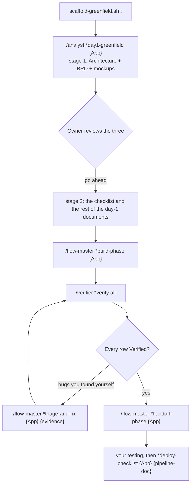

# TechieFlow — Solo-Dev Delivery Framework

> One person with domain knowledge takes a product through the whole software life cycle, with AI agents doing the work and the person managing and reviewing every output. Runs in **Claude Code** and **OpenCode**, identically.
>
> **This is the solo edition of a two-edition family.** The team edition is the [AI-First Development Playbook](https://github.com/techierathore/AI-First-Playbook) — the same philosophy sized for an engineering team.

| If you want to | Read |
|---|---|
| Set up a machine for the first time | [`docs/TechieFlow-Setup.md`](docs/TechieFlow-Setup.md) |
| Understand what every command does and what it costs | [`docs/TechieFlow-How-It-Works.md`](docs/TechieFlow-How-It-Works.md) |
| Know the shape every document must have | [`docs/TechieFlow-Document-Schemas.md`](docs/TechieFlow-Document-Schemas.md) |
| Understand the numbers the framework reports | [`docs/TechieFlow-Telemetry-Explained.md`](docs/TechieFlow-Telemetry-Explained.md) |
| Know why an agent was refused something | [`docs/TechieFlow-Permissions-And-YOLO.md`](docs/TechieFlow-Permissions-And-YOLO.md) |
| Fix something surprising | [`docs/TechieFlow-FAQ.md`](docs/TechieFlow-FAQ.md) |
| Change the framework itself | [`WorkFlow-Context.md`](WorkFlow-Context.md) |
| See what has been done to it | [`docs/CHANGELOG.md`](docs/CHANGELOG.md) |

---

## 1. What it does

An idea becomes a brief, the brief becomes the requirements, the architecture and the screen designs, the requirements become a numbered checklist, the build implements the checklist, and a separate verifier starts the application, drives it with a browser robot and marks each row passed or failed. Bugs found by a person are logged by one command and fixed by another. Developer and end-user guides are generated from the running application. Every command ends by rewriting one status file, so the state of a project is always known.

Three things make it different from prompting an agent by hand:

- **The shape is enforced, not requested.** Every human document has a schema — required sections, size budget, row rules — and a checker that fails the phase when a generated document breaks it.
- **Rules that were ignored became hooks.** Eight guards refuse an action outright and print why: any git write, a malformed status file, `Verified` without a verify run, a hand edit of a telemetry file, a database write outside build and fix, run material at the repository root, a backgrounded build in unattended mode, and ending a turn with the status gate incomplete.
- **The work is measured.** Five append-only streams per project record what each command cost, which check caught which failure, and what each miss cost to fix.

The framework is technology-neutral. It asks a set of stack questions at day-1 and records the answers in the project's Architecture document; an answer set can fill them in (the owner's .NET set ships as `docs/TechieFlow-Stack-Defaults-DotNet.md`).

---

## 2. Installing it into a project

Prerequisites are one-time per machine and live in [`docs/TechieFlow-Setup.md`](docs/TechieFlow-Setup.md): the toolchain, headless Chromium, and — for mobile heads — the Appium device hosts. **`python3` is required**; the guard hooks fail open without it.

Copy the framework in; never `npm install` it. All three scripts locate the framework from their own directory, so invoke whichever machine's copy you are on.

```bash
# an existing application
/path/to/TechieFlow/scaffold-brownfield.sh /path/to/existing-app

# a new application
mkdir /path/to/my-new-app && cd /path/to/my-new-app && git init
/path/to/TechieFlow/scaffold-greenfield.sh .

# refresh a project to the current framework (preview first)
/path/to/TechieFlow/update-framework.sh /path/to/app --dry-run
/path/to/TechieFlow/update-framework.sh /path/to/app
```

The scaffolders never touch a file that already exists. The updater force-overwrites framework files and preserves everything holding your work.

| Overwritten (the framework wins) | Preserved (your work, never touched) |
|---|---|
| `.tfcore/{tasks,templates,agents,standards,utils,hooks,telemetry}/`, `.claude/commands/TechieFlow/`, `.claude/settings.json`, `.opencode/` | `docs/`, `src/`, `tests/`, `PROJECT-STATUS.md`, `CLAUDE.md`, `.editorconfig`, `.tfcore/core-config.yaml`, `.tfcore/routing.yaml`, the root `opencode.jsonc`, the NuGet-deployed library personas |

Everything the framework drops into a project is a copy, so the scripts also keep the project's `.gitignore` ignoring those copies, and a second block for machine-generated test material. They never run git themselves: if a framework file was committed before the ignore entry existed, you untrack it yourself once.

Restart the harness afterwards so it re-scans the commands.

---

## 3. The flow

**A new application**



**An existing application** is the same after day-1: `*day1-brownfield` reads the code, writes the same documents plus the DevGuide, and migrates any existing plan into the one checklist.

**Which command next?** Pick by the weakest open row: anything unbuilt means `*build-phase`; all built but not verified means `*verify all`; all verified means `*handoff-phase`. When in doubt, build. If a session died mid-phase, the status file is stale — run `*refresh-status {App}` first, which rebuilds it from the checklist, the working tree and a fresh build.

**Running unattended.** Do not start a long run as a bare harness command. The supervisor survives a usage limit, a crash and an agent that stops early:

```bash
bash .tfcore/utils/tf-goal.sh [--harness opencode] [--model <id>] <app-folder> "<goal>"
bash .tfcore/utils/tf-goal.sh --resume <app-folder>     # after a reboot
```

---

## 4. The commands

Replace `{App}` with your application name. Claude Code takes the long persona path; OpenCode takes the short one.

| What you want | Claude Code | OpenCode |
|---|---|---|
| Day-1, new application | `/TechieFlow:agents:analyst *day1-greenfield {App}` | `/flow-analyst *day1-greenfield {App}` |
| Day-1, existing application | `/TechieFlow:agents:analyst *day1-brownfield {App}` | `/flow-analyst *day1-brownfield {App}` |
| Screen designs and mockups | `… analyst *mockups {App} [--update]` | `/flow-analyst *mockups {App}` |
| Requirements into the checklist | `… analyst *split-brd {App}` | `/flow-analyst *split-brd {App}` |
| A change to an existing project | `… analyst *amend-docs {App} "<what changed>"` | `/flow-analyst *amend-docs {App} "…"` |
| Brainstorm, brief, research | `… analyst *brainstorm {topic}` · `*create-project-brief` · `*research-prompt {topic}` | same, on `/flow-analyst` |
| Build everything open | `/TechieFlow:agents:flow-master *build-phase {App}` | `/flow-master *build-phase {App}` |
| Verify | `/TechieFlow:agents:verifier *verify ui\|functional\|all` | `/flow-verifier *verify all` |
| Bugs: log and analyse only | `… flow-master *triage-issues {App} {evidence} [verify]` | `/flow-master *triage-issues …` |
| Bugs: fix them | `… flow-master *fix-issues {App} {folder}` | `/flow-master *fix-issues …` |
| Bugs: the whole sequence unattended | `… flow-master *triage-and-fix {App} {evidence}` | `/flow-master *triage-and-fix …` |
| One thing an agent missed | `… flow-master *log-miss {App} "<sentence>" [--fixed]` | `/flow-master *log-miss …` |
| Developer guide | `… flow-master *devguide {App} [--update]` | `/flow-master *devguide {App}` |
| End-user manual | `… flow-master *productguide {App}` | `/flow-master *productguide {App}` |
| Hand it over | `… flow-master *handoff-phase {App}` | `/flow-master *handoff-phase {App}` |
| Deployment steps, after UAT | `… flow-master *deploy-checklist {App} {pipeline-doc}` | `/flow-master *deploy-checklist …` |
| Recover a dead session | `… flow-master *refresh-status {App} [verify]` | `/flow-master *refresh-status {App}` |
| The measurements | `… flow-master *metrics {App}` | `/flow-master *metrics {App}` |
| Render a document to HTML | `… flow-master *generate-html <path>` | `/flow-master *generate-html <path>` |
| Unattended mode on or off | `… flow-master *yolo` | `/flow-master *yolo` |

`*help` on any persona prints its own table. You never invoke the library agents `/trblazeui` and `/techierag` yourself: the build and the fix call them as sub-agents for `REQ-UI-` and `REQ-RAG-` rows.

---

## 5. What it produces

Every per-project document is named after the application: `docs/<App>-Brief.md`, `-BRD.md`, `-Architecture.md`, `-Checklist.md`, `-UIDesign.md`, `-Coding-Standards.md`, `-UsageGuide.md`, `-DevGuide.md`, `-ProductGuide.md`, `-Deployment-Checklist.md`, `-Misses.md`, `-Decision-Request.md`, `-<Upstream>-Feedback.md`, plus `PROJECT-STATUS.md` and `CLAUDE.md` at the root, mockups under `docs/mockups/`, and screenshots under `docs/screenshots/<App>/`.

| Document | Who reads it |
|---|---|
| Brief | You, before anything is built. One page: what it is, who for, must do, out of scope. Day-1 reads it. |
| BRD, Architecture, UIDesign and the mockups | You, at the day-1 review. This is the cheap moment to redirect. |
| Checklist | Agents only. One table, one row per requirement, the single source of truth. Never rendered to HTML. |
| Coding Standards | Every implementing agent, and the verifier's standards check. |
| PROJECT-STATUS | You, to know where the project is. Rewritten by every command, never appended to. |
| UsageGuide | You, as the test plan for your own testing. |
| DevGuide | A developer tracing a bug: every screen to its code, with the line to break on. |
| ProductGuide | The end user. |
| Deployment Checklist | Whoever puts it on the host, after UAT. |
| Misses | You and the agents. Rebuilt from the record whenever something is logged as missed. |
| Decision Request | You. Every choice an agent cannot make: options, what each costs, a recommendation, and a block to paste back. It is never read back by an agent. |
| Feedback, one file per upstream | That team — each library, and the framework itself. Every entry says in its first word whether it blocks your work. Reporting is never refused; a non-blocking entry never stops a run. |

Each document has a required shape and a size budget for the application's size (Small, Medium or Large), enforced by `bash .tfcore/utils/tf-doc-check.sh --app {App}`. Add `--warn` to get a report instead of a refusal, which is what you want on a project that predates the schemas. Human documents render to HTML by script; an agent document never does — the checklist and the miss list are refused by name.

---

## 6. Permissions, in one paragraph

The shipped configuration allows every file operation and all of Bash with no prompting, asks before a delete or `sudo`, and **denies every git and `gh` write outright, in every mode including bypass**. Git is manual in this framework: you run it, in your own terminal or by typing `!git …`. Deletes stop asking in unattended mode. The full account, including why each guard exists, is in [`docs/TechieFlow-Permissions-And-YOLO.md`](docs/TechieFlow-Permissions-And-YOLO.md).

## 7. What it measures

Five append-only streams per project under `docs/metrics/`, read with `*metrics {App}`: command runs, verification verdicts, misses, chat sessions, and your own commits. They answer five questions — the first-pass rate, which check caught the failure, the escape rate, what misses cost to fix, and the effort per phase. Definitions, real figures and the sentence to say about each are in [`docs/TechieFlow-Telemetry-Explained.md`](docs/TechieFlow-Telemetry-Explained.md); the field contract is `.tfcore/telemetry/SCHEMA.md`.

Standing rules: provenance never merges, only identifiers and counts are recorded, telemetry has no veto, and an agent never writes what it cannot know. Dollar figures exist only for OpenCode runs; Claude Code reports tokens and no rate card is ever applied.

## 8. Running phases on cheaper models

Each command carries a tier — frontier, standard or economy — and each tier maps to a real model per harness, in the project's `.tfcore/routing.yaml`. One script does everything; you never edit a generated file.

```bash
bash .tfcore/utils/tf-routing.sh status
bash .tfcore/utils/tf-routing.sh on
bash .tfcore/utils/tf-routing.sh set-tier verify-phase economy
```

Drift is observed, never enforced: a run on the wrong model is recorded as such and nothing blocks. Full guide: [`docs/TechieFlow-Routing-Guide.md`](docs/TechieFlow-Routing-Guide.md).

---

## 9. Team edition

TechieFlow is the solo edition — one developer and AI across a portfolio, the unit of work being the run. The **[AI-First Development Playbook](https://github.com/techierathore/AI-First-Playbook)** is the same philosophy for a team of five to fifty on one product, where the unit of work is the feature and the hard parts are onboarding, review gates and shared standards. The two are independent repositories; neither depends on the other. Both hold to markdown as the source of truth, diagrams in Mermaid, HTML for human documents only, one checklist as the single source of truth, and verifying by executing rather than by reading.

---

Last revised 2026-09-07, at the close of Session 6 of the reset. When the framework changes, update `WorkFlow-Context.md` and `docs/CHANGELOG.md` in the same pass.
