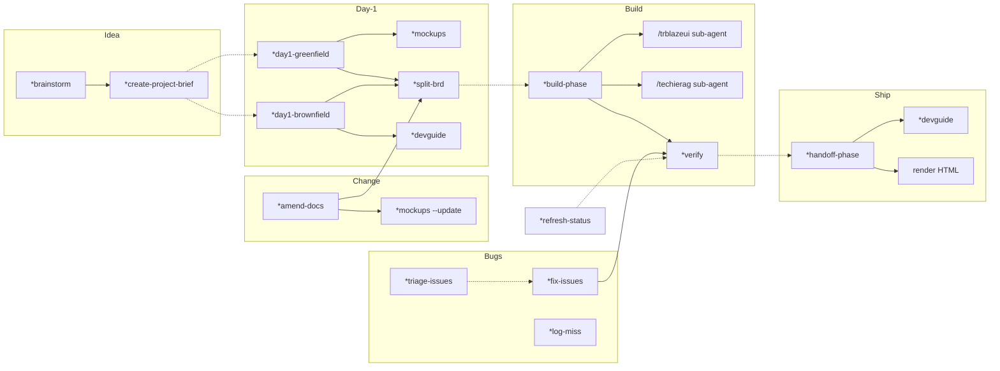
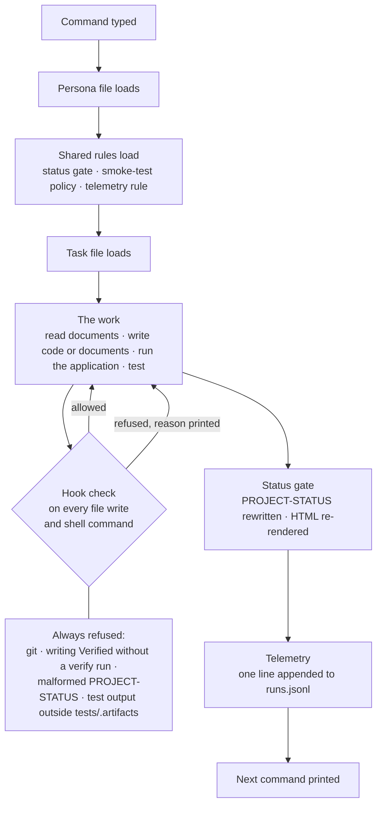

# TechieFlow — How It Works

| | |
|---|---|
| Purpose | Describe what the framework is, what each command does, what surrounds every command, what each command costs, what the telemetry measures, and where the current design falls short. |
| Audience | The framework owner, contributors, and anyone evaluating the framework. No prior knowledge of AI coding harnesses is assumed. |
| Status | Reviewed with the owner in Session 1 of the reset (2026-09-04). Section 8 lists the defects found during that review; they feed the framework requirements written in Session 2. |
| Companion | `TechieFlow-Reset-Plan-2026-09-04.md` |

---

## 1. Overview

TechieFlow is a software development harness companion. It enables one person with domain knowledge of a product to take that product through the complete software development life cycle, with AI agents performing the work and the person acting as manager and reviewer of every output.

The framework covers every phase. An idea is brainstormed with the analyst persona and condensed into a project brief. From the brief the framework produces the requirements document, the architecture, and the screen designs, and converts the requirements into a checklist of numbered items. The build command implements the checklist. A separate verify command starts the application, drives it with a browser robot, and marks each item passed or failed. Bugs found by a person are logged by one command and fixed by another. Developer and end-user guides are generated from the running application. Every command ends by rewriting a single status file, so the state of a project is always known.

Alongside the work, the framework measures the work. Every command records the model used, the elapsed time, and the tokens consumed. Every verification records which check caught which failure. Every miss records its kind, the phase that let it through, who found it, and the cost of the fix. Over time this shows which model suits which kind of work, which is the basis for model routing, and it yields figures on AI-assisted development that have not been published elsewhere.

The framework runs in two harnesses, Claude Code and OpenCode, and must work identically in both.

---

## 2. Framework terms

| Term | Meaning in TechieFlow | Software development equivalent |
|---|---|---|
| **Harness** | The tool that runs the AI agent and gives it access to the files and the shell: Claude Code or OpenCode. | The IDE or CI runner that executes the work. |
| **Persona (agent)** | A markdown file defining who the agent is for a job and which commands it accepts. Four exist: analyst, architect, flow-master, verifier. | A role definition with a fixed set of responsibilities. |
| **Command** | An instruction typed to a persona, prefixed with `*`, such as `*build-phase TechieRag`. Each command maps to one task file. | A CLI sub-command. |
| **Task** | A markdown file holding the step-by-step procedure for one command. The agent reads it and follows it. | A runbook, or a script written in prose. |
| **Template** | The blueprint for one document: a skeleton with placeholders and guidance for each section. The agent fills it to produce the BRD, the Architecture, and the other documents. Sixteen exist under `.tfcore/templates/v4custom/`. At present the guidance is loose prose, so a generated document may add, skip, or over-fill sections without anything stopping it. Session 3 of the reset gives each template a strict structure (required sections in order, size limits, row rules) and a script that rejects a document that breaks it. | A document template plus a validator. |
| **Hook** | A small script the harness runs automatically before or after an agent action, with power to block it. Eight exist. Example: every `git` command is blocked. | A pre-commit hook or a CI policy check. Runs regardless of the agent's intent. |
| **Utility script** | A shell or Python script the agent runs instead of doing a step by hand, such as the HTML renderer or the telemetry writer. Seventeen exist under `.tfcore/utils/`. | A build tool or CLI utility. |
| **`.tfcore/`** | The framework's folder inside each project. Hidden, ignored by git, refreshed by `update-framework.sh`. Holds personas, tasks, templates, hooks, scripts. Never edited inside a project. | The installed copy of a library. |
| **Harness mirror** | Claude Code discovers commands only under `.claude/commands/`, so every persona and task is copied there byte for byte. OpenCode instead reads file paths from `opencode.jsonc`. Both must stay in step with `.tfcore/`. | Two build configurations pointing at one source tree. |
| **`core-config.yaml`** | Per-project settings: application name, which documents the agents always load. | The project's configuration file. |
| **Checklist** | `docs/<App>-Checklist.md`. One table, one row per numbered requirement, with a status column. The single source of truth for what is done. Never rendered to HTML. | The work-item board. |
| **Status gate** | The rule that every command ends by rewriting `PROJECT-STATUS.md` in a fixed shape. A hook rejects a malformed write. | A mandatory end-of-job report. |
| **YOLO mode** | Run to completion with no questions and all permissions except git writes. Set by a flag file with a 24-hour expiry. The owner's preferred mode for most commands. | An unattended batch run. |
| **Model routing** | A YAML file mapping each command to a cost tier (frontier, standard, economy) and each tier to a model per harness. Currently disabled. | Selecting machine size per pipeline stage. |
| **Telemetry streams** | The measurement system. Five files under `docs/metrics/`, one line appended per event, never edited: command runs (command, model, time, tokens), verification verdicts (first check that failed), misses (kind, phase, finder, fix cost), chat sessions (tokens in and out), and the owner's git commits. A report reads them into five figures; see section 6. | An append-only event log with a reporting query. |

---

## 3. The commands

### 3.1 Command nesting

Several commands call others. The diagram shows which command invokes which, in life-cycle order. Solid arrows are automatic calls; dashed arrows are calls the owner makes.

### 3.2 Idea stage — analyst

| Command | Reads | Writes | Template | Owner usage |
|---|---|---|---|---|
| `*brainstorm {topic}` | The owner's idea, the brainstorming techniques catalogue | `docs/brainstorming-session-results.md` | `brainstorming-output-tmpl.yaml` | Used regularly, usually followed by the project brief in the same session. |
| `*create-project-brief` | The brainstorm results | A one-page brief: product, users, must-do, out of scope | `project-brief-tmpl.yaml` | Used regularly. The brief is the input to day-1. |
| `*create-competitor-analysis` | Owner input | Competitor analysis document | `competitor-analysis-tmpl.yaml` | Never used. Retained. |
| `*perform-market-research` | Owner input | Market research document | `market-research-tmpl.yaml` | Never used. Retained. |
| `*research-prompt {topic}` | Owner input | A prompt for an external deep-research tool | none | Never used; the owner researches on the web directly. Retained for trial. |
| `*create-brd {App} {topic}` | Existing BRD | New numbered `BRD-N` items, each confirmed one at a time | none | Not used. Day-1 and `*amend-docs` cover the need. |

### 3.3 Day-1 — analyst

**`*day1-greenfield {App}`**: the starting command for a product with no code.

- Reads: the project brief or concept text, any hint documents, the TrBlazeUI component catalogue.
- Writes: BRD, Architecture, Coding Standards, `.editorconfig`, PROJECT-STATUS, CLAUDE.md, AGENTS.md, UsageGuide. Calls `*mockups`, then `*split-brd`. Renders every human document to HTML.
- Templates: `app-brd`, `app-architecture`, `app-usageguide`, `app-project-status`, `app-claude-md`, `app-agents-md`, `app-editorconfig`, `build-invocation-ladder`.
- Owner input requested: application name and concept only.
- **Defects found in review (see §8):** D-1, D-2, D-3, D-4.

**`*day1-brownfield {App}`**: the starting command for a product that already has code.

- Reads: the whole source tree, any existing plan or specification documents.
- Writes: the same set as greenfield, plus the DevGuide (screen-by-screen code map with screenshots) generated from the running application. Migrates an existing development plan into the checklist. Calls `*split-brd`.
- Templates: as greenfield, plus `app-devguide`.
- **Defects found in review:** D-5.

**`*mockups {App} [--update]`**

- Reads: BRD, Architecture, the TrBlazeUI component catalogue.
- Writes: `docs/<App>-UIDesign.md` (one section per screen mapping each region to a TrBlazeUI control) and `docs/mockups/*.html` (one HTML picture per screen). The build implements from these; the verifier compares built screens to them.
- Template: `app-uidesign`.
- Currently described as greenfield-only. **Defect:** D-5.

**`*split-brd {App}`**

- Reads: BRD (`BRD-N` items), Architecture, UIDesign.
- Writes: `docs/<App>-Checklist.md`. Each BRD item becomes one or more rows numbered `REQ-UI-`, `REQ-FN-`, `REQ-NFR-`, `REQ-RAG-`. The prefix routes the work: UI rows to the TrBlazeUI sub-agent, RAG rows to the TechieRag sub-agent, FN and NFR rows to flow-master. Each row carries an acceptance line, which is what the verifier tests.
- Template: `app-checklist`.
- Owner usage: never run by hand; expected to be called automatically after the BRD is approved. **Defect:** D-6.

### 3.4 Build — flow-master

**`*build-phase {App}`**

- Reads: checklist, Architecture, Coding Standards, UIDesign and mockups, build invocation ladder.
- Does: clusters all open rows, builds each cluster (`/trblazeui` for UI rows, `/techierag` for RAG rows, its own sub-agents for the rest), starts the application, smoke-tests each changed screen (data present, nothing overlapping), then calls the verifier.
- Writes: source code; checklist status up to `Implemented` (a hook blocks `Verified`); library feedback files when TrBlazeUI or TechieRag lacks something; PROJECT-STATUS; one telemetry line.
- Templates: `app-library-feedback`, `build-invocation-ladder`.
- **Defect:** D-7 (DevGuide not produced on completion).

### 3.5 Verify — verifier

**`*verify {ui | functional | all | REQ-list}`**

- Reads: checklist rows in scope, DevGuide (which controls each screen must show), mockups.
- Does: starts the application, runs Playwright browser tests and `dotnet test`, and applies seven checks to each requirement in order: build, acceptance test, data present, visual correctness against the mockup, assets loaded, speed within a declared budget, coding standards. The first failing check is recorded.
- Writes: checklist status (`Verified`, or `Needs re-verify` with a remark); `docs/.last-verify.json`, the proof that a real verify ran; one `gates.jsonl` line per requirement.
- Scripts: `tf-assets.sh`, `tf-mockup-parity.sh`, `tf-perf.sh`.
- **Defect:** D-8 (task size).

### 3.6 Change — analyst

**`*amend-docs {App} {change}`**

- Reads: BRD, Architecture, checklist, UIDesign.
- Does: edits BRD and Architecture in place, appends new `BRD-N` items, ripples new rows into the checklist, and calls `*mockups --update` when the change adds or alters a screen. Re-renders HTML.
- Owner usage: used for every mid-project change, for example adding the phase-effort report screen to TfLens.
- **Defect:** D-9 (the mockup step was undocumented in the previous version of this file).

### 3.7 Bugs — flow-master

**`*triage-issues {App} {evidence} [verify]`**: analysis only. Takes screenshots and/or a written bug list, reproduces each bug, logs it against its requirement, demotes the row to `Needs re-verify`, adds rows for unspecified defects, and names the `*fix-issues` command to run next. Never edits code. Its telemetry line is marked `escaped`.

**`*fix-issues {App} {folder}`**: takes a folder of screenshots and an optional notes file, reproduces each bug, fixes the code (UI via the TrBlazeUI sub-agent), re-smokes, re-verifies the touched rows, updates the documents.

**`*log-miss {App} "description"`**: the twenty-second record. Writes one miss line classifying the miss and a remark on the checklist row. No reproduction, no code. **Defect:** D-10 (the record stores categories only, not the description).

### 3.8 Ship — flow-master

**`*handoff-phase {App}`**: run once when the checklist is green, before owner testing. Finalises the UsageGuide (test users, screen-by-screen test plan), generates or refreshes the DevGuide, consolidates library feedback, re-renders HTML, sets status to Handoff.

**`*devguide {App} [--update]`**: the developer's low-level document. Every screen traced from page to control to service to data access, with a screenshot. Re-runnable for changed screens only. Generated automatically at brownfield day-1 and at handoff. **Defect:** D-7.

**`*productguide {App}`**: the end-user manual, screenshot-illustrated, task by task. On demand. Owner usage: not yet used.

### 3.9 Maintenance — flow-master

**`*refresh-status {App}`**: rebuilds PROJECT-STATUS from evidence (checklist table, file modification times, a fresh build) after an interrupted run. Never reads git. Owner usage: after brownfield onboarding of older projects.

**`*metrics {App}`**: reads the five telemetry files and writes `docs/metrics/METRICS.md` and `.html`. Owner usage: recent, regular.

**`*generate-html`, `*render-workflow-docs`**: render markdown to styled HTML through `tf-render-html.sh`. The checklist is never rendered.

---

## 4. What surrounds every command

Every command is wrapped by the same three mechanisms: shared rules read before the work, hooks watching during the work, and the status gate closing the work.

### 4.1 Example: a document-producing command, `*day1-greenfield TechieDesk`

1. The owner types the command to the analyst persona inside the TechieDesk project, with the project brief as input.
2. The analyst persona file loads: its identity, its commands, and its standing rules (BRD items are numbered and never renumbered; git is never run).
3. The three shared rule files load: how every command ends, how to smoke-test, how to record telemetry.
4. The day1-greenfield task file loads: the procedure for producing every day-1 document.
5. The agent reads the brief and the TrBlazeUI component catalogue. It drafts the BRD from the BRD template, section by section, numbering each requirement. It drafts the Architecture from its template. It writes the Coding Standards, `.editorconfig`, CLAUDE.md, AGENTS.md, and the UsageGuide skeleton.
6. Every file write passes through the hooks. Writes to `docs/` are allowed. A write to PROJECT-STATUS that does not match the template shape is refused.
7. The task calls `*mockups`. The agent produces the UIDesign document and one HTML mockup per screen.
8. The task calls `*split-brd`. The agent produces the checklist, one row per requirement, with an acceptance line each.
9. The status gate runs: PROJECT-STATUS is written in template shape with the next command set to `*build-phase TechieDesk`; every human document is rendered to HTML by script.
10. One telemetry line is appended: day1-greenfield, TechieDesk, model, start, end, tokens.
11. The next command is printed.

In YOLO mode steps 1 to 11 run without a pause. Outside YOLO mode the task pauses for review after step 5, and the owner reports that in practice the run frequently stops there and the mockups of step 7 are not produced (defect D-1).

### 4.2 Example: a code-producing command, `*build-phase TechieRag`

1. The owner types the command to the flow-master persona inside the TechieRag repository.
2. The flow-master persona file loads: identity, commands, standing rules (never run git, never write `Verified`, start the application yourself).
3. The three shared rule files load.
4. The build-phase task file loads: read the checklist, cluster the open rows, build each cluster, smoke-test, call the verifier.
5. The agent reads the checklist, the Architecture, the Coding Standards, the UIDesign and mockups. It groups the open rows into clusters and starts sub-agents: `/trblazeui` for UI rows with the mockups as their contract, `/techierag` for RAG rows, its own builders for the rest.
6. Every file write and shell command passes through the hooks. A `git commit` is refused with a printed reason. A `Verified` written into the checklist is refused. Test output written outside `tests/.artifacts/` is refused.
7. When the code is written, the agent builds the solution using the build invocation ladder, starts the application, opens each changed screen in a headless browser, and checks that data is shown and nothing overlaps.
8. The agent calls `*verify`. The verifier runs its seven checks and writes verdicts into the checklist and one `gates.jsonl` line per requirement.
9. The status gate runs: PROJECT-STATUS rewritten, HTML re-rendered.
10. One telemetry line is appended: build-phase, TechieRag, model, start, end, tokens, sub-agent count.
11. The next command is printed.

If the run dies during step 5 to 8, steps 9 to 11 never happen and PROJECT-STATUS is stale. `*refresh-status TechieRag` rebuilds it from the checklist and the files on disk.

Steps 2 to 4 are reading only. In the current framework they total more than 20,000 words before step 5 begins. Section 7 describes the effect.

---

## 5. Fixed instruction cost per command

Every command carries a fixed cost before it does any work: the instruction text the agent must read. That text is the same on every run and is independent of the project. It has four parts: the persona file, the shared rule files the task includes, the task file itself, and the templates the task reads. When a task calls another task, the called task's text is read as well.

The table gives the fixed cost of each command as measured on 2026-09-04. Word counts are exact; token estimates use 1.35 tokens per word, which is typical for English technical prose. "At start" is what is read before the first useful step. "When chaining" adds the tasks the command calls. The review verdict is the framework maintainer's assessment for Session 4, subject to the owner's decision.

| Command | Task (words) | Persona | Shared rules | Templates | At start (words → tokens) | Calls | When chaining (words) | Review verdict |
|---|---|---|---|---|---|---|---|---|
| `*day1-brownfield` | 7,287 | analyst 1,241 | 7,737 | 10,980 | 27,245 → ~36,800 | devguide, split-brd, generate-html | 35,136 | Trim hard. Duplicates day1-greenfield; share one day-1 core. |
| `*day1-greenfield` | 3,377 | analyst 1,241 | 5,028 | 10,980 | 20,626 → ~27,800 | mockups, split-brd, day1-brownfield, generate-html | 32,232 | Restructure into two stages (D-1). Template load of 10,980 words is the largest single item; Session 3 schemas cut it. |
| `*build-phase` | 4,412 | flow-master 3,564 | 9,280 | 3,052 | 20,308 → ~27,400 | verify-phase | 32,158 | Keep. Trim. Loads all four shared files. |
| `*fix-issues` | 1,789 | flow-master 3,564 | 7,737 | 0 | 13,090 → ~17,700 | triage-issues, build-phase, verify-phase | 31,406 | Keep. Combine with triage into one flow (D-16). |
| `*refresh-status` | 2,388 | flow-master 3,564 | 4,904 | 6,539 | 17,395 → ~23,500 | verify-phase, generate-html | 30,729 | Keep. Trim; a status rebuild does not need 17,000 words. |
| `*devguide` | 5,274 | flow-master 3,564 | 5,028 | 1,853 | 15,719 → ~21,200 | verify-phase, generate-html | 29,053 | Keep. Trim. |
| `*triage-issues` | 2,054 | flow-master 3,564 | 7,737 | 0 | 13,355 → ~18,000 | verify-phase | 25,205 | Keep. Combine with fix (D-16). |
| `*verify` | 11,850 | verifier 1,220 | 7,737 | 0 | 20,807 → ~28,100 | generate-html | 24,635 | Keep. Shrink to one third plus scripts (D-8). Largest task file. |
| `*productguide` | 1,448 | flow-master 3,564 | 5,028 | 364 | 10,404 → ~14,000 | verify-phase, generate-html | 23,738 | Keep. Unused so far. |
| `*mockups` | 1,702 | analyst 1,241 | 2,195 | 466 | 5,604 → ~7,600 | verify-phase, generate-html | 18,938 | Keep. Move inside day-1 stage 1; apply to brownfield (D-2, D-5). |
| `*handoff-phase` | 1,592 | flow-master 3,564 | 4,904 | 702 | 10,762 → ~14,500 | devguide, generate-html | 17,520 | Keep. |
| `*metrics` | 2,147 | flow-master 3,564 | 2,195 | 5,064 | 12,970 → ~17,500 | generate-html | 14,454 | Keep. The report template alone is 5,064 words; trim. |
| `*amend-docs` | 1,790 | analyst 1,241 | 4,904 | 3,008 | 10,943 → ~14,800 | author-brd, generate-html, mockups | 13,052 | Keep. |
| `*render-workflow-docs` | 1,341 | flow-master 3,564 | 2,709 | 3,008 | 10,622 → ~14,300 | none | 10,622 | Merge with generate-html; both call the same script. |
| `*log-miss` | 1,830 | flow-master 3,564 | 4,904 | 0 | 10,298 → ~13,900 | none | 10,298 | Keep. Trim; 10,000 words of reading for a twenty-second command. Call automatically (D-15). |
| `*generate-html` | 1,484 | flow-master 3,564 | 0 | 3,008 | 8,056 → ~10,900 | none | 8,056 | Merge with render-workflow-docs. The 3,008-word HTML shell is a script asset, not reading. |
| `*split-brd` | 1,133 | analyst 1,241 | 4,904 | 702 | 7,980 → ~10,800 | none | 7,980 | Keep. Run automatically after BRD approval (D-6). |
| `*brainstorm` | 672 | analyst 1,241 | 0 | 0 | 1,913 → ~2,600 | none | 1,913 | Keep. |
| `*create-brd` (author-brd) | 625 | analyst 1,241 | 0 | 1,361 | 3,227 → ~4,400 | none | 3,227 | Unused. **Remove** (owner decision 2026-09-04). |
| `*research-prompt` | 1,001 | analyst 1,241 | 0 | 0 | 2,242 → ~3,000 | none | 2,242 | Retained for trial. |
| `*elicit` (advanced-elicitation) | 616 | analyst 1,241 | 0 | 0 | 1,857 → ~2,500 | none | 1,857 | Inherited from BMAD. **Remove** (owner decision 2026-09-04). |
| `create-doc` (used by brief, competitor, market) | 546 | analyst 1,241 | 0 | 0 | 1,787 → ~2,400 | none | 1,787 | Keep; three retained commands depend on it. |
| `document-project` | 1,883 | architect 817 | 0 | 0 | 2,700 → ~3,600 | none | 2,700 | Inherited from BMAD. Overlaps day1-brownfield. **Remove** (owner decision 2026-09-04). |
| `index-docs`, `shard-doc`, `execute-checklist`, `kb-mode-interaction` | 415 to 827 each | flow-master or architect | 0 | 0 | 1,400 to 4,400 each | none | | Inherited from BMAD. Not in the owner's usage. **Remove** (owner decision 2026-09-04). |

The shared rule files, which are the second-largest item in most rows:

| Shared file | Words | Included by |
|---|---|---|
| `_smoke-test-policy` | 2,833 | every task that builds or runs the application |
| `_status-update-gate` | 2,709 | every task that updates the checklist or status |
| `_metrics-emit-gate` | 2,195 | every task that emits telemetry |
| `_yolo-mode` | 1,543 | build-phase only, and only as a conditional ("if YOLO is on, do not hand back"). `verify-phase` does not reference YOLO at all. The owner enables YOLO explicitly with `*yolo`; see D-18 for the expected behaviour. |

Observations:

- Twelve commands read more than 10,000 words before their first useful step. Three read more than 20,000. The reset target is under 7,000 words at start for any command.
- The flow-master persona is 3,564 words and is loaded by fourteen commands. Shrinking that one file shrinks fourteen commands.
- Templates are the largest item for the two day-1 commands. The Session 3 schema work reduces that load as a side effect.
- Seven commands inherited from BMAD are not in the owner's usage: create-brd (author-brd), elicit, document-project, index-docs, shard-doc, execute-checklist, kb-mode-interaction. The owner decided on 2026-09-04 to remove them; the removal is carried out in Session 4c, from both harnesses, with `create-doc` kept because three retained commands depend on it.
- Observed run costs (elapsed time and tokens per run, from telemetry) are in section 6.

---

## 6. Telemetry

Five files under `docs/metrics/`. Each line is one event. Nothing is edited after it is written.

| File | One line per | Written by |
|---|---|---|
| `runs.jsonl` | command run: command, model, harness, start, end, tokens, sub-agents | every task, at the status gate |
| `gates.jsonl` | requirement graded in a verify run, with the first check that failed | verify-phase, triage-issues |
| `misses.jsonl` | thing the agent got wrong, plus a second line when it is fixed | log-miss, triage-issues, fix-issues |
| `sessions.jsonl` | chat session: tokens in and out | a hook at session end |
| `commits.jsonl` | one git commit by the owner | a git hook the owner installs; agents never run it |

### 6.1 Observed run cost, from the run stream

Measured from every `runs.jsonl` across the seven repositories that carry telemetry, on 2026-09-04. Median values; tokens are output tokens per run. These figures depend on the project and the work; the fixed instruction cost in section 5 does not.

| Command | Runs recorded | Repos | Median duration (min) | Median output tokens |
|---|---|---|---|---|
| `*fix-issues` | 42 | 6 | 26 | 123,000 |
| `*verify` | 26 | 6 | 30 | 95,000 |
| `*build-phase` | 22 | 4 | 158 | 397,000 |
| `*log-miss` | 21 | 4 | 1 | 8,000 |
| `*amend-docs` | 8 | 3 | 20 | 58,000 |
| `*triage-issues` | 6 | 4 | 23 | 144,000 |
| `*metrics` | 6 | 2 | 6 | 10,000 |
| `*handoff-phase` | 4 | 3 | 26 | 121,000 |
| `*mockups` | 3 | 1 | 25 | 99,000 |
| `*refresh-status` | 2 | 2 | 9 | not recorded |
| `*split-brd` | 1 | 1 | 10 | 161,000 |
| `*day1-greenfield`, `*day1-brownfield`, `*devguide`, `*productguide` | 0 | | | no run recorded in any repository (D-11) |
| `*brainstorm`, `*create-project-brief` | 0 | | | not instrumented (D-13) |

Fix, verify and build account for 90 of the 142 recorded runs. The run record does not carry the mode (YOLO or interactive), so cost by mode cannot yet be reported (D-12). Dollar cost is recorded only for OpenCode runs.

### 6.2 The five questions the report answers

The report (`*metrics`) answers five questions.

1. **First-pass rate.** Of all requirements, the share marked Verified on their first verification. It measures how often the agent gets a requirement right without rework. Example: 100 requirements, 70 verified first time, first-pass rate 70 percent.

2. **Which check caught it.** The verifier applies seven checks to every requirement in a fixed order, and the first to fail is recorded. The checks: build (does it compile), acceptance (does the requirement's automated test pass), data (does the screen show real data), visual (does the screen look right and match the mockup), assets (did the stylesheet and scripts load), speed (within the declared budget), standards (does the code follow the coding standards). The distribution shows which checks do the work. Failures concentrated in "data" mean screens are wired to nothing. Failures concentrated in "visual" mean working screens that look broken. Few failures caught by any check while people keep finding bugs means the checks are not looking at the right things, which is the TfLens pattern.

3. **Escape rate.** The share of defects found by a person after every automated check passed. It measures how far the automation can be trusted. Across all repositories, 54 of 128 recorded misses were found by the owner rather than by a check.

4. **Misses and rework cost.** For each miss: its kind (wrong behaviour, partial implementation, not in the specification), the phase that caused it, who found it, and the tokens the fix consumed. It shows where the process leaks and what each leak costs. Across all repositories, 63 misses were classified "the verify method was insufficient" and 44 "the checklist item was missing or its acceptance was vague".

5. **Effort per phase.** For each command: elapsed time, tokens, model, sub-agent count. It shows what each stage costs and allows a cheap model to be compared with an expensive one on the same kind of work.

Dollar figures exist only for OpenCode runs. Claude Code reports tokens, never dollars, and the report never converts.

---

## 7. Instruction size and its effect

An AI model divides its attention across everything it reads. The more text in front of it, the smaller the share each sentence receives. A rule alone in a short file is followed. The same rule as one of six hundred is followed most of the time, and the remainder is where misses originate. When an agent reports "the gate was missed" or "no such gate exists", both mean the same thing: the sentence was present and did not receive enough attention to be acted on.

An analogy: a new team member is handed a sixty-page manual to read before every task. They read it, work, and by the afternoon have forgotten page fourteen. A note is added on page sixty-one: "do not forget page fourteen". The manual is now sixty-one pages.

| Item | Size | Effect on a run |
|---|---|---|
| Shared rules read on every command | 9,280 words | About 25 minutes of human reading before any work, on every command, including one-minute commands. |
| The verify task | 11,850 words | The largest task and the source of most "verify method insufficient" misses; the instructions for what to check are interleaved with instructions for how to set up. |
| All tasks together | 70,000 words | Tasks repeat one another, so a change in one leaves the others stale. |
| Rules stated as MUST or NEVER in prose | 622 | Each depends on the agent remembering it. |
| Rules enforced by hooks | 8 | These always hold. No agent has run git since the hook was installed. |
| `WorkFlow-Context.md`, the session briefing | 344 KB | Mostly a six-month incident log. A session that reads it spends attention on history. |
| `README.md` | 121 KB | The same problem for a human reader. |

Markdown is not the cause. Three kinds of text are mixed in the task files: instructions to follow now, explanations of why a rule exists, and the history of the incident that produced it. Only the first belongs in a file read on every run. A more structured format would not separate them; editing does.

Three moves shrink a task, applied block by block in Session 4 of the reset:

- A mechanical step becomes a script. Twenty lines of shell replace several hundred words and cannot forget.
- A rule the agent has ignored more than once becomes a hook, which cannot be ignored, or is deleted.
- Explanation and history move to human documents. The task keeps the step, not the story.

The mechanical parts already work: 8 hooks, 17 scripts, 16 templates, 3 scaffold scripts. The prose is what grew, and the prose is what the reset removes.

---

## 8. Defects and gaps found in the Session 1 review

These are inputs to `TechieFlow-Requirements.md` (Session 2). Each becomes a requirement line with a check, or is closed as not a defect.

Each defect is also recorded in the framework repository's own miss stream, `docs/metrics/misses.jsonl`, as `MISS-TechieFlow-20260904-NN` where NN equals the defect number (D-1 is `-01`, D-19 is `-19`; D-20 and D-21 were proposed by the maintainer in Session 2 without asking the owner first, which is itself logged as `-22`; both accepted by the owner on 2026-09-04). The Session 1 work itself is recorded in `docs/metrics/runs.jsonl` as a `framework-reset` run: 2026-09-04 08:18 to 14:43 UTC, model claude-fable-5-1, 569,794 output tokens. The schema gains the `framework-reset` command value in Session 2 (D-19).

| ID | Where | Defect | Owner's expectation |
|---|---|---|---|
| D-1 | `*day1-greenfield` | Outside YOLO mode the run pauses for BRD review and in practice stops there; mockups are not produced. In YOLO mode the run also ends without mockups, reporting "review the BRD first". | Day-1 becomes two stages with one owner review between them. **Stage 1** produces three linked documents and runs to completion in YOLO mode, mockups included: the Architecture (with the standing .NET decisions as a section), the BRD (with mockups per use case, screen-by-screen flow, and the fields on every screen), and the mockups themselves. **Stage 2**, on the owner's go-ahead, produces the checklist via split-brd and the remaining day-1 documents (Coding Standards, PROJECT-STATUS, CLAUDE.md, AGENTS.md, UsageGuide). |
| D-2 | `*day1-greenfield`, BRD | Mockups are produced after the BRD, as a separate step. The BRD is text and diagrams only. | Mockups are produced while the BRD is written (stage 1 of D-1). The BRD links a mockup per use case beside its acceptance criteria and lists the fields of every screen. The Architecture follows the same pattern. |
| D-3 | `*day1-greenfield` | No cap on scope or document size, and no definition anywhere of what a small, medium or large application is. TfLens is a small application by any measure (six or seven screens including login, one role, integration only with AppManager) and still produced 180 requirements and a 30,400-word BRD. | The framework defines application size by measurable criteria, agreed with the owner on 2026-09-04: **Small** up to 10 screens, one role, up to 40 to 50 requirements. **Medium** up to 20 screens, up to 100 requirements. **Large** anything beyond, and a large application is not written as one BRD: its requirements are split into phases, each phase with its own BRD, checklist and build. Integration with AppManager does not count as an external integration; AppManager is the owner's shared platform for identity, roles, licences and subscriptions and is part of every application. The size is chosen at day-1 stage 1 from the brief and written into the BRD header. The size sets the document budgets (Session 3) and the requirement cap; when a project's requirement count grows past its size during `*amend-docs`, the framework proposes a phase split rather than growing the single BRD. |
| D-4 | `*day1-greenfield` | No standing .NET decisions, so each project invents its own configuration, secret, database and container arrangement. TfLens ended with settings in three places. | A one-page standing decisions document, read at day-1 and build. |
| D-5 | `*mockups`, `*day1-brownfield` | Mockups are documented as greenfield-only. Brownfield changes also need mockups, and brownfield day-1 does not detect or link existing mockups. | Mockups apply to any project. Brownfield day-1 finds existing mockups, records where they are, and links them from the documents. |
| D-6 | `*split-brd` | Owner has never run it by hand and expects it to follow BRD approval automatically. The nesting is not visible to the owner. | The checklist is produced automatically once the BRD is approved; the nesting is documented (§3.1). |
| D-7 | `*devguide` | The DevGuide is produced at brownfield day-1 and at handoff. Greenfield projects get no DevGuide until handoff, and this was not documented. | The DevGuide is produced automatically when the build phase completes the checklist, for every project type. |
| D-8 | `*verify` | 11,850 words; the check definitions are buried in setup instructions. Source of 63 of 128 recorded misses ("verify method insufficient"). | Shrunk to judgement plus scripts in Session 4c. |
| D-9 | `*amend-docs` | Its call to `*mockups --update` was undocumented in the previous version of this file. | Documented (§3.6). Closed. |
| D-10 | `*log-miss` | The miss record stores categories only. The owner's sentence describing the miss is not kept anywhere readable. | A one-sentence `what` written to a human-readable file beside the record (Session 5). |
| D-11 | Telemetry | No run record exists for `*day1-greenfield`, `*day1-brownfield`, `*devguide`, `*productguide` in any repository. | Confirm whether those tasks emit; if they do not, they must. |
| D-12 | Telemetry | The run record does not carry whether YOLO mode was on, so cost cannot be reported by mode. | Record the mode on every run so the cost table in §5 can be split by mode. |
| D-13 | Personas | The analyst's idea-stage commands (brainstorm, project brief, competitor analysis, market research, research prompt) were absent from the previous version of this file and emit no telemetry. | Documented (§3.2). Telemetry for them decided in Session 2. |
| D-14 | Harnesses | The framework still carries a Codex adapter. The owner supports two harnesses only. | Codex frozen now; removal decided after the reset. TfLens's harness page will list Claude Code and OpenCode only. |
| D-15 | `*log-miss`, `*triage-issues`, `*fix-issues` | `*log-miss` is never called automatically. The nesting diagram (§3.1) shows it standing alone. Triage finds root causes and fix repairs them, yet neither records the miss or its cost unless the owner types the log command by hand. | Triage calls log-miss automatically for every root cause it identifies, recording the discovery cost. Fix calls log-miss automatically when a fix is complete, recording the fix cost. The owner never types log-miss for a bug that went through triage or fix. |
| D-16 | Bug handling | The owner's actual way of working is one sequence typed as a long prompt every time: compare every screen to its mockup, triage (analyse only), log-miss for discovery cost, fix, log-miss for fix cost, metrics, all in YOLO mode, with a summary per step. No command does this. | One command, working name `*triage-and-fix {App} {evidence}`, runs that exact sequence in YOLO mode and ends with a per-step summary: screens compared, root causes found and logged with cost, fixes made and logged with cost, metrics refreshed. The separate triage and fix commands remain for when only one is wanted. |
| D-17 | Telemetry, every phase with an owner review | When the owner reviews a phase's output (for example the BRD, Architecture and mockups after day-1 stage 1) and gives corrections, nothing is recorded: not how many gaps were found, not what producing the documents cost, not what applying the corrections cost. Only build and verify phases are measured for misses. | Every phase that ends in an owner review records a review outcome: the number of corrections given, the cost of producing the reviewed output, and the cost of applying the corrections. Whether this is a new record kind ("correction") or a miss with a review origin is decided in Session 2; the requirement is that the cost of deviation is measurable in every phase, not only in build and verify. |
| D-18 | YOLO mode | YOLO is documented as a mode the owner switches on with `*yolo`. Only `build-phase` reacts to it, and only as a conditional; `verify-phase` has no YOLO handling at all; the other tasks either ignore it or mention it in passing. The owner's experience is that YOLO does not carry through consistently (see D-1). | YOLO is supported by every command: when the flag is on, no command pauses for confirmation, every command takes the documented default and records it. For `*build-phase` and `*verify` YOLO is the default, on without being asked, because these two commands are never useful when they stop halfway. The other commands honour the flag when set. The run record carries the mode (D-12). |
| D-19 | Telemetry, the framework itself | The reset of the framework is itself development work: sessions, tokens, defects found, corrections applied. None of it is being recorded. The framework repository has its own `docs/metrics/`, but the schema's command list has no value for framework maintenance, so a session like this one cannot write a run record without inventing a value. | The schema gains a command value for framework maintenance work (working name `framework-reset`). Every reset session ends by writing one run record into the TechieFlow repository's `runs.jsonl` with the session's token window, and every defect in this table is logged as a miss in its `misses.jsonl` with the one-sentence `what` (D-10), so the cost of resetting the framework is visible in TfLens beside the cost of building applications. This is also the content point for the framework blog post. |
| D-20 (accepted by the owner 2026-09-04) | Checklist acceptance lines | 14 recorded misses across repositories are classified "ambiguous acceptance": the acceptance line allowed more than one honest reading, the builder took one and the verifier another. The checklist template does not prescribe a form for the line. | The framework defines the shape once, in the checklist template; the analyst writes every line in it when the BRD becomes the checklist; the document checker refuses a row without it before the checklist is saved. No person reviews lines. Example, MyDiary: vague and refused, "Users can search their diary entries"; fixed shape and accepted, "When a signed-in user types `holiday` in the search box on the Entries screen and presses Enter, then the list shows only entries whose title or body contains `holiday`, and shows 'No entries found' when none match." The accepted line names the actor, the action, the screen and a result a browser robot can observe. |
| D-21 (accepted by the owner 2026-09-04) | File search | The framework folder inside a project is hidden and git-ignored, so file search tools return nothing for files that are present. On 2026-08-27 a verify run wrote "not present anywhere in this tree" about a script that existed, and closed a gate on it. | An agent never writes "not present" about a file or tool without trying its literal path, and the remark names the path tried. |
| D-22 (raised by the owner 2026-09-04, at the close of Session 2) | Distribution | The framework reaches a project only by cloning this repository and running its shell scripts from the clone. README §3 says "copy, don't npm-install". There is no package, no version, no pipeline, and no way for anyone else to install it. The team edition, the AI-First Playbook, is published on npm as `@techierathore/ai-first-playbook` with a one-shot `npx … install`, pre-publish checks and GitHub Actions. | TechieFlow is distributed the same way: an npm package `@techierathore/techieflow`, a one-shot `npx @techierathore/techieflow@latest install` (and `update`) that produces exactly what the shell scripts produce today for both harnesses, versioned through GitHub releases, published by a pipeline after automated checks. The shell scripts remain for use from a local clone. Built on the main branch, in parallel with the reset on the dev branch, from `TechieFlow-Distribution-Pipeline-Prompt.md`. Logged as `MISS-TechieFlow-20260904-23`. |
