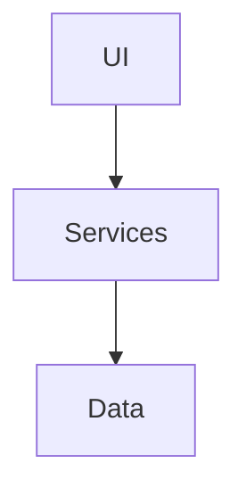
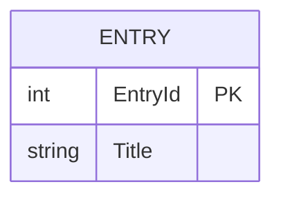

# MyDiary — Architecture

| | |
|---|---|
| App | MyDiary |
| Kind | app |
| Size | Small |
| Stack answer set | dotnet |
| Date | 2026-09-04 |

## 1. Stack decisions

| Q | Topic | Decision | Source |
|---|---|---|---|
| Q1 | Configuration | appsettings.json | answer set |
| Q4 | Authentication | AppManager | owner |

## 2. Solution structure

| Project | Kind | Purpose |
|---|---|---|
| `MyDiary` | web app | the head |
| `MyDiary.Tests` | test project | tests |

## 3. Component map

**How a request travels:**
1. The page calls the entry service.
2. The service calls the entry data access.
3. Rows come back and the grid shows them.

## 4. Data model

| Entity | Key fields | Notes |
|---|---|---|
| Entry | EntryId, Title, Body | one per day at most |

## 5. Cross-cutting

- **Identity:** AppManager API.
- **Configuration:** appsettings.json.
- **Logging:** Serilog file sink.
- **Errors:** problem details.

## 6. Decisions log

| Date | Decision | Why | Status |
|---|---|---|---|
| 2026-09-04 | Blazor Server | one process | decided |
